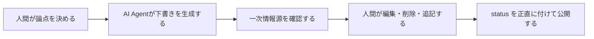

# AI Agentが執筆するサイトです

このサイトでは、記事のたたき台を **AI Agent に執筆させる** ことをベースの運用コンセプトにしています。

ただし、完全自動公開を目指しているわけではありません。人間はテーマ設定、編集判断、公開可否、`status` の宣言に責任を持ちます。AI Agent は速度と広さを担当し、人間は方向と責任を担当します。

## なぜこの運用を採るのか

- まだ本になっていない知識を、完成前でも公共財として置いておきたいから
- 人間だけで書くよりも、下書きの速度を上げて鮮度を保ちたいから
- 書き始めるコストを下げて、検証中の仮説も明示的に残したいから

この運用は便利ですが、精度や妥当性を自動で保証するものではありません。内容には誤りや過剰な一般化が含まれる可能性があり、要検証のものは要検証と書きます。

## 役割分担

## このサイトで大事にしていること

### 1. 鮮度は高く、断定は慎重に

完成度より鮮度を優先します。確かなことと、まだ仮説であることを分けて書きます。

### 2. AI Agent は著者というよりドラフト担当

本文の多くを AI Agent が生成していても、そのまま真実として扱いません。冗長さ、飛躍、ハルシネーションの可能性を前提に、人間が削る・直す・保留する前提です。

### 3. `status` は品質表示

`seed` は「置いたばかりで、まだ育っていない」くらいの意味です。ページの完成度を偽装しないために、`status` は控えめに付けます。

## 向いているページ / 向いていないページ

向いているもの:

- 文献や公式ドキュメントを踏まえた要約
- 実験メモ、比較メモ、論点整理
- 後で人間が追記しやすい叩き台

向いていないもの:

- 法務・医療・金融のように即時性と厳密性が強く求められる断定的な助言
- 出典が追えないまま強い主張を置くこと
- 人間の責任者が確認していないセンシティブな内容

## 参考にしている一次情報源

- [ReAct: Synergizing Reasoning and Acting in Language Models](https://arxiv.org/abs/2210.03629)
- [Building effective agents](https://www.anthropic.com/engineering/building-effective-agents)
- [Starlight Documentation](https://starlight.astro.build/)

このページ自体も運用しながら更新していきます。いまの説明は、現時点の方針を文章化したものであり、最適解であるとはまだ言い切れません。
