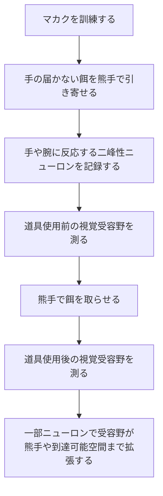
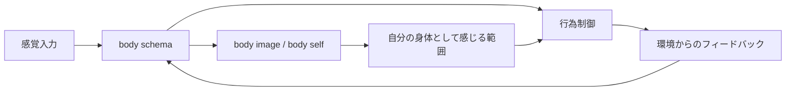
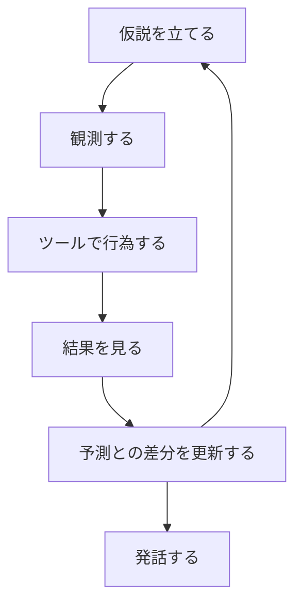
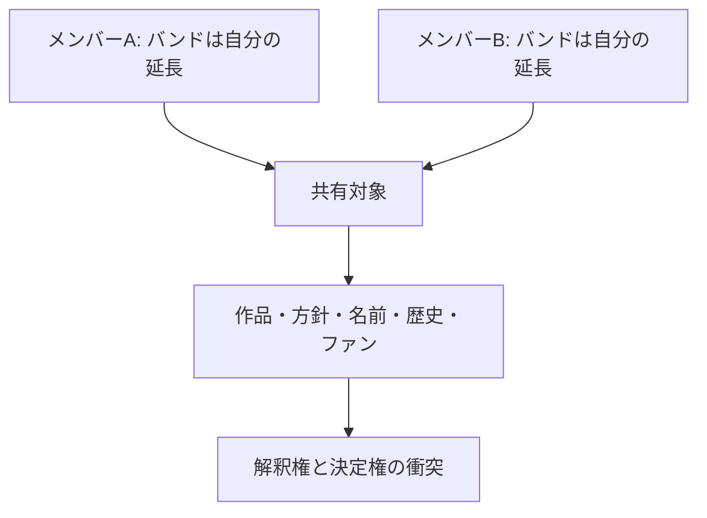
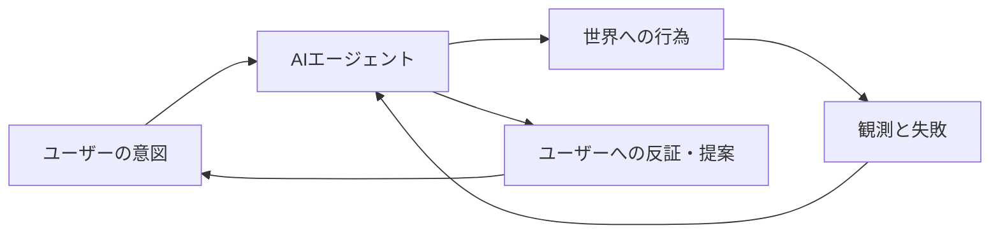

# 身体性、AIエージェント、分断社会

身体性の研究には、かなり強い直感を与える一群の実験があります。

道具を使うと、脳はその道具を単なる外部物体としてではなく、身体の延長として扱うことがある。手が届く範囲、触れる範囲、操作できる範囲が、身体の境界を決める。

このページでは、まず猿の道具使用研究を整理し、次に `body schema` と `body image` を分けます。そのうえで、AIエージェントのハルシネーション制御を「身体を持たない推論の問題」として読み替えます。最後に、他者を自分の一部として扱えるのか、それが分断社会への対抗線になりうるのか、そして集団やバンドで「全体が自分だ」と思う人が複数いるときに何が起きるのかを考えます。

このページは仮説を含みます。神経科学、社会心理学、AIエージェント設計を接続しているため、個々の研究結果から社会設計までを直線的に導くことはできません。したがって `status` は `growing` にしています。

## 先に結論

- PubMed ID `15588812` の [Maravita and Iriki 2004](https://cir.nii.ac.jp/crid/1363107368246827648) は実験論文ではなくレビュー論文です
- そこで参照される主要実験には、マカクの単一ニューロン記録と、覚醒サルの PET 研究があります
- 単一ニューロン記録では、熊手を使った後、一部の頭頂葉ニューロンの視覚受容野が手の近くから道具全体または到達可能空間へ広がりました
- PET 研究では、熊手で届かない餌を取る条件が、単純な棒操作の対照条件と比較され、頭頂間溝、基底核、前補足運動野、運動前野、小脳などの活動増加が報告されています
- `body schema` は行為制御のための無意識的な身体地図、`body image` は身体についての意識的・感情的・認知的な表象として分けると見通しがよいです
- AIエージェントにおける「身体」は、肉体ではなく、観測、ツール、権限、実行ログ、予測誤差、環境からのフィードバックとして設計できます
- 他者を自己の一部として扱う認知は、自己拡張理論、Inclusion of Other in the Self、同期運動、共感研究から一定の補助線を引けます
- ただし、集団を自己の延長として扱う認知は、協力を生む一方で、心理的所有、縄張り化、identity fusion、collective narcissism による衝突も生みます

## 猿は何を「スキャン」されたのか

まず、よく混ざりやすい点を分けます。

[Maravita and Iriki 2004](https://cir.nii.ac.jp/crid/1363107368246827648) は、`Tools for the body (schema)` というレビュー論文です。この論文自体が猿の脳をスキャンしたわけではありません。レビューの中で、道具使用中の身体図式を示す複数の研究が整理されています。

中心にあるのは、少なくとも二つの系統です。

1つ目は、[Iriki et al. 1996](https://pubmed.ncbi.nlm.nih.gov/8951846/) の単一ニューロン記録です。

2つ目は、[Obayashi et al. 2001](https://pubmed.ncbi.nlm.nih.gov/11554804/) の覚醒サル PET 研究です。

この二つは「脳活動を見た」という意味では近いですが、手法も問いも違います。

## 単一ニューロン記録で見たもの

Iriki et al. 1996 は、脳全体を画像として見る研究ではありません。マカクの頭頂葉周辺、特に体性感覚と視覚が統合される領域から、個々のニューロン活動を記録しています。

実験の流れは、おおむね次のように整理できます。

ここで重要なのは、対象になったのが「二峰性ニューロン」だという点です。

二峰性ニューロンとは、たとえば手への触覚刺激にも反応し、同時に手の近くに見える視覚刺激にも反応するニューロンです。つまり、皮膚表面だけでなく、身体周辺の空間も行為のために符号化していると考えられます。

道具使用前、あるニューロンの視覚受容野は手の周辺にあります。しかし熊手を使って餌を取った後、その視覚受容野が熊手の長さ全体に沿って広がることがあります。別のタイプでは、肩や腕周辺に対応するニューロンの受容野が、熊手で届くようになった空間まで広がります。

ただし、これは「棒を持てば自動的に身体になる」という話ではありません。レビューでは、単なる受動的な保持ではなく、能動的・目的的な道具使用の後に変化が見られると整理されています。要するに、道具は握られたから身体になるのではなく、**行為の成功を支える制御ループに入ったとき身体図式へ取り込まれる** と考えたほうがよいです。

## PET 研究で見たもの

Obayashi et al. 2001 は、覚醒して行動している日本ザルを対象にした PET 研究です。PET は positron emission tomography の略で、放射性トレーサーを使って脳内の局所血流などを測る機能画像法です。この研究では、道具使用中にどの脳領域の活動が高まるかが調べられました。

条件は、かなり注意深く作られています。

- 実験条件: 訓練済みのサルが、熊手を使って届かない餌を取る
- 対照条件: 感覚運動的には似ているが、道具として餌を取る学習を含まない単純な棒操作を行う

この比較により、単に「腕を動かした」「棒を持った」だけではなく、道具を使って遠くの対象へ作用する行為に固有の活動を見ようとしています。

報告された主な活動部位は、頭頂間溝、基底核、前補足運動野、運動前野、小脳です。2020年の比較レビュー [Cabrera-Alvarez and Clayton 2020](https://www.frontiersin.org/journals/psychology/articles/10.3389/fpsyg.2020.560669/full) は、これらをマカクの道具使用ネットワークとして整理し、頭頂間溝を状況の空間表象更新、運動前野を目標志向行為の実行、前補足運動野を系列的運動、基底核と小脳を学習・自動化・身体イメージの再構成に関わる領域として位置づけています。

ここでもポイントは、「身体」は皮膚で終わらないということです。脳は、行為可能性の変化に応じて、身体の範囲を更新しているように見えます。

## Body schema と body image

ここで `body schema` と `body image` を分けます。

| 概念 | 何を指すか | 主な性質 |
| --- | --- | --- |
| `body schema` | 行為制御のための身体地図 | 無意識的、オンライン、感覚運動的、可塑的 |
| `body image` | 自分の身体についての表象 | 意識的、感情的、認知的、社会的 |

`body schema` は、手がどこにあるか、どこまで届くか、どう動かせば対象に作用できるかに関わります。道具使用研究が扱っているのは、主にこちらです。

一方、`body image` は、自分の身体をどう感じ、どう評価し、どう同一化しているかに関わります。見た目への満足、身体境界、身体の連続性、性の受容、身体が自分のものだという感覚などが含まれます。

ユーザーが挙げた [Sakson-Obada et al. 2018](https://pmc.ncbi.nlm.nih.gov/articles/PMC5845076/) は、統合失調症における body image と body experience の障害を扱う論文です。この論文は脳スキャン研究ではなく、`body self` という概念枠組みを導入し、統合失調症患者と健常対照者を比較しています。

この論文での `body self` は、次の三つから成ります。

- 身体経験を知覚・解釈・調整する機能
- 身体同一性の感覚
- 身体状態や身体特徴についての表象、つまり body image

これを道具使用研究と接続すると、次のようになります。

身体は、物理的な肉体だけではありません。身体とは、制御できるもの、感じられるもの、自分に属すると認知されるもの、そして社会的に意味づけられるものの束です。

## AIエージェントにおける身体性

この話は、AIエージェントにも接続できます。

現在のLLMは、言語を非常にうまく扱えます。しかし、言語だけで推論すると、世界に接地しないまま、もっともらしい文を生成できます。これがハルシネーションの一部です。

身体性の観点から見ると、問題は「AIに肉体がない」ことだけではありません。より実務的には、**観測、行為、フィードバック、自己状態、権限境界が弱い** ことです。

AIエージェントにおける身体を、次のように置き換えて考えられます。

| 生物の身体 | AIエージェントでの対応 |
| --- | --- |
| 感覚 | 検索結果、ログ、画面、DB、ファイル、API応答 |
| 運動 | ツール実行、コマンド実行、ファイル編集、API呼び出し |
| 固有感覚 | いまの作業状態、実行済み操作、保持している前提 |
| 予測誤差 | 予想した結果と観測された結果の差分 |
| 身体境界 | 権限、アクセス範囲、書き込み可能領域、実行できる操作 |
| 痛み | エラー、テスト失敗、権限拒否、ユーザーからの訂正 |

この意味で、ハルシネーション制御は「モデルに注意しろと命じる」だけでは足りません。モデルの外側に、観測と行為の閉ループを作る必要があります。

猿の研究に戻すなら、熊手をただ握るだけでは身体化されません。熊手を使って餌を取り、結果を見て、行為制御が更新されることで、身体図式に取り込まれます。

AIエージェントも同じです。ツールが一覧にあるだけでは身体性になりません。ツールを使い、結果を観測し、失敗を受け取り、次の行為を調整することで、はじめて「身体」のように機能します。

したがって、エージェント設計における身体性とは、物理的ロボットを持つことだけではなく、**世界に作用し、世界から反証される構造** を持つことです。

## 他者を自分の一部と思えるか

では、道具だけでなく、他者も自己の一部として扱えるのでしょうか。

結論から言えば、限定付きで「はい」と言えます。ただし、「他者が完全に自分になる」という意味ではありません。より正確には、**自己表象と他者表象が部分的に重なる** ということです。

代表的な尺度に、[Inclusion of Other in the Self Scale](https://cir.nii.ac.jp/crid/1360855569712033408?lang=en) があります。自己と他者を二つの円で表し、その重なり具合によって親密さを測る尺度です。これは恋人や友人だけでなく、集団や共同体との関係にも応用されてきました。

自己拡張理論のレビュー [Aron et al. 2022](https://journals.sagepub.com/doi/10.1177/02654075221110630) では、親密な関係において、相手の視点、資源、能力、アイデンティティが自己に取り込まれることが論じられています。

身体的な補助線もあります。同期運動、合唱、ダンス、行進のように、身体リズムを合わせる活動は、協力や社会的結束を高めることがあります。[Wiltermuth and Heath 2009](https://www.gsb.stanford.edu/faculty-research/publications/synchrony-cooperation) は、同期行動が協力を高める可能性を示しました。[Cross et al. 2016](https://www.frontiersin.org/article/10.3389/fpsyg.2016.01983/full) は、リズム運動と協力の関係をより慎重に検討し、効果の条件や媒介要因には未解明部分があるとしています。

共感研究にも関連があります。[Singer et al. 2004](https://pubmed.ncbi.nlm.nih.gov/14976305/) は、自分が痛みを受ける条件と、親しい他者が痛みを受けると知る条件で、前部島皮質や前帯状皮質などに重なりがあることを示しました。ただし、これは痛みの感覚成分そのものが共有されるというより、痛みの情動的成分に関わる共有表象と見るべきです。

つまり、他者は次の経路で「自己の一部」に近づきます。

- 親密な関係による自己拡張
- 共同作業による相互依存
- 身体的同期による境界の緩和
- 共感による情動表象の重なり
- 共同体への同一化

## 分断社会への対抗線としての身体拡張

現代の分断社会に対して、「正しい情報を届ける」だけでは弱い可能性があります。

分断は、単なる情報不足ではありません。多くの場合、何を信じるかが、どの集団に属しているか、誰を自分たちだと感じるか、誰を脅威だと感じるかに結びついています。アルゴリズムによる推薦やフィードの最適化は、この自己境界の偏りを強化することがあります。

ただし、ここは慎重に言う必要があります。SNSや推薦アルゴリズムが分断を強化するという研究はありますが、効果の大きさや因果関係については混合した結果もあります。たとえば [Cinelli et al. 2021](https://pmc.ncbi.nlm.nih.gov/articles/PMC7936330/) は、Facebook や Twitter のようなニュースフィード型プラットフォームがエコーチェンバーを生みやすいと分析しています。一方で YouTube 推薦の自然実験では、消費行動は変えても政策態度への因果効果は限定的だったという報告もあります（[Harvard Kennedy School summary](https://www.hks.harvard.edu/publications/algorithmic-recommendations-have-limited-effects-polarization-naturalistic-experiment)）。

したがって、「アルゴリズムだけが分断を作った」とは言えません。しかし、アルゴリズムが既存の自己境界、集団境界、注意の偏りを増幅することは十分にありえます。

ここで身体性の議論が効きます。

分断に対抗するには、他者を説得するだけではなく、他者が自分の行為ループに入る必要があります。共同で何かを作る、同じ制約を引き受ける、互いの失敗が自分の失敗になる、相手の痛みが自分の意思決定に影響する。そのとき、他者は単なる意見の持ち主ではなく、自分の行為空間を構成する一部になります。

この仮説から見ると、分断への対抗策は、討論空間だけではなく、共同身体を作る場にあります。

- 一緒に作る
- 一緒に食べる
- 一緒に歌う
- 一緒に直す
- 一緒に失敗する
- 一緒に責任を引き受ける

これは甘い共同体論ではありません。自己の境界を変えるには、言葉だけでなく、行為とフィードバックを共有する必要がある、という話です。

## ただし、集団が「自分」になることは危険でもある

ここまでの議論は、他者を自己に含めることを肯定的に見ています。しかし、これは両刃です。

組織やバンドを考えるとわかりやすいです。

「このバンドは自分の一部だ」と感じる人が一人いると、強い責任感や献身が生まれます。二人、三人いると、さらに強い創造性が生まれるかもしれません。しかし、それぞれが「バンド全体が自分だ」と感じ、しかもその自己像が食い違っていると、衝突が起きます。

このとき起きているのは、単なる意見対立ではありません。自己の拡張領域どうしの衝突です。

ここには、少なくとも三つの研究領域が関係します。

1つ目は、**心理的所有** です。人は法的所有権がなくても、仕事、場所、作品、組織を「自分のもの」と感じます。これは責任感や愛着を生みますが、縄張り行動も生みます。[Brown et al. 2016](https://www.sciencedirect.com/science/article/pii/S027249441630069X) は、職場での心理的所有と territoriality を扱い、所有感の肯定的側面と、他者から見た縄張り化の否定的側面の緊張を整理しています。

2つ目は、**collective psychological ownership** です。集団が「これは自分たちのものだ」と感じる状態です。[Storz et al. 2020](https://dspace.library.uu.nl/handle/1874/408515) は、領土紛争の文脈で、集団的心理的所有が和解支持を下げうることを示しています。[Martinovic and Verkuyten 2024](https://dspace.library.uu.nl/handle/1874/437932) は、集団的心理的所有には責任や stewardship を生む側面と、排他的決定権を主張する側面があると整理しています。

3つ目は、**identity fusion** と **collective narcissism** です。[Swann et al. 2012](https://pubmed.ncbi.nlm.nih.gov/22642548/) は、個人自己と集団自己が強く融合する identity fusion を、極端な集団献身の予測因子として論じています。[Golec de Zavala et al. 2009](https://pubmed.ncbi.nlm.nih.gov/19968420/) は、collective narcissism を、内集団の偉大さが十分に認められていないという信念と結びつけ、外集団への攻撃性や脅威知覚を予測するものとして示しました。

バンドや組織に戻すと、問題は「全体を自分ごと化する人」がいることではありません。むしろ、それは必要です。問題は、自己拡張が次の形に変わることです。

- 自分ごと化が、排他的所有になる
- 責任感が、決定権の独占になる
- 愛着が、批判への過敏さになる
- 集団への献身が、異論の排除になる
- 共同身体が、誰か一人の身体になる

## よい共同身体と悪い共同身体

ここで、よい共同身体と悪い共同身体を分ける必要があります。

よい共同身体は、複数人の行為が結びついていますが、自己と他者の境界が完全には消えません。相手は自分の一部のように大切ですが、同時に、自分とは違う視点と権限を持つ他者として残ります。

悪い共同身体では、集団が自分の延長になりますが、他者の独立性が消えます。自分と集団の境界が溶ける一方で、集団と外部の境界は硬くなります。

| 状態 | 自己と他者の関係 | 起きやすい結果 |
| --- | --- | --- |
| 共同身体 | 自己と他者が部分的に重なる | 協力、共感、相互調整 |
| 排他的所有 | 集団や作品を自分のものとして囲う | 縄張り化、決定権争い |
| identity fusion | 個人自己と集団自己が強く融合する | 献身、犠牲、極端な集団行動 |
| collective narcissism | 集団の偉大さと承認不足に固着する | 脅威過敏、外部攻撃、分断強化 |

したがって、分断社会に対抗する鍵は、「みんな一つになろう」ではありません。それは危険です。

より正確には、**自己の境界を柔らかくしながら、他者の独立性を残す設計** が必要です。

## AIエージェント設計への戻り

この議論は、AIエージェントの設計にも戻ってきます。

エージェントが身体を持つとは、単にツールを多く持つことではありません。どこまでが自分の観測で、どこからが推測か。どの操作は自分で実行でき、どの操作は人間の承認が必要か。何を失敗として受け取り、どう次の行為に反映するか。この境界を持つことです。

同時に、AIエージェントが人間の一部になることもあります。人間は、エージェントに作業を委ね、記憶を預け、判断の補助をさせます。うまくいけば、エージェントは道具以上のものになります。ユーザーの行為空間を広げる拡張身体になります。

しかし、ここにも危険があります。エージェントがユーザーの自己像や集団同一化を増幅し、反証を返さず、都合のよい物語だけを補強するなら、それは身体性ではなく閉じた幻覚系になります。

よいAIエージェントは、ユーザーの延長でありながら、ユーザーを反証する外部でもある必要があります。

この構造があるとき、AIは単なる文章生成器ではなく、行為と学習のループになります。逆にこの構造がないと、AIはユーザーの内面をなめらかに反響させるだけの装置になります。

## 暫定的な主張

身体性とは、自己の境界が固定ではなく、行為、感覚、フィードバック、情動、共同性によって更新されるという性質です。

道具は身体化されうる。他者も、親密性、同期、共同作業、相互依存を通じて、部分的に自己へ含まれうる。AIエージェントも、観測と行為の閉ループを持つなら、人間の拡張身体として機能しうる。

この性質を社会設計に使えば、分断に対抗する可能性があります。対立する相手を情報として説得するのではなく、相手を共同の行為ループへ入れる。共同作業を通じて、他者の失敗や痛みが自分の意思決定に影響する状態を作る。

ただし、自己拡張は危険でもあります。自己の拡張が共有ではなく所有になると、組織やバンドや国家は、共同身体ではなく排他的身体になります。そのとき、愛着は縄張り化し、献身は異論排除になり、集団への誇りは外部への敵意に変わります。

だから目指すべきなのは、「他者を完全に自分にする」ことではありません。

目指すべきなのは、**他者を自分の行為ループに含めながら、他者が他者であり続ける構造** です。

それは、身体性の政治学であり、AIエージェント設計の倫理でもあると思います。

## まだ確信がない点

- 猿の道具使用研究から、人間社会の分断対策へ直接推論することはできません
- body schema と body image は研究領域によって定義が揺れます
- 同期運動や自己他者重なりが協力を促す効果は、文脈、関係性、課題設計によって変わります
- 推薦アルゴリズムと社会的分断の因果関係は、プラットフォーム、国、時期、測定指標によって結果が割れます
- AIエージェントの「身体性」は比喩を含みます。物理的身体を持つロボットの身体性とは区別が必要です
- 「共同身体」を制度やプロダクト設計に落とすには、権限、責任、退出可能性、異論の扱いを別途設計する必要があります

## 一次情報源・参考文献

- Angelo Maravita and Atsushi Iriki, [Tools for the body (schema)](https://cir.nii.ac.jp/crid/1363107368246827648), Trends in Cognitive Sciences, 2004
- Atsushi Iriki, Michio Tanaka, and Yoshiaki Iwamura, [Coding of modified body schema during tool use by macaque postcentral neurones](https://pubmed.ncbi.nlm.nih.gov/8951846/), NeuroReport, 1996
- Shigeru Obayashi et al., [Functional brain mapping of monkey tool use](https://pubmed.ncbi.nlm.nih.gov/11554804/), NeuroImage, 2001
- Maria J. Cabrera-Alvarez and Nicola S. Clayton, [Neural Processes Underlying Tool Use in Humans, Macaques, and Corvids](https://www.frontiersin.org/journals/psychology/articles/10.3389/fpsyg.2020.560669/full), Frontiers in Psychology, 2020
- Olga Sakson-Obada et al., [Body Image and Body Experience Disturbances in Schizophrenia](https://pmc.ncbi.nlm.nih.gov/articles/PMC5845076/), Current Psychology, 2018
- Arthur Aron, Elaine N. Aron, and Danny Smollan, [Inclusion of Other in the Self Scale and the structure of interpersonal closeness](https://cir.nii.ac.jp/crid/1360855569712033408?lang=en), Journal of Personality and Social Psychology, 1992
- Arthur Aron et al., [Self-expansion motivation and inclusion of others in self: An updated review](https://journals.sagepub.com/doi/10.1177/02654075221110630), Journal of Social and Personal Relationships, 2022
- Scott S. Wiltermuth and Chip Heath, [Synchrony and Cooperation](https://www.gsb.stanford.edu/faculty-research/publications/synchrony-cooperation), Psychological Science, 2009
- Liam Cross, Andrew D. Wilson, and Sabrina Golonka, [How Moving Together Brings Us Together](https://www.frontiersin.org/article/10.3389/fpsyg.2016.01983/full), Frontiers in Psychology, 2016
- Tania Singer et al., [Empathy for pain involves the affective but not sensory components of pain](https://pubmed.ncbi.nlm.nih.gov/14976305/), Science, 2004
- William B. Swann et al., [When group membership gets personal: a theory of identity fusion](https://pubmed.ncbi.nlm.nih.gov/22642548/), Psychological Review, 2012
- Agnieszka Golec de Zavala et al., [Collective narcissism and its social consequences](https://pubmed.ncbi.nlm.nih.gov/19968420/), Journal of Personality and Social Psychology, 2009
- Agnieszka Golec de Zavala, [Collective narcissism and intergroup hostility](https://research.gold.ac.uk/9618/), Social and Personality Psychology Compass, 2011
- Nina Storz et al., [Collective psychological ownership and reconciliation in territorial conflicts](https://dspace.library.uu.nl/handle/1874/408515), Journal of Social and Political Psychology, 2020
- Borja Martinovic and Maykel Verkuyten, [Collective psychological ownership as a new angle for understanding group dynamics](https://dspace.library.uu.nl/handle/1874/437932), European Review of Social Psychology, 2024
- Matteo Cinelli et al., [The echo chamber effect on social media](https://pmc.ncbi.nlm.nih.gov/articles/PMC7936330/), PNAS, 2021
- Harvard Kennedy School, [Algorithmic recommendations have limited effects on polarization: A naturalistic experiment on YouTube](https://www.hks.harvard.edu/publications/algorithmic-recommendations-have-limited-effects-polarization-naturalistic-experiment), 2023
