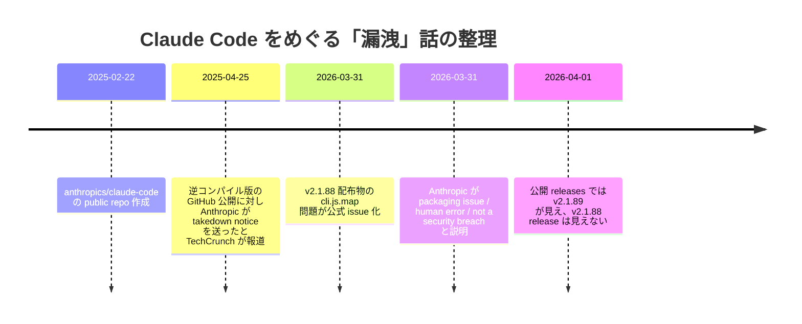

# Claude Code の「ソースコード漏洩」をどう見るか

2026-03-31 前後に、`Claude Code` の「ソースコードが漏れた」という話が一気に広がりました。
ただし、この話はかなり混線しています。

最初に結論だけ書くと、次の整理がいちばん妥当そうです。

- 2026-03-31 に `@anthropic-ai/claude-code` の `v2.1.88` 配布物に問題があり、内部ソースコードをたどりやすい形のファイルが公開されたのは、かなり確からしい
- ただし、これは **Claude モデル本体の重み流出** を意味しない
- **顧客データや認証情報が漏れた** という証拠は、少なくとも確認できた範囲では出ていない
- 「Anthropic がハックされた」という言い方も、公開されている声明とは合わない
- さらに、2025 年春の **逆コンパイル版公開と DMCA の件** が別事件として混ざっている

このページは、確認できた範囲のエビデンスをもとに、何が言えて何がまだ言えないかを切り分けるためのメモです。

## 先に要点

| 主張 | 現時点の判定 | 根拠 |
| --- | --- | --- |
| 2026-03-31 に Claude Code 配布物でソース露出事故があった | かなり確からしい | 公式 GitHub issue、`v2.1.88` タグ、`v2.1.88` release 不在、Anthropic 広報コメント |
| 漏れたのは Claude モデルの重みそのもの | 根拠不足 | 確認できた情報は CLI / ツール側のコード露出についてで、モデル重みの話ではない |
| 顧客データや credentials も漏れた | 現時点では裏取りできない | Anthropic 広報は否定している |
| Anthropic が外部攻撃で侵害された | 現時点では否定寄り | Anthropic 広報は packaging issue / human error / not a security breach と説明 |
| Claude Code は open source だから「漏洩」と呼ぶのはおかしい | ミスリーディング | 公式 repo は public だが、`LICENSE.md` は permissive OSS license ではなく商用利用規約ベース |

## まず確認できる事実

### 1. 公式の `anthropics/claude-code` リポジトリ自体は public

Anthropic の公式 GitHub リポジトリ `anthropics/claude-code` は公開状態で、GitHub 上のメタデータでは **2025-02-22 作成** になっています。

ただし、ここで重要なのは「public repository」と「open source license」は同義ではないことです。
`LICENSE.md` には、Claude Code の利用が Anthropic の Commercial Terms に従うと書かれており、Apache 2.0 や MIT のような permissive license ではありません。

つまり、

- コードが GitHub 上で見えること
- 誰でも自由に再配布・改変できること

は別です。

「もともと public repo があるのだから漏洩ではない」という言い方は、この点を雑に潰しています。

### 2. 2026-03-31 に `v2.1.88` を巡る security / packaging 問題が公式 issue に立っている

Anthropic の公式リポジトリには、2026-03-31 に `v2.1.88` の npm 配布物に `cli.js.map` が含まれていると指摘する issue が立っています。
その issue は `area:packaging` と `area:security` のラベル付きで、同日中に close されています。

この時点で少なくとも、

- 問題報告が公式 repo 上で受理されたこと
- 単なる SNS デマではなく、配布物レベルの事故として扱われたこと

は確認できます。

### 3. `v2.1.88` はタグとして存在するが、GitHub release としては見えない

公式 repo では `v2.1.88` の tag は確認できます。
一方で、公開 release 一覧では `v2.1.87` の次が `v2.1.89` になっており、`v2.1.88` の release ページ取得は 404 になります。

この挙動だけで「完全に yanked された」と断定するのはやや慎重であるべきですが、少なくとも **問題のあった版が通常の公開 release と同じ扱いで残されていない** ことは強く示唆されます。

### 4. Anthropic は「internal source code が含まれた」と認めつつ、breach ではないと説明している

2026-03-31 の *The Verge* 掲載の広報コメントでは、Anthropic は次の趣旨を述べています。

- その日の Claude Code release に internal source code が含まれていた
- sensitive customer data や credentials は関与していない
- 人為的な packaging error であり、security breach ではない

ここは、現時点で確認できる中ではいちばん明快な公式説明です。

## 何が誇張されやすいか

### 「Claude が全部漏れた」

かなり雑な言い方です。

今回確認できる範囲では、問題になっているのは **Claude Code という coding CLI / agent tool の実装** です。
Claude モデル本体の重み、学習データ、推論インフラ全体が流出したとまでは読めません。

### 「Anthropic がハックされた」

これも現時点では言い過ぎです。

Anthropic 広報は、外部侵害ではなく **release packaging の人為ミス** と説明しています。
もちろん、第三者がそれを完全に独立検証できているわけではありません。
ただ、少なくとも公開情報ベースでは「侵入型の breach が起きた」と言うより、「配布事故が起きた」と書くほうがエビデンスに沿っています。

### 「顧客のコードや API key まで出た」

現時点では裏取りできません。

少なくとも確認できた声明では、customer data や credentials の露出は否定されています。
逆に言うと、これを覆す強い一次情報が出てこない限り、SNS の断片だけで断定すべきではありません。

### 「Claude Code は最初から open source だった」

これも不正確です。

公式 repo は public ですが、ライセンスは permissive OSS license ではありません。
2025-04 には、逆コンパイルして GitHub に再公開した開発者へ Anthropic が takedown notice を送ったと *TechCrunch* が報じています。

少なくとも 2025 年時点では Anthropic 側が「誰でも自由に再配布してよい OSS」として扱っていなかったことは、この件からも読み取れます。

## 混ざりやすい別事件

この話題では、少なくとも次の 2 件を分けたほうがよいです。

### A. 2025 年春の「逆コンパイル版公開」

これは、開発者が Claude Code を de-obfuscate / reverse engineer して GitHub に公開し、Anthropic が takedown を行ったと報じられた件です。

ここで争点になっていたのは、

- Claude Code は permissive に配布されているのか
- 逆コンパイルして再配布してよいのか

というライセンス寄りの話です。

### B. 2026-03-31 の「配布物に source map が含まれた」

こちらは、Anthropic 側の配布パッケージそのものに問題のあるファイルが含まれていた、という話です。

両者は別であり、2025 年の話を引いて「前から全部オープンだった」と言うのも、2026 年の配布事故を見て「モデル重みまで抜かれた」と言うのも、どちらも雑です。

## まだ断定しないほうがいい点

次の点は、2026-04-01 時点ではまだ慎重に扱うべきだと思います。

- 露出したコード総量が正確にどれくらいだったか
- public repo にない未公開機能がどの程度含まれていたか
- guardrail bypass や system prompt の詳細が、どこまで真正なものとして読めるか
- 実害がどこまで競争上 / セキュリティ上あったか

このあたりは、今のところ二次報道やコミュニティ解析が先行しています。
面白い観察は多いですが、一次情報だけで固めきれているとはまだ言いにくいです。

## いま書ける、いちばん堅いまとめ

2026-03-31 に `Claude Code` の `v2.1.88` 配布物で、内部ソースコードをたどりやすくするファイルが公開されたのは、かなり確からしいです。
Anthropic 自身も、release に internal source code が含まれたこと自体は認めています。

ただし、それをもって

- Claude モデル本体が漏れた
- 顧客データが漏れた
- Anthropic が攻撃者に侵害された

とまで広げるのは、現時点ではエビデンス不足です。

より正確に言うなら、

> `Claude Code` の配布プロセスでソース露出事故が起きたことはかなり確からしいが、そこから先の「何がどこまで漏れたか」は話ごとに証拠の強さが違う

という整理になります。

## 一次情報源

- [anthropics/claude-code repository metadata](https://github.com/anthropics/claude-code)
- [anthropics/claude-code LICENSE.md](https://github.com/anthropics/claude-code/blob/main/LICENSE.md)
- [GitHub issue #41329: `cli.js.map` uploaded to npm](https://github.com/anthropics/claude-code/issues/41329)
- [GitHub tags for `anthropics/claude-code`](https://github.com/anthropics/claude-code/tags)
- [GitHub releases for `anthropics/claude-code`](https://github.com/anthropics/claude-code/releases)

## 二次情報源

- [The Verge: Claude Code leak exposes a Tamagotchi-style ‘pet’ and an always-on agent](https://www.theverge.com/ai-artificial-intelligence/904776/anthropic-claude-source-code-leak)
- [TechCrunch: Anthropic sent a takedown notice to a dev trying to reverse-engineer its coding tool](https://techcrunch.com/2025/04/25/anthropic-sent-a-takedown-notice-to-a-dev-trying-to-reverse-engineer-its-coding-tool/)

## 更新メモ

- 2026-04-01 時点の公開情報をベースに整理
- 将来 Anthropic の詳細な postmortem や security advisory が出たら、優先して差し替えるべきページ
