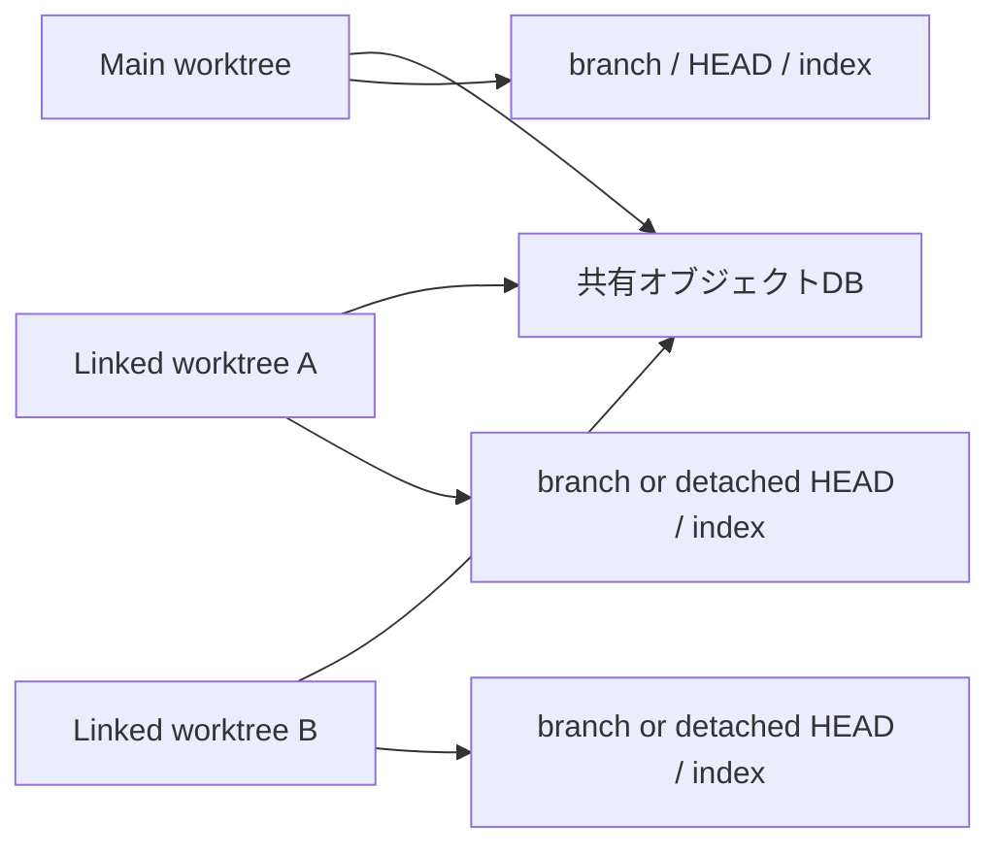
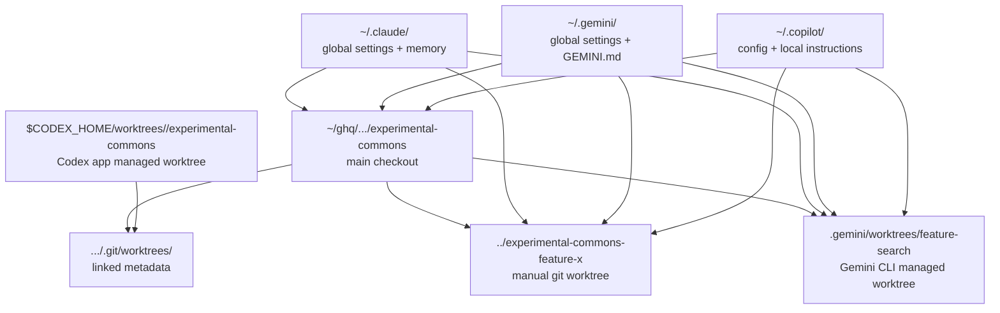

# Git worktree と Codex 運用

このページは、`git worktree` を使った並行開発の考え方と、`Codex CLI` / `Codex app` に加えて `Gemini CLI`、`GitHub Copilot CLI`、`Claude Code CLI` を含む実践的な運用メモをまとめたものです。

もともとは「CLI での worktree 活用法」という話題を広げて整理したページですが、ここでは **Git 自体の背景**、**なぜ detached HEAD が出てくるのか**、**Codex app の handoff と worktree 管理** まで含めて一本化しています。

各ツールの細部はバージョンで変わりうるため、コマンドや制限は一次情報源も合わせて確認してください。とくに Codex app と Gemini CLI の worktree 機能は今後挙動が変わる可能性があります。

## 先に結論

- `git worktree` は「1つのリポジトリで複数の作業ディレクトリを同時に持つ」ための仕組み
- 背景にある思想は、**ブランチの切り替えコストを下げて、文脈を混ぜないこと**
- 人間が複数タスクを並行する時だけでなく、**複数エージェントを同時に走らせる運用** と相性がいい
- Codex app はこの思想をかなり正面から採り入れており、`$CODEX_HOME/worktrees` に detached HEAD の worktree を作って thread ごとに切り分ける
- Gemini CLI は 2026-04-03 時点で **experimental な built-in worktree** を持ち、`.gemini/worktrees/` 配下に isolated な作業ディレクトリを作れる
- Claude Code CLI は `claude --worktree` を備えており、`.claude/worktrees/` 配下に worktree を作って並列セッションを走らせられる
- GitHub Copilot CLI は、2026-04-03 時点で確認した公式 docs では built-in の worktree 作成機能は見当たらず、**既存 worktree に入って起動する** 運用が基本になる
- Codex CLI は worktree を自動作成する前提ではなく、**既存の worktree を作ってから `-C` でそこに入る** 運用が分かりやすい

## なぜ `git worktree` が必要なのか

Git の通常運用では、1つの working tree に対して 1つのブランチを checkout します。
そのため、次のような場面で文脈がぶつかりがちです。

- feature を書いている途中で hotfix が飛び込む
- 比較実験を 2 パターン並行で試したい
- agent A と agent B に別々のタスクを任せたい
- main の開発サーバを立ち上げたまま、別の変更も触りたい

昔ながらの回避策は `git stash`、ローカル clone の複製、あるいは無理やり branch を切り替えることでした。
ただ、これらは「状態の退避」や「ディスクの重複」はできても、**文脈の分離を安く何度もやる** にはやや不便です。

`git worktree` はそこを埋めます。Git 公式 docs の説明どおり、1つの repository は複数の working tree を持てます。つまり、**オブジェクト履歴は共有しつつ、作業場所だけを増やす** という発想です。

## 背景にある思想

`git worktree` の思想を乱暴に言うと、次の 3 つです。

### 1. ブランチは文脈であり、作業場所でもある

人間は 1 本の feature branch だけを順番に進めているわけではありません。
実際には、調査、修正、比較実験、レビュー対応が入り乱れます。`worktree` は、それぞれの文脈に対して独立した作業場所を与えます。

### 2. checkout の切り替えを安くする

branch を行き来するたびに未コミット変更を片付けるのは、認知負荷が高いです。
`worktree` は「切り替え」ではなく「増設」に近いので、途中状態を保ったまま別の文脈へ移れます。

### 3. 可変な参照は 1 箇所で責任を持つ

一方で Git は、同じ branch を複数 worktree で同時 checkout させません。
これは不便というより、**ref を誰が進めるか曖昧にしないための設計** です。
Codex app が detached HEAD を多用するのも、この制約と整合的です。

## 最低限のメンタルモデル



- repository の履歴オブジェクトは共有される
- `HEAD` や `index` のような一部状態は worktree ごとに分かれる
- 同じ branch を 2 箇所で checkout することはできない
- 実験用なら detached HEAD の worktree を作るのが自然

このリポジトリの現在の運用でも、Codex 管理下の worktree が detached HEAD でぶら下がっています。これは異常ではなく、むしろ agent 並行実行ではかなり合理的です。

## どんな時に向いているか

### 人間中心の開発

- main で開発サーバを立てたまま、別タスクを進めたい
- レビュー修正と新機能実装を切り離したい
- リリースブランチの hotfix を、feature 作業を汚さず進めたい

### agent 中心の開発

- issue ごとに 1 worktree を割り当てたい
- agent ごとに独立した編集空間を持たせたい
- 失敗しても捨てられる spike 環境を量産したい
- 手元の local checkout は人間の観察・検証用に保ちたい

## 素の `git worktree` 運用

### 新しい topic branch を切って始める

```bash
git worktree add -b feature/worktree-doc ../experimental-commons-worktree-doc main
```

- `main` から新しい branch を切る
- 新しいディレクトリにその branch を checkout する
- 「1 issue = 1 branch = 1 worktree」にしたいときの基本形

### 既存 branch を別 worktree で開く

```bash
git worktree add ../experimental-commons-review fix/sidebar-copy
```

- 既存 branch を別ディレクトリで開く
- すでにその branch が他 worktree で checkout されていると失敗する

### 実験用の detached HEAD worktree を作る

```bash
git worktree add --detach ../experimental-commons-spike HEAD
```

- branch を増やしたくない比較実験や調査向け
- 使い捨て前提の spike と相性がいい

### 状態確認

```bash
git worktree list --porcelain
```

`--porcelain` は人間が読むより、ツールや agent が扱いやすい形式です。
Codex やスクリプトから worktree 一覧を処理したいときは、通常表示よりこちらのほうが安全です。

### 片付け

```bash
git worktree remove ../experimental-commons-spike
git worktree prune
```

worktree ディレクトリを手で消すより、まず `git worktree remove` を使うほうが無難です。
手で消した場合は管理情報が残ることがあるので、必要に応じて `git worktree prune` を使います。

## どこに worktree ができるか

2026-04-03 時点で確認した範囲では、各ツールの整理は次のようになります。

| ツール | built-in worktree 作成 | 既定の置き場所 | ひとことで言うと |
| --- | --- | --- | --- |
| `git worktree` | あり | 自分で `git worktree add <path>` に渡した場所 | いちばん素直で汎用 |
| Codex app | あり | `$CODEX_HOME/worktrees/...` | GUI が worktree を管理してくれる |
| Codex CLI | なし | 既存 worktree に入る | `-C` で対象を明示 |
| Gemini CLI | あり、experimental | `.gemini/worktrees/<name>/` | CLI 側で worktree を切れる |
| GitHub Copilot CLI | 公式 docs 上は見当たらず | 既存 worktree に入る | `cd` して `copilot` |
| Claude Code CLI | あり | `.claude/worktrees/<name>/` | `claude --worktree` で並列セッション |

ここで大事なのは、**worktree を作る主体** と **instructions / memory を読む主体** が別だということです。
たとえば Copilot CLI や Claude Code CLI は worktree 自体を自動生成しなくても、既存 worktree の中で十分に働けます。

## ディレクトリ構造

まず全体像を雑に描くとこうなります。



もう少しファイル寄りに書くと、典型例はこうです。

```text
~/ghq/github.com/org/repo/                  # main checkout
├── AGENTS.md
├── CLAUDE.md
├── GEMINI.md
├── .github/copilot-instructions.md
├── .claude/settings.json
├── .gemini/settings.json
└── .git
    └── worktrees/
        ├── repo-feature-x/                # linked worktree metadata
        └── repo-review-y/

../repo-feature-x/                         # manual git worktree
├── AGENTS.md
├── CLAUDE.md
├── CLAUDE.local.md                        # この worktree だけ
├── GEMINI.md
├── .github/copilot-instructions.md
└── .git -> .../repo/.git/worktrees/repo-feature-x

~/ghq/github.com/org/repo/.gemini/worktrees/feature-search/
└── ...                                    # Gemini CLI の experimental worktree

~/.codex/worktrees/abc123/repo/            # 既定では $CODEX_HOME/worktrees/
└── ...                                    # Codex app が管理する worktree

~/ghq/github.com/org/repo/.claude/worktrees/feature-auth/
└── ...                                    # Claude Code の built-in worktree

~/.claude/
├── CLAUDE.md
├── settings.json
└── projects/<repo>/memory/                # 同じ git repo の worktrees で共有

~/.gemini/
├── GEMINI.md
└── settings.json

~/.copilot/
├── config.json
└── copilot-instructions.md
```

この図で読み取るべきことは 3 つです。

- **repo 内の instruction files は worktree ごとに複製される**
- **home 配下の設定は複数 worktree で共有される**
- **ツールによって worktree 本体の置き場所が違う**

## 何が共有され、何が分かれるのか

### worktree ごとに分かれるもの

- checkout されたファイル群
- `git` の `HEAD` と `index`
- gitignored なローカルメモやローカル設定
- その worktree の `node_modules`、venv、build cache など

### 複数 worktree で共有されやすいもの

- Git object database
- `~/.claude/settings.json` のような user-level 設定
- `~/.gemini/settings.json` や `~/.gemini/GEMINI.md`
- `~/.copilot/config.json` や `$HOME/.copilot/copilot-instructions.md`

### 共有と分離が混ざるもの

- Claude Code の auto memory は `~/.claude/projects/<project>/memory/` にあり、**同じ git repo の worktree 間で共有**
- Claude Code の `CLAUDE.local.md` は gitignored なので、**作った worktree にしか存在しない**
- Copilot CLI の repo root instructions は各 worktree にコピーされるが、`~/.copilot/` の local instructions は全 worktree 共通
- Gemini CLI の `~/.gemini/GEMINI.md` は共有だが、repo 内の `GEMINI.md` や `.gemini/settings.json` は worktree ごと

## Codex CLI と組み合わせる

Codex CLI 自体は `git worktree` の高レベル管理者というより、**指定されたディレクトリの中で作業する agent** です。
そのため、CLI 中心の運用では次の順番が分かりやすいです。

1. 人間またはスクリプトが `git worktree add` で作業場所を作る
2. `codex -C <path>` でその worktree に入る
3. task が終わったら commit / push / PR
4. 不要になったら worktree を remove する

### 対話的に入る

```bash
codex -C ../experimental-commons-worktree-doc
```

これで Codex はその worktree を作業ルートとして扱います。
別 worktree には別 session を割り当てるほうが、ログと文脈が混ざりにくいです。

### 非対話で走らせる

```bash
codex exec -C ../experimental-commons-worktree-doc "src/content/docs/ai/agents/ 以下に worktree 運用ページを追加して、astro.config.mjs の Tools に載せてください"
```

反復実行するなら `codex exec` が便利です。
CI 的に使う場合や、反復可能な編集タスクをスクリプト化したい場合に向きます。

### resume / fork の考え方

ローカルヘルプを見る限り、CLI には `resume` と `fork` があります。
運用上は次のように考えると整理しやすいです。

- `resume`: 同じ作業文脈を継続したい
- `fork`: 会話文脈を分けて別の試行を始めたい

ただし、**会話を fork したからといって filesystem が自動で分かれるわけではありません**。
安全に並行化したいなら、fork した会話にも別 worktree を与えるほうがよいです。

## Codex app / GUI の worktree 運用

2026-04-03 時点で確認できる OpenAI 公式 docs では、Codex app は worktree を built-in で扱います。
新しい thread を作るときに `Worktree` を選び、開始 branch を指定し、必要なら local environment を紐づける流れです。

実務上のポイントは 3 つあります。

### 1. worktree は `$CODEX_HOME/worktrees` に作られる

Codex app docs では、Codex 管理の worktree は `$CODEX_HOME/worktrees` 配下に作られるとされています。
このリポジトリでも同型の配置が確認できるので、ローカル運用とも整合しています。

### 2. 開始時点では detached HEAD になる

docs では、Codex app が作る worktree は最初 branch checkout ではなく detached HEAD になると説明されています。
これは branch を乱立させないためでもあり、同じ branch を複数場所で握らないためでもあります。

つまり app のデフォルト思想は、

- まず isolated な作業空間を作る
- 必要になったらその場で branch 化する
- あるいは Local に handoff する

という順番です。

### 3. Local への handoff は Git 制約の回避策でもある

app docs では、worktree 上で branch を作った後に同じ branch を local checkout へそのまま持ち込もうとすると、
「その branch は別 worktree で使用中」という Git の制約にぶつくと説明されています。

そのため Codex app では、同じ thread を foreground に戻したいときは **branch を二重 checkout するのではなく handoff する** という導線が用意されています。
これは UI 都合ではなく、Git の ref 管理と整合した設計です。

## Gemini CLI で worktree を使う

Gemini CLI は、2026-04-03 時点で **experimental な Git worktree 機能** を公式 docs で案内しています。
この点は Copilot CLI や Claude Code CLI と違って、CLI 自身が worktree 作成を前面に出しているので少し性格が違います。

### built-in worktree を使う

まず設定で experimental worktree を有効化します。

```json
{
  "experimental": {
    "worktrees": true
  }
}
```

その上で、`--worktree` か `-w` を使います。

```bash
gemini --worktree feature-search
```

公式 docs では、この名前が **`.gemini/worktrees/` 配下のディレクトリ名** と **branch 名** の両方に使われると説明されています。
名前を省略するとランダム名になります。

```bash
gemini --worktree
```

### 再開する

Gemini CLI の docs では、作業を止めても worktree は自動削除されません。
再開するときは、その worktree ディレクトリに入って `--resume` を使います。

```bash
cd .gemini/worktrees/feature-search
gemini --resume <session_id>
```

### 手動の `git worktree` と組み合わせる

built-in を使わずに、素の Git で作ってから Gemini CLI を入れてもよいです。

```bash
git worktree add ../project-feature-search -b feature-search
cd ../project-feature-search && gemini
```

### Gemini CLI で気をつける点

- built-in worktree は experimental
- `.gemini/worktrees/` 配下に増えるので、repo の見た目がやや複雑になる
- `~/.gemini/settings.json` は全 worktree 共通
- repo root の `GEMINI.md` や `.gemini/settings.json` は worktree ごと
- `GEMINI.md` の既定名は変えられ、`AGENTS.md` も context filename に含められる

## GitHub Copilot CLI で worktree を使う

2026-04-03 時点で確認した GitHub Docs では、Copilot CLI に Codex app や Gemini CLI のような built-in worktree 作成機能は見当たりません。
そのため、基本運用は **worktree を先に作って、そのディレクトリで `copilot` を起動する** です。

### いちばん素直な使い方

```bash
git worktree add ../repo-review fix/sidebar-copy
cd ../repo-review
copilot
```

GitHub Docs でも、Copilot CLI は「作業したい project directory に移動してから起動する」流れで説明されています。

### なぜ `cd` が大事なのか

Copilot CLI の docs では、trusted directory と path permissions の既定範囲が **current working directory とその配下** です。
つまり worktree 運用では、

- main checkout で起動した Copilot
- 別 worktree で起動した Copilot

は、アクセス可能範囲も trust 境界も別物として扱えます。

これは worktree の思想とかなり相性がいいです。

### 既存 session を使う

GitHub Docs では、直近の local session を `copilot --continue` で再開できます。
ただし、worktree を分けているなら **session も worktree ごとに分ける** ほうが安全です。

### instructions の見え方

Copilot CLI は、次の instruction sources を公式に案内しています。

- repo root の `.github/copilot-instructions.md`
- `.github/instructions/**/*.instructions.md`
- `AGENTS.md`
- repo root の `CLAUDE.md` / `GEMINI.md`
- `$HOME/.copilot/copilot-instructions.md`
- `~/.copilot/config.json`

このため、worktree 運用では「repo にある instructions は各 worktree に存在する」「`~/.copilot` は全 worktree 共通」という理解でほぼ足ります。

## Claude Code CLI で worktree を使う

Claude Code は、2026-04-03 時点で公式 docs の common workflows に **`claude --worktree`** を明示しています。
つまり Claude Code も、Gemini CLI と同様に CLI から worktree を増やす導線を持っています。

### built-in worktree を使う

```bash
claude --worktree feature-auth
claude --worktree bugfix-123
```

名前を省略するとランダム名になります。

```bash
claude --worktree
```

公式 docs では、worktree は **`<repo>/.claude/worktrees/<name>`** に作られ、branch は **`worktree-<name>`** という名前になると説明されています。
ベースは `origin/HEAD` が指すデフォルトのリモートブランチです。

### built-in worktree の周辺機能

Claude Code docs では、次も明示されています。

- subagent に `isolation: worktree` を与えると、各 subagent が独自 worktree を使える
- 変更なしで終了した worktree は自動削除される
- 変更やコミットがある worktree は、保持するか削除するかを対話で選べる
- `.worktreeinclude` を置くと、`.env` など gitignored ファイルを worktree 側へコピーできる

このあたりまで含めると、Claude Code の worktree は単なる `git worktree add` の sugar ではなく、**セッション管理とセットの運用機能** に近いです。

### 手動の `git worktree` を使う場合

もちろん、手で切った worktree に入って `claude` を起動する運用もできます。

```bash
git worktree add ../repo-auth-fix -b fix/auth-timeout
cd ../repo-auth-fix
claude
```

公式 docs でも、場所や branch を細かく制御したいときはこの手動方式が案内されています。

### CLAUDE.md と worktree

Claude Code は `CLAUDE.md` を current working directory から上に向かって読みます。
そのため、repo root にある `CLAUDE.md` は各 worktree で自然に見えます。

また公式 docs では、project-level instructions の置き場として次を案内しています。

- `CLAUDE.md`
- `.claude/CLAUDE.md`
- `CLAUDE.local.md`
- `~/.claude/CLAUDE.md`

### worktree 運用で重要な例外

Claude Code docs でとくに重要なのは次の 2 点です。

1. `CLAUDE.local.md` は gitignored のローカルメモなので、**作った worktree にしか存在しない**
2. auto memory は `~/.claude/projects/<project>/memory/` に保存され、**同じ git repo の worktree で共有される**

つまり Claude Code は、

- 明示 instruction は per-worktree にもできる
- 学習された memory は repo 単位で共有されやすい

という、少しハイブリッドな構造です。

### `--add-dir` は worktree 切り替えの代替ではない

Claude Code には `--add-dir` がありますが、公式 docs ではこれは **file access の付与** であって、通常の設定発見とは別物だと説明されています。
さらに `--add-dir` 先の `CLAUDE.md` は既定では読み込まれません。

そのため、複数 worktree をまたいで 1 session で扱うより、

- 1 worktree = 1 Claude session

に寄せたほうが挙動が読みやすいです。

## 4 つの CLI をどう使い分けるか

### Codex

- app なら built-in worktree 管理が強い
- CLI は既存 worktree に `-C` で入れるのが明快

### Gemini

- built-in worktree が欲しいなら最有力
- ただし experimental なので挙動変化には注意

### Copilot

- 既存 repo の instructions と GitHub 連携を活かしたいときに向く
- worktree 自体は自分で切る前提のほうが読みやすい

### Claude

- built-in worktree があり、並列セッションの運用まで公式 docs にある
- `CLAUDE.md` と auto memory を育てながら使うのに向く
- 同一 repo の worktree 間で memory が共有される点を意識すると運用しやすい

## CLI と app の役割分担

### CLI が向いているとき

- shell script と組み合わせたい
- worktree の作成規則を自分で決めたい
- tmux / zellij / IDE と併用したい
- 1 task ごとに明示的な `git worktree add` を切りたい

### app が向いているとき

- 複数 thread を GUI で並列管理したい
- worktree と会話履歴をセットで持ちたい
- Local / Worktree の handoff を UI で安全にやりたい
- 永続 worktree や cleanup を Codex 側にある程度任せたい

雑に言うと、CLI は **自分で worktree を設計する運用**、app は **worktree を前提に agent 並列開発を回す運用** に向いています。

## おすすめ運用ルール

### 1 issue = 1 worktree = 1 主担当

最初の既定値はこれで十分です。
1 つの worktree に人間と複数 agent が同時に書き込み始めると、衝突は避けにくくなります。

### detached HEAD を怖がりすぎない

spike や app 管理 worktree では detached HEAD は自然です。
共有したくなった時点で branch を切ればよく、最初から branch を固定する必要はありません。

### local checkout は観察用に残す

常用 IDE、開発サーバ、ブラウザ確認は local checkout に寄せ、agent は worktree で動かす、という分業はかなり安定します。

### 「同じ branch を両方で握らない」を徹底する

worktree と local の両方で同じ branch を checkout したくなったら、設計が崩れ始めています。
別 branch に切るか、handoff するか、どちらかに寄せたほうが安全です。

### 使い終わった worktree は消す

Node 系プロジェクトでは `node_modules` や build cache が worktree ごとに太りやすいです。
長生きさせる worktree と使い捨て worktree を分けて考えたほうがよいです。

## よくある詰まり方

### `fatal: '<branch>' is already used by worktree`

同じ branch を別 worktree がすでに checkout しています。
branch を変えるか、今使っている worktree を手放す必要があります。

### worktree ディレクトリを手で消してしまった

管理情報だけ残ることがあります。
`git worktree prune` や `git worktree repair` を確認してください。

### agent の会話を増やしたのに、変更がぶつかる

会話の数と worktree の数を分けて考えてください。
session を分けても、同じ filesystem を共有していれば普通に競合します。

## 関連ページ

- [AI Agentが執筆するサイトです](/experimental-commons/ai/agents/agent-authored-site/)
- [OpenClaw セットアップマニュアル](/experimental-commons/ai/agents/openclaw-setup/)
- [Contributing Guide](/experimental-commons/guides/contributing/)

## 一次情報源

- [Git worktree documentation](https://git-scm.com/docs/git-worktree)
- [Codex CLI](https://developers.openai.com/codex/cli)
- [Codex app: Worktrees](https://developers.openai.com/codex/app/worktrees)
- [Using Codex with your ChatGPT plan](https://help.openai.com/en/articles/11369540)
- [Gemini CLI: Git Worktrees (experimental)](https://geminicli.com/docs/cli/git-worktrees/)
- [Gemini CLI: configuration](https://geminicli.com/docs/reference/configuration/)
- [Gemini CLI: Provide context with GEMINI.md files](https://geminicli.com/docs/cli/gemini-md/)
- [GitHub Copilot CLI: getting started](https://docs.github.com/en/copilot/how-tos/copilot-cli/cli-getting-started)
- [GitHub Copilot CLI: using Copilot CLI](https://docs.github.com/en/copilot/how-tos/copilot-cli/use-copilot-cli-agents/overview)
- [GitHub Copilot CLI: configure Copilot CLI](https://docs.github.com/en/copilot/how-tos/copilot-cli/set-up-copilot-cli/configure-copilot-cli)
- [GitHub Copilot CLI: add custom instructions](https://docs.github.com/en/copilot/how-tos/copilot-cli/add-custom-instructions)
- [Claude Code quickstart](https://code.claude.com/docs/en/quickstart)
- [Claude Code common workflows: worktrees](https://code.claude.com/docs/ja/common-workflows#git-worktree-%E3%82%92%E4%BD%BF%E7%94%A8%E3%81%97%E3%81%A6%E4%B8%A6%E5%88%97-claude-code-%E3%82%BB%E3%83%83%E3%82%B7%E3%83%A7%E3%83%B3%E3%82%92%E5%AE%9F%E8%A1%8C%E3%81%99%E3%82%8B)
- [Claude Code: how Claude remembers your project](https://code.claude.com/docs/en/memory)
- [Claude Code settings](https://code.claude.com/docs/en/settings)
- [Claude Code slash commands and `--add-dir`](https://code.claude.com/docs/en/slash-commands)
