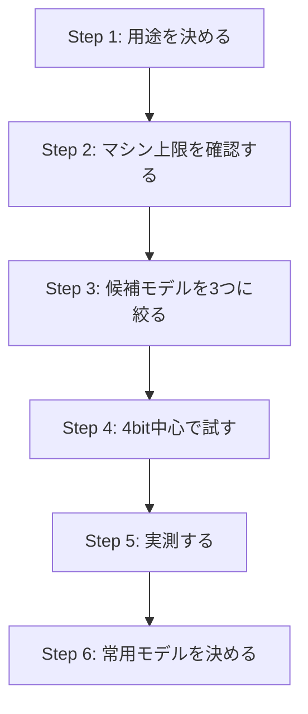

# ローカルLLMの選定方法

## 概要

ローカルLLMを選ぶときは、単に「一番大きいモデルを選ぶ」よりも、**手元のマシンで安定して、継続的に、目的に合った速度で動くか**を基準に考えるほうが実用的です。

特に Apple Silicon 系のマシンでは、CPUやNeural Engineよりも、実際には **ユニファイドメモリ容量・メモリ帯域・量子化サイズ** の影響が大きくなります。

本資料では、ローカルLLMの選定を以下の順で考える方法を整理します。

1. 何をしたいかを明確にする
2. マシンの制約を確認する
3. モデルの種類と量子化を確認する
4. 「動く」と「快適に使える」を分けて判断する
5. 誤解しやすいポイントを避ける

---

## 1. まず用途を決める

ローカルLLMの選定で最初にやるべきことは、用途の明確化です。

### 主な用途

* **コード生成・コード読解**
* **日本語の会話・要約・執筆支援**
* **エージェント的な利用（ツール呼び出し、長い指示、複数ステップ処理）**
* **RAG（検索拡張生成）との組み合わせ**
* **画像を扱うマルチモーダル用途**

用途によって、重視すべき点が変わります。

### 見るべき観点

* コード用途なら、推論精度だけでなく**指示追従性・整形の安定性**
* 会話用途なら、**日本語品質・応答の自然さ**
* エージェント用途なら、**ツール利用や長めの文脈耐性**
* マルチモーダル用途なら、**画像入力対応の有無**

---

## 2. 次にマシンの制約を確認する

今回の前提マシンは、以下のような Apple Silicon 構成を想定しています。

* 14コアCPU
* 32コアGPU
* 16コアNeural Engine
* 36GBユニファイドメモリ
* 512GB SSD

このクラスでは、ローカルLLM選定の中心は **36GBのメモリ枠をどう使うか** です。

### 重要な考え方

* 物理メモリ全部をモデルに使えるわけではない
* OSや常駐アプリの利用分を差し引く必要がある
* コンテキスト長を増やすと、追加でメモリを使う
* そのため、**モデルサイズぎりぎり**より、**少し余裕がある構成**のほうが実用的

### 実務上の目安

| サイズ帯 | 位置づけ |
|---|---|
| 7B〜14B級 | 快適に使いやすい枠 |
| 24B〜32B級の4bit量子化 | 実用の中心 |
| 30B前後の8bit量子化 | 条件付きで可 |
| 70B級 dense モデル | このメモリでは基本きつい |

つまり、36GBクラスでは「大きいモデルを無理に載せる」よりも、**24B〜32B級を無理なく回す**ほうが満足度が高くなりやすいです。

---

## 3. モデル名だけでなく「種類」と「量子化」を見る

モデル選定では、パラメータ数だけを見るのでは不十分です。

### dense モデルと MoE モデル

* **dense**: 常にモデル全体を使うタイプ
* **MoE**: 一部だけをアクティブに使うタイプ

MoE は、総パラメータ数が大きく見えても、実運用では比較的軽く扱える場合があります。ただし、**量子化サイズや実際の配布形式**を確認しないと、見かけほど軽くないこともあります。

### 量子化の考え方

| 形式 | 特徴 |
|---|---|
| 4bit | 実用本命。軽くて回しやすい |
| 8bit | 品質が少し欲しいときの候補。ただし重い |
| bf16 / fp16 | 高品質だが、ローカルではかなり重い |

ローカル用途では、まず **q4系で実用に乗るか** を見るのが現実的です。

---

## 4. 「動く」と「快適に使える」を分けて考える

ローカルLLMでは、この区別がとても重要です。

### 動く

* 起動できる
* 一応推論できる
* ただし遅い、落ちやすい、他アプリと併用しづらい

### 快適に使える

* 日常的に起動したまま使える
* 会話やコード補助で待ち時間がストレスになりにくい
* コンテキスト長や同時利用でも極端に不安定にならない

選定の基準は「動くか」ではなく、**目的に対して快適か**で判断するべきです。

---

## 5. 主要モデルの整理

### Z.ai 系

#### GLM-4.7-Flash

この系統は、36GBクラスの Apple Silicon でも現実的な候補です。

* q4 ならかなり現実的
* q8 は入る可能性はあるが余裕は薄い
* コードやエージェント用途でも試しやすい

**評価**: 候補として有望

#### GLM-5

こちらはローカル常用というより、クラウド前提で考えたほうがよい規模です。

**評価**: このクラスのMacでローカル常用する対象ではない

---

### Moonshot / Kimi 系

#### Kimi K2.5

Kimi K2.5 は非常に大きく、36GBクラスの単体Macでは現実的ではありません。

* 小さい量子化でも要求メモリが大きい
* SSDオフロードで起動だけはできる場合がある
* ただし速度低下が大きく、常用しにくい

**評価**: 単体の36GB Macでは非現実的

#### Moonlight 16B / Kimi-VL A3B 系

Moonshot 系でも軽量派生モデルは別です。

* 16B級の4bit変換版なら現実的
* マルチモーダル用途では特に候補になりやすい

**評価**: 軽量版なら十分検討対象

---

### Qwen3.5 35B-A3B

このモデルは、36GBクラスでも**動く可能性は高い**です。

ただし、モデル自体がかなり大きいため、以下の前提が必要です。

* 4bit前提で考える
* 長いコンテキストを欲張りすぎない
* 他アプリ併用や安定性を重視するなら余裕は少なめ

**評価**: 動く寄りだが、快適さではやや重い側

---

### gpt-oss 20b

このモデルは、今回の構成とかなり相性が良い候補です。

* モデルサイズが比較的扱いやすい
* 常駐させてローカル利用しやすい
* エージェントやコード補助とも相性が良い

**評価**: 36GB Apple Silicon での本命候補のひとつ

---

## 6. 迷ったときの選び方

### パターンA: とにかく安定して使いたい

* まずは **gpt-oss 20b** のような軽めで実用性の高いモデルから始める
* そのうえで不足があれば、より大きいモデルへ広げる

### パターンB: 少し大きめのモデルを試したい

* **Qwen3.5 35B-A3B** のような30B超級を、4bit・控えめコンテキストで試す
* ただし「快適さ」は事前に期待値調整しておく

### パターンC: Z.ai 系を使いたい

* まずは **GLM-4.7-Flash** を試す
* GLM-5 はローカル前提で考えない

### パターンD: Moonshot 系を使いたい

* **Kimi K2.5 本体は避ける**
* **Moonlight 16B や Kimi-VL A3B 系の軽量版**を狙う

---

## 7. 複数のMacをつなげば巨大モデルを動かせるか

ここは誤解が起きやすいポイントです。

### よくある誤解

「Mac Studioを複数台つなげば、メモリを合算して1台の巨大共有メモリマシンとして使えるのではないか」

### 実際にはどうか

* **できない**
* 複数台のMacをつないでも、1台の巨大ユニファイドメモリにはならない
* できるのは、あくまで**ネットワーク越しの分散推論**

### 実務上の意味

* 研究・実験としては成立しうる
* ただし構成が複雑で、速度面も厳しくなりやすい
* 低メモリ機を何台も並べるより、**大メモリの単体機**のほうが現実的

Kimi K2.5 のような巨大モデルへの示唆としては、小容量Macを多数並べるより、最初から大容量メモリ機を選ぶほうが筋が良いです。分散推論は「動くかもしれない」構成であって、「おすすめ構成」ではありません。

---

## 8. 電気代や運用コストも選定要素に入れる

ローカルLLMは、性能だけでなく運用コストも重要です。

### 見るべきコスト

* マシン本体価格
* 消費電力
* 発熱と冷房コスト
* 保守の手間
* ストレージ使用量

特に、大きいモデルを無理に分散で回す構成は、電力効率が悪く、配置や配線が複雑になり、メンテナンス負荷が高く、速度に対するコスト効率が悪くなりやすい傾向があります。

そのため、**ローカルLLMの選定は、単体性能だけでなく運用全体で判断する**べきです。

---

## 9. 実務向けの選定フレーム

以下の順で選ぶと判断しやすくなります。



### Step 1. 用途を決める

* コード中心か
* 会話中心か
* エージェント中心か
* 画像も扱うか

### Step 2. マシン上限を確認する

* メモリ容量
* メモリ帯域
* ストレージ容量
* 常用アプリ込みの余裕

### Step 3. 候補モデルを3つに絞る

例:

* 軽量・安定枠
* 中量級・本命枠
* 少し背伸びする検証枠

### Step 4. 4bit中心で試す

* 最初から高精度版を狙わない
* まずは回るかではなく、快適かを確認する

### Step 5. 実測する

* 体感速度
* 応答品質
* 長文での安定性
* コード生成の崩れやすさ
* メモリ使用量

### Step 6. 常用モデルを決める

* 毎日使う本命
* 必要時だけ使う重いモデル
* 用途別の使い分け

---

## 10. 36GB Apple Silicon 環境での実践的な結論

### まず試すべき帯

* **7B〜14B級**: 快適枠
* **24B〜32B級の4bit**: 実用本命

### 有力候補まとめ

| モデル | 評価 |
|---|---|
| gpt-oss 20b | 安定して使いやすい本命候補 |
| GLM-4.7-Flash | Z.ai系を試すなら有力 |
| Qwen3.5 35B-A3B | 少し重いが検証価値あり |
| Moonlight 16B / Kimi-VL A3B | Moonshot系を試すなら現実的 |

### 避けたほうがよい方向

* 70B級 dense モデルを無理に載せる
* Kimi K2.5 のような超巨大モデルを小容量機で無理やり動かす
* 複数Macをつないで共有メモリ化できると誤解する

---

## まとめ

ローカルLLMの選定では、次の3点が重要です。

1. **用途に合っていること**
2. **手元のマシンで快適に動くこと**
3. **運用コストまで含めて持続可能であること**

今回のような 36GB Apple Silicon 環境では、

* 軽量〜中量級を賢く選ぶ
* 4bit量子化を中心に考える
* 「最大サイズ」ではなく「常用できるサイズ」を選ぶ

という方針が、最も失敗しにくい選び方です。

巨大モデルはロマンがありますが、日常運用では **"一番大きいもの" より "毎日気持ちよく使えるもの" のほうが価値が高い**、というのが実務上の結論です。

---

## M1 MacBook 16GB 環境での選定

:::note
ここからは、上記の36GB構成とは異なる **M1 MacBook 16GBメモリ** 環境に特化した内容です。
:::

### 16GBという制約を正確に把握する

物理16GBのすべてがモデルに使えるわけではありません。

| 用途 | 目安 |
|---|---|
| macOS本体 + システムプロセス | 3〜4GB |
| ブラウザ・Slack等の常駐アプリ | 2〜4GB |
| モデルに使える実質上限 | **8〜10GB前後** |

アプリをほぼ閉じた状態でも、10GBを超えるモデルはかなり厳しくなります。

M1のユニファイドメモリ帯域は **68.25 GB/s** です（M2は100 GB/s、M3は150 GB/s）。同じ16GBでも世代が新しいほど推論速度が出やすいですが、帯域の差より **絶対的なメモリ容量の制限** が先に問題になります。

### 現実的なモデルサイズの上限

| サイズ帯 | 16GBでの評価 |
|---|---|
| 1B〜3B | 快適に動く。ただし品質は限られる |
| 7B（4bit量子化） | 実用の中心。現実的な本命 |
| 8B（4bit量子化） | 7Bとほぼ同等、十分現実的 |
| 13B〜14B（4bit量子化） | ギリギリ入ることがある。安定性に注意 |
| 7B（8bit量子化） | やや重い。常用は厳しいケースも |
| 13B以上（8bit量子化） | 基本的に入らない |
| 20B以上（4bit含む） | 非推奨。SSDスワップ頼みになる |

**16GB環境では7B〜8Bの4bit量子化が実用の中心** です。14B系は試す価値はありますが、他アプリと併用しながら安定して使うには余裕がありません。

### 量子化の選び方

| 形式 | 16GBでの扱い |
|---|---|
| q4_K_M | 最初の選択肢。品質と軽さのバランスが良い |
| q4_K_S | より軽くしたい場合 |
| q5_K_M | 7Bなら試せる。8Bは少しきつい |
| q8_0 | 7B以下なら可能性あり。ただし重い |
| bf16 / fp16 | このメモリではほぼ動かない |

### 有力なモデル候補

#### 7B〜8B系（本命帯）

**Qwen2.5 7B**
* 日本語・コードに強く、4bitで十分実用になる
* 会話・要約・コード補助どれも試しやすい本命

**Llama 3.1 8B / Llama 3.2 系**
* 4bit（q4_K_M）で快適に動く
* 英語品質は高い。日本語は専用チューニング版が品質高め

**Gemma3 4B / 9B 系**（要検証）
* 4BはこのMacで最も快適な帯域のひとつ
* 9Bは4bitで試せるが、他アプリとの併用時に注意

**Phi-4 mini / Phi-3 mini 系**
* 3B〜4B級で品質が高い評判
* 常駐させておきたい場合の軽量枠として有力

#### 日本語特化系

**Sarashina2 / ELYZA 系**
* 日本語に特化したファインチューン
* 7B系ベースなら16GBで動く
* 日本語の会話・要約用途で品質が欲しい場合の候補

#### コード特化系

**Qwen2.5 Coder 7B**
* コード特化の7Bモデル。4bitで十分動く
* コード生成・補助用途の現実的な本命

**DeepSeek Coder V2 Lite 16B（4bit）**（要検証）
* コード生成品質は高い評価。ギリギリ入る可能性あり
* 安定性・速度は十分確認が必要

#### 避けたほうがよいモデル

| モデル | 理由 |
|---|---|
| 13B以上の8bit量子化 | 入らない |
| 20B以上の4bit量子化 | SSDスワップ頼みになり速度が大幅低下 |
| 70B系 | 論外 |
| MoE系大規模モデル（Mixtral等） | 総パラメータが大きく実際も重い場合が多い |

### 快適に使うためのヒント

* 生成速度の目安: **10〜25 tokens/秒**（体感で読めるくらいの速さ）
* 実用コンテキスト長: **4096〜8192 token** 程度
* ブラウザのタブを閉じる、Slackを落とすなどでメモリを確保する
* コンテキスト長は控えめに設定する（長いと遅くなる）
* バックグラウンドのIndexing処理（Spotlight等）が走っていないか確認する

### ツール選択

**ollama（推奨）**

```bash
# インストール
brew install ollama

# モデルの起動
ollama run qwen2.5:7b
```

Apple Siliconのメタル加速に対応しており、セットアップが簡単です。**LM Studio** はGUIで操作でき、モデル探しやベンチマークを視覚的に行いたい場合に便利です。

### クラウドAPIとの使い分け

16GB環境では、**ローカルとクラウドの使い分け** が現実的な解になります。

| 用途 | 推奨 |
|---|---|
| 軽い会話・補助・要約 | ローカル7B（プライバシー確保にも） |
| 高精度なコード生成 | クラウドAPI |
| 長文処理・複雑な推論 | クラウドAPI |
| オフライン作業 | ローカル必須 |
| コスト重視 | ローカル（推論コスト無料） |

### M1 16GB での実践的な結論

**本命構成**

* 日常補助: `qwen2.5:7b`（q4_K_M）
* コード補助: `qwen2.5-coder:7b`（q4_K_M）
* 軽量常駐: `phi-4-mini` または `gemma3:4b`

36GB環境との最大の違いは、**14B以上は実験用途であって常用には向かない** という点です。16GBクラスでは「正しいサイズ感のモデルを選ぶ」ことが最も重要な判断になります。足りなければクラウドAPIと組み合わせる、というのが実務上の落としどころです。
