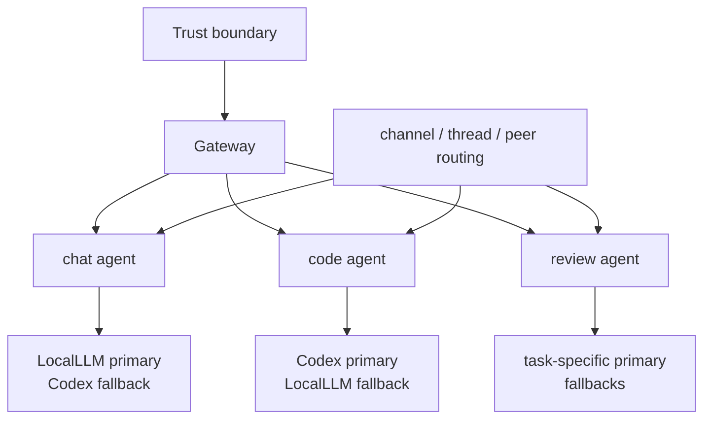

# OpenClaw を multi-agent で設計するときのリサーチ

OpenClaw を Discord bot として運用しようとすると、最初に迷いやすいのは「bot をいくつ持つべきか」と「LocalLLM と Codex をどう切り替えるべきか」です。

ここで先に結論を書くと、**multi-agent 設計の難しさは、agent の数そのものではなく、責務の切り方にある** ことが多いです。bot の数とモデルの数を一致させる必要はありません。それよりも、まず **どこに trust boundary があるか**、次に **どの agent にどの役割を持たせるか**、最後に **channel / thread 単位でどう routing するか** を分けて考えたほうが、実装も運用もかなり読みやすくなります。

この記事は、特定の社内外構成をそのまま公開するものではなく、もっと広く使える **OpenClaw の設計原則** としてまとめたメモです。細部の命名や deployment 形態は環境ごとに変わりうるので、必要に応じて読み替えてください。

## 先に結論

- OpenClaw は「1 bot = 1 model」で考えないほうがよい
- 最初の分解軸は model ではなく **trust boundary**
- multi-agent にするときは、**agent の数を先に増やすのではなく role を先に定義する**
- 最小構成としては、日常会話と実装支援を **2 Agent に分ける** と運用が安定しやすい
- モデル切り替えは会話の途中で都度賢く判断するより、**agent ごとの primary / fallback** に閉じ込めたほうが扱いやすい
- 実際の振り分けは本文解釈よりも、**channel / thread / peer 単位の routing** を先に使うほうが壊れにくい
- SubAgent は補助には便利だが、**モデル選択の主役** にはしないほうがよい

## まず bot の数と model の数を切り離す

OpenClaw を触り始めたとき、「LocalLLM 用 bot」と「Codex 用 bot」を別々に立てたくなることがあります。発想としては自然ですが、設計の軸としてはやや早すぎます。

なぜなら、bot は **入口**、agent は **役割**、model は **実行方針** だからです。

この 3 つを混ぜると、次のような設計になりがちです。

- bot の見た目を増やしすぎる
- どの会話がどのモデルで処理されるか読めなくなる
- 運用上の分離と model routing の責務が混ざる

OpenClaw では、むしろ次の順で分けると整理しやすいです。

1. trust boundary をどこで切るか
2. その境界の中で agent role をどう分けるか
3. 各 agent にどの model policy を持たせるか
4. user-facing な routing をどこで決めるか

## multi-agent で最初に決めるべきこと

multi-agent 設計と言うと、`planner`、`writer`、`reviewer`、`tool-user`、`coder` のように agent を細かく並べたくなります。ただ、OpenClaw では **agent 名を増やすこと自体は設計ではない** と考えたほうがよいです。

先に決めるべきなのは、たとえば次のようなことです。

### 1. その agent はどの責務を持つのか

- 会話するのか
- 実装するのか
- 調査するのか
- レビューするのか
- 外部と内部のどちらの文脈に属するのか

### 2. その agent は何にアクセスしてよいのか

- どの workspace を触れるのか
- どの tools を呼べるのか
- どの secrets を持ってよいのか
- どの会話履歴を参照してよいのか

### 3. その agent はどこから呼ばれるのか

- channel 単位なのか
- thread 単位なのか
- command 単位なのか
- 別の agent から委譲されるのか

この 3 つを先に決めないまま agent を増やすと、multi-agent というより **責務不明な prompt の束** になりやすいです。

## 最小構成としての 2 Agent

multi-agent 設計をいきなり細かく始めるより、まずは **会話用** と **コード用** の 2 Agent に分けるくらいがちょうどよいことが多いです。

これは「OpenClaw は常に 2 Agent で十分」という意味ではありません。むしろ逆で、**2 Agent で安定運用できるところまで責務を削ぎ落としてから、必要な場合だけ増やす** という意味です。

たとえば、次のような分担です。

### `chat` agent

- 日常会話
- 軽い要約
- 一般的な質問応答
- 雑談の延長で済む調査

### `code` agent

- コード生成
- コード修正
- 実装相談
- 差分レビューや手順設計

この分け方のよいところは、**役割が人間に説明しやすい** ことです。
「この thread は code agent に流す」「普段のチャンネルは chat agent に紐づける」という運用ルールに落とし込みやすく、あとから見返したときも動線が追えます。

multi-agent 化は、この最小構成の上に足していくほうが壊れにくいです。

## いつ agent を増やすべきか

OpenClaw で agent を増やす理由として妥当なのは、主に次の 3 パターンです。

### 1. role が本当に異なる

たとえば `chat` と `code` の差のように、期待される出力も、使う tools も、失敗の仕方も違う場合です。

### 2. trust boundary が異なる

同じ `code` でも、触れてよいリポジトリや secrets が違うなら、それは role の差というより boundary の差です。agent 追加だけではなく、Gateway 分離まで含めて考えるべきです。

### 3. 運用導線を分離したい

同じ能力でも、ある channel では常に reviewer 的に振る舞わせたい、別の thread では executor としてのみ使いたい、ということがあります。この場合は user-facing な入口の違いとして agent を増やす価値があります。

逆に、「なんとなく複雑そうだから 5 Agent にする」は、たいてい失敗します。

## model policy は agent に持たせる

agent を切ったら、次に model を agent にぶら下げます。

最小構成の典型例はこうです。

| Agent | primary | fallback | 向いている用途 |
| --- | --- | --- | --- |
| `chat` | LocalLLM | Codex | 低コストで軽い応答を返したい会話 |
| `code` | Codex | LocalLLM | 実装・修正・コード読解を伴う作業 |

ここで大事なのは、**モデル切り替えを会話の途中のその場判断に寄せすぎない** ことです。

「この質問は軽そうだから LocalLLM」「次は少し難しそうだから Codex」という切り替えを同一セッション内で頻繁にやると、表向きには賢そうでも、実際には次の問題が出やすいです。

- 挙動の再現性が下がる
- 失敗時の切り分けが難しくなる
- どのモデルがどの責務を持っていたか説明しづらくなる
- prompt と権限の境界が曖昧になる

そのため、**model selection の大半は agent 作成時に固定する** くらいの方針のほうが安定します。

agent が 3 つ以上になっても考え方は同じで、`review` agent や `research` agent を増やす場合でも、それぞれに primary / fallback を持たせたほうが追いやすいです。

## routing は channel / thread 単位でやる

OpenClaw の設計で見落としやすいのは、「model を切り替える」ことと「どの会話をどの agent に渡すか」は別問題だという点です。

運用上は、本文の意味理解に全面依存する routing より、まずは次のような **明示的な binding** を使うほうがよいです。

- 普段の雑談チャンネルは `chat`
- コード相談専用チャンネルは `code`
- 特定の thread だけ `code`
- 特定の peer や command だけ `code`

この方式の利点は、失敗したときに見直す場所が明確なことです。
問題が起きたとき、「routing 設定が悪いのか」「agent の prompt が悪いのか」「primary model の選定が悪いのか」を分けて考えられます。

multi-agent ではとくに、この説明可能性が重要です。agent が増えるほど「なぜこの agent が呼ばれたのか」が見えなくなると、保守が急に難しくなります。

## trust boundary は model とは別に考える

ここが設計上いちばん重要です。

OpenClaw で入口を分けるべきかどうかは、「Chat 向けか Code 向けか」より先に、**その入口が同じ trust boundary に属しているか** で判断したほうがよいです。

もし次のような差があるなら、1 つの Gateway にまとめず、**Gateway 自体を分ける** ことを検討する価値があります。

- 触れてよい workspace が違う
- 渡してよい secrets が違う
- 呼べる tools が違う
- 扱うデータの公開範囲が違う
- Discord token や接続先を分けたい

このときのポイントは、Gateway を分ける理由が「モデルを変えたいから」ではないことです。
**境界の違いを、運用上もそのまま分離するため** に Gateway を分けます。

分けるなら、少なくとも次は独立させるのが自然です。

- profile
- config file
- port
- workspace
- state directory
- secrets

## multi-agent 全体像のメンタルモデル

OpenClaw を雑に図にすると、次の 3 層に分けて考えると整理しやすいです。



この図で言いたいことは単純です。

- **境界** は Gateway で分ける
- **役割** は agent で分ける
- **モデル方針** は primary / fallback に持たせる
- **入口の振り分け** は routing で決める

2 Agent はこの図の最小版であり、multi-agent はその拡張版です。最初から複雑にしないほうが、実運用ではたいてい強いです。

## SubAgent は補助として使う

SubAgent 自体は便利です。とくに次のような用途では素直に効きます。

- 作業分解
- planner / reviewer / executor の分担
- 一時的な補助役
- 長いタスクの局所的な切り出し

ただし、**SubAgent に model routing の中心責務まで持たせる** と、設計が不透明になりやすいです。

たとえば、「困ったら SubAgent を呼ぶ」「SubAgent 側で適切な model を選ぶ」という設計は、短期的には便利でも、どこで責任が決まっているのかが見えにくくなります。

そのため、優先順位としては次の順が無難です。

1. Gateway で trust boundary を切る
2. agent で role を切る
3. agent に primary / fallback を持たせる
4. 必要なら SubAgent を補助的に使う

## 設定の考え方

実際の設定項目やキー名は OpenClaw のバージョンで変わる可能性がありますが、考え方としては次のようになります。

```yaml
gateway:
  bindings:
    - match:
        channel: "general"
      agent: "chat"
    - match:
        channel: "code-help"
      agent: "code"
    - match:
        channel: "review"
      agent: "review"
    - match:
        thread_tag: "implementation"
      agent: "code"

agents:
  chat:
    primary: "local-llm"
    fallbacks:
      - "codex"

  code:
    primary: "codex"
    fallbacks:
      - "local-llm"

  review:
    primary: "codex"
    fallbacks:
      - "local-llm"
```

ここでは細かい syntax よりも、**routing と model policy の責務が別々に書かれていること** が大事です。

## この構成のメリット

### 1. 運用が説明しやすい

「会話は chat、実装は code」と説明できるので、チーム内の暗黙知が減ります。

### 2. 壊れたときの切り分けがしやすい

routing、agent prompt、model policy、trust boundary のどこが問題かを順に疑えます。

### 3. 境界を後から強化しやすい

最初は 1 Gateway / 2 Agent で始めて、必要になった段階で reviewer や research agent を増やしたり、複数 Gateway に拡張しやすいです。

### 4. model 変更の影響範囲を局所化できる

LocalLLM や Codex の入れ替えをしても、agent ごとの方針が保たれていれば運用ルールを壊しにくいです。

## 注意点

### 1. agent を増やしすぎない

最初から `planner`、`writer`、`reviewer`、`codegen`、`ops` と細かく切りすぎると、routing だけで複雑になります。まずは 2 Agent から始めるほうが無難です。

### 2. dynamic routing を過信しない

自然言語理解で完全自動判定したくなりますが、誤判定時の説明可能性が落ちます。明示的 routing を先に使うほうが現実的です。

### 3. 境界の違いを 1 Gateway に押し込まない

もし secrets や tools や workspace が違うなら、それは role の違いではなく boundary の違いです。agent の設定だけで吸収しようとすると、あとで事故りやすいです。

### 4. 役割の差と境界の差を混同しない

`review` agent を増やすのは role の差です。別の secrets を持つ agent を分けるのは boundary の差です。この 2 つを同じ話として扱うと、設定も説明も崩れやすいです。

## まとめ

OpenClaw の設計で本当に大事なのは、「bot をいくつ増やすか」ではありません。

大事なのは、

- **どこを trust boundary とみなすか**
- **どの役割を別 agent にするか**
- **どの model policy を agent に持たせるか**
- **どの channel / thread をどこへ流すか**

を分けて考えることです。

その意味で、OpenClaw の multi-agent 設計は、まず **最小構成の 2 Agent** から始めるとわかりやすいです。会話用とコード用に役割を分け、model policy を agent に閉じ込め、routing は channel / thread 単位で明示的に決める。そのうえで、review や research のように本当に独立した責務が出てきたときだけ agent を増やす。さらに強い隔離が必要なときだけ、Gateway を trust boundary ごとに分離する。

この分解は派手ではありませんが、実装と運用の両方で壊れにくい設計です。

## 一次情報源

- [OpenClaw Setup](https://docs.openclaw.ai/start/setup)
- [OpenClaw CLI Reference](https://docs.openclaw.ai/cli)
- [Discord Developer Portal Documentation](https://discord.com/developers/docs/intro)
- [OpenAI Codex](https://openai.com/codex/)
