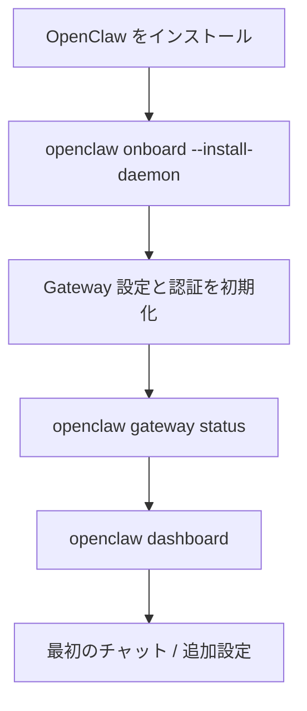

# OpenClaw セットアップマニュアル

このページは、OpenClaw を「まず動かす」ところまでの最短手順をまとめたメモです。
公式ドキュメントの構成は比較的広く、CLI・macOS app・from source の入口が分かれているので、最初に踏む順番を一本化しています。

細部はリリースによって変わる可能性があるため、コマンドオプションや要件は公式ドキュメントも合わせて確認してください。

## どのセットアップ経路を選ぶか

| 目的 | おすすめ | 理由 |
| --- | --- | --- |
| とにかく最短で試したい | CLI のオンボーディング | `openclaw onboard` で Gateway と初期設定をまとめて作れる |
| macOS で安定運用したい | macOS app 中心 | 公式 docs は app に Gateway を同梱して使う流れを stable workflow として案内している |
| 中身を触りながら開発したい | from source | `pnpm` ベースで Gateway を手元起動できる |

## 最短セットアップ

### 前提条件

- Node.js 22 以降
- ターミナルから `curl` を使えること
- ローカルで `127.0.0.1:18789` を開けること

公式の Setup ページでは Node 24 推奨、Node 22 LTS もサポートとされています。
Windows では WSL2 が強く推奨されています。macOS / Linux のほうが公式の導線は素直です。

### 手順

1. OpenClaw をインストールする

```bash
curl -fsSL https://openclaw.ai/install.sh | bash
```

2. オンボーディングを実行する

```bash
openclaw onboard --install-daemon
```

3. Gateway の状態を確認する

```bash
openclaw gateway status
```

4. Control UI を開く

```bash
openclaw dashboard
```

5. 動作確認を追加で行う

```bash
openclaw health
```

`openclaw dashboard` で Control UI が開けば、ひとまず「ローカル Gateway に接続できる」状態までは到達できているはずです。

## セットアップの全体像



## どこに設定が保存されるか

公式 docs では、カスタマイズはリポジトリの外に置く運用が推奨されています。

- 設定: `~/.openclaw/openclaw.json`
- ワークスペース: `~/.openclaw/workspace`

この構成にしておくと、OpenClaw 本体を更新しても、個人用の skills・prompts・memories を分離しやすいです。

まず雛形だけ作りたい場合は、次のコマンドでも初期化できます。

```bash
openclaw setup
```

対話形式の導線を明示的に使いたい場合は、次も候補です。

```bash
openclaw setup --wizard
openclaw configure
```

## macOS app を使う場合の流れ

公式の Setup ページでは、macOS app を起点にした運用が stable workflow として案内されています。

1. OpenClaw.app をインストールして起動する
2. オンボーディングと権限確認を完了する
3. Gateway が Local モードで起動していることを確認する
4. 必要なら `openclaw channels login` で外部チャネルを接続する
5. `openclaw health` で健全性を確認する

この流れは「まず動かす」にはかなり楽ですが、Gateway を細かく追いかけたいときは CLI / from source のほうが観察しやすいです。

## from source で触る場合

ローカル開発では、公式 docs に次の前提が書かれています。

- Node.js 22 以降
- `pnpm`
- Docker は任意

開発中の最短ループは次のとおりです。

```bash
pnpm install
pnpm gateway:watch
```

初回だけ、設定とワークスペースを明示的に初期化しておくと安全です。

```bash
openclaw setup
```

`pnpm build` 後に packaged CLI を直接叩く流れも docs にあります。

```bash
pnpm build
node openclaw.mjs gateway --port 18789 --verbose
```

## ハマりどころ

### Gateway が起動していない

まずは状態確認を優先します。

```bash
openclaw gateway status
```

フォアグラウンドで挙動を見たいなら、次のように直接起動して観察できます。

```bash
openclaw gateway --port 18789
```

### sandbox 設定が分からない

Docker ベースの隔離実行を使うなら、sandbox CLI の説明系コマンドが入口になります。

```bash
openclaw sandbox explain
openclaw sandbox list --json
```

### Control UI は開くが、追加チャネルが使えない

初回セットアップでは Control UI だけでも動作確認できます。
外部チャネル連携は後回しにして、まずはローカル UI と Gateway の疎通ができるかを切り分けるほうが楽です。

## このページの使い方

最初の 30 分で見るなら、次の順に読むのがおすすめです。

1. このページの「最短セットアップ」
2. 公式の Getting Started / Onboarding Wizard
3. 必要になった時点で Setup / CLI Reference / Sandbox

## 一次情報源

- [OpenClaw Getting Started](https://docs.openclaw.ai/quickstart)
- [OpenClaw Setup](https://docs.openclaw.ai/start/setup)
- [OpenClaw Onboarding Wizard](https://docs.openclaw.ai/wizard)
- [OpenClaw CLI Reference](https://docs.openclaw.ai/cli)
- [OpenClaw Sandbox CLI](https://docs.openclaw.ai/sandbox)
- [OpenClaw macOS Developer Setup](https://docs.openclaw.ai/platforms/mac/dev-setup)
