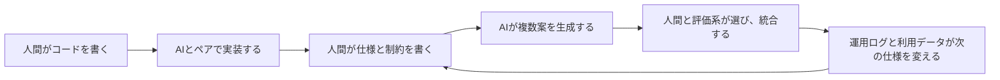
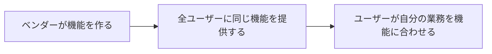
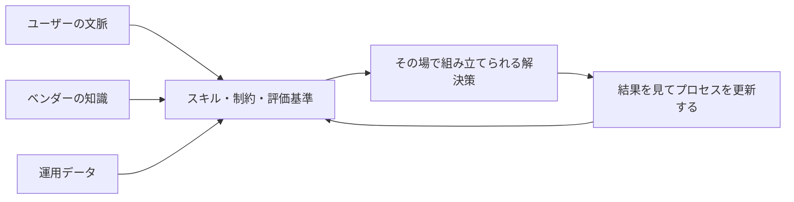
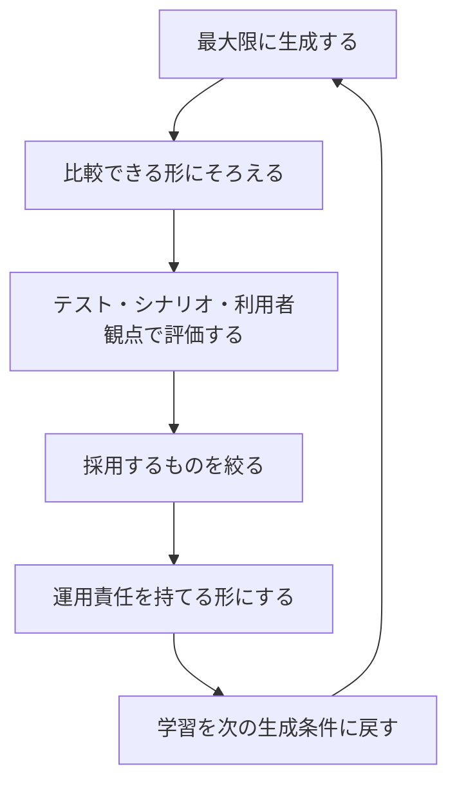

# AI時代のプロダクトはプロセスになる

このページは、Tim O'Reilly の ["Conviction Collapse" and the End of Software as We Know It](https://www.oreilly.com/radar/conviction-collapse-and-the-end-of-software-as-we-know-it/) を中心に、AI時代のプロダクト観を整理するメモです。

O'Reillyの記事は、Harper Reed との対話を通じて、ソフトウェアを「完成した物」と見る前提を揺さぶっています。中心にあるのは、**プロダクトは固定された物ではなく、探索・生成・選択・運用のプロセスから呼び出されるものになりつつある** という見方です。

ここでは、Dan Shapiro の [The Five Levels: from Spicy Autocomplete to the Dark Factory](https://www.danshapiro.com/blog/2026/01/the-five-levels-from-spicy-autocomplete-to-the-software-factory/) と、Harper Reed 自身の [When code stops being the bottleneck](https://github.com/harperreed/harper.blog/blob/45adb7537d98270261ffa476bf27cc28b2ae079f/content/post/2026-04-14-when-code-stops-being-the-bottleneck/index.md) を補助線にしながら、次の2点に絞って考えます。

1. AI時代には、プロダクトは物というよりプロセスになりつつあります
2. 作るコストがゼロに近づくほど「No」と言う難易度は上がりますが、作ったものには選ぶコストと運用コストが残ります

## 先に結論

- AIで実装コストが下がるほど、プロダクトの重心は「完成物」から「完成物を生むプロセス」へ移ります
- ここでいうプロセスには、開発プロセスと、サービスそのものがユーザーごとに組み立てられるという二つの意味があります
- 作るコストが下がると、以前よりも「No」と言いにくくなります
- ただし、作ったものには選ぶコスト、説明するコスト、テストするコスト、運用するコストが残ります
- したがって、AIを抑制するより、**生成は広く、採用は狭く、運用は厳しく** する設計が必要になります

このページの立場は、「AIで作りすぎるから危険」という抑制論ではありません。むしろ、探索としての出力は最大化したほうがよいです。ただし、出力を増やすほど、価値は「作る能力」から「選ぶ能力」「捨てる能力」「運用する能力」へ移ります。

## Conviction collapse とは何か

O'Reillyの記事で印象的なのは、Harper Reed が現在の感覚を **conviction collapse** と呼んでいることです。

以前なら、資金調達をしてから数か月から1年ほどかけてプロダクトを作ります。その間に顧客と話し、仮説を磨き、チームは「自分たちはこれを作るのだ」という確信を育てていきます。

ところがAIで生成速度が上がると、この時間構造が崩れます。Harperのチームは、プロダクト一式とランディングページを作り、人に見せ、フィードバックを得て、また別のプロダクト一式を作ります。そのサイクルが短すぎるため、従来の意味で「確信を育てる」時間がありません。

ここで崩れているのは、単なる開発見積もりではありません。**プロダクト判断の筋肉が、従来の時間軸に合わせて鍛えられていた** という前提そのものです。

作るのに9か月かかるなら、作る前に真剣に考えます。作るのに数日しかかからないなら、とりあえず作ってしまいます。この変化は一見すばらしいものです。ただし、「とりあえず作れる」状態が続くと、何を続けるべきか、何を捨てるべきか、なぜそれに賭けるのかが難しくなります。

## プロダクトがプロセスになる、の二つの意味

「プロダクトはプロセスになる」という表現は、少しわかりにくいです。ここには少なくとも二つの話が混ざっています。

1つ目は、**開発プロセスがプロダクトの中核になる** という話です。

2つ目は、**提供されるサービス自体がプロセス的になる** という話です。

この二つを分けると見通しがよくなります。

### 1. 開発プロセスがプロダクトの中核になる

Harper Reed の記事では、AI codegen はツール変更ではなく operating model の変更だと説明されています。Dan Shapiro の5段階モデルで言えば、autocomplete やAIペアプロの段階を超えると、人間はコードを書く人から、仕様を書く人、計画をレビューする人、複数のエージェントの出力を選別する人へ移っていきます。

つまり、開発の価値は次のように移ります。

このとき「プロダクト」は、リポジトリに入っているコードだけではありません。むしろ次の束がプロダクトの競争力になります。

- 仕様の書き方
- agent に渡すスキル、文脈、制約
- 評価用のテスト、シナリオ、ログ再生環境
- 生成された複数案を比較する手順
- どの案を採用し、どの案を捨てるかの判断基準
- 本番運用で得た学習を次の仕様に戻す仕組み

ここでは、コードは最終成果物でありながら、同時に途中成果物でもあります。毎回の生成物は重要ですが、それ以上に重要なのは、**良い生成物を何度でも呼び出せるプロセス** です。

### 2. サービス自体がプロセス的になる

もう一つの変化は、ユーザーに提供されるもの自体が、固定されたUIや機能一覧ではなくなっていくことです。

O'Reillyの記事では、将来のプロダクトの一形態として、スキル、文脈、UIを束ね、ユーザー自身のAIが固有の問題を解けるようにするものが示唆されています。これは、従来のSaaSと少し違います。

従来のSaaSは、おおむねこうでした。

プロセス的なサービスは、むしろこうなります。

ここで売られているのは、完成済みの機能というより、**解決策を生成・選択・調整する能力** になります。

たとえば「請求書管理ソフト」を考えると、従来は画面、承認フロー、帳票、通知が固定機能として提供されます。AI時代には、会社ごとの例外、承認文化、監査要件、過去のやり取りを読み込んだうえで、その会社に合う処理手順やUIが組み立てられるかもしれません。

この場合、プロダクトの境界はぼやけます。コードベースだけでなく、業務知識、判断基準、エージェントの作業手順、評価ログまで含めて「サービス」になるからです。

## No と言う難易度が上がる

以前から、プロダクト開発で「No」と言うのは難しいことでした。

顧客は機能を求めます。営業は差別化を求めます。経営は成長を求めます。エンジニアは面白い問題を解きたくなります。だから、ロードマップはいつも膨らみます。

それでも、かつては実装コストが防波堤になっていました。

- それを作るには2か月かかります
- そのためには別の機能を遅らせる必要があります
- 運用負荷が増えます
- チームのキャパシティが足りません

こうした制約は、ある意味で「No」を支援していました。

AIで作るコストが下がると、この防波堤が崩れます。「試すだけならすぐできます」「別案も作れます」「ランディングページも作れます」「プロトタイプも今夜できます」という状況になるからです。すると、No は論理ではなく意志の問題に近づきます。

Harper Reed の記事が言うように、コードが安くなると、選択が高くなります。Dan Shapiro のモデルでレベルが上がるほど、人間はタイピングから解放されますが、その代わりに仕様、判断、レビュー、運用設計を背負います。

## それでも作ったものは無料ではない

ここで重要なのは、「作るコストがゼロに近い」と「持つコストがゼロ」は違うということです。

AIが10個の案を作れるなら、試すこと自体はよいです。むしろ、試すべきです。しかし、作った瞬間から次のコストが発生します。

- どれを採用するか選ぶコスト
- なぜ採用したのか説明するコスト
- 使われなかった案を捨てるコスト
- 採用したものをテストするコスト
- セキュリティ、アクセシビリティ、法務、ブランド整合性を見るコスト
- 本番で運用し、問い合わせを受け、障害対応するコスト
- 将来の変更時に、その存在を思い出すコスト

ソフトウェアは、生成された瞬間よりも、**存在し続ける期間のほうが長い** ものです。

だから、「AIで作れるから全部作る」は半分正しいですが、半分は危ういです。正確には、**AIで全部作り、しかし全部は採用しない** くらいがよいです。

## 抑制ではなく、出力と選択を分離する

ここで「ではAIの利用を制限しよう」と考えるのは、たぶん筋が悪いです。

出力コストが下がったなら、探索量は増やしたほうがよいです。3案ではなく10案を見たほうがよいです。1つの実装に賭けるより、複数のエージェントに違うアプローチを試させたほうがよいでしょう。Harper Reed のいう cook-off 的な運用は、この点でかなり重要なパターンだと思われます。

ただし、出力を増やす層と、採用を決める層は分ける必要があります。

AIを抑制するのではなく、**生成は広く、採用は狭く、運用は厳しく** します。

この分離がないと、チームは生成物を抱え込みすぎます。逆にこの分離があると、AIの出力増加は脅威ではなく、探索能力になります。

## これからのプロダクト判断

AI時代のプロダクト判断では、「作れるか？」の重みが下がります。その代わり、次の問いが重くなります。

- これは誰のどの状況をよくするのか
- これを持ち続ける運用責任を負えるのか
- 似た案の中で、なぜこれを選ぶのか
- 捨てる案から何を学習するのか
- この機能は固定物として持つべきか、生成プロセスとして持つべきか
- そのプロセスは再現可能か、評価可能か、説明可能か

特に最後の問いが大事です。

プロダクトがプロセスになるなら、チームは「成果物」だけでなく「成果物を生む条件」を管理しなければなりません。仕様、スキル、文脈、評価、運用ログ、ユーザーからのフィードバック。これらを雑に扱うと、AIはたくさん作ってくれますが、何がよかったのかが残りません。

## まだ曖昧な点

このページは、指定された3本の記事をもとにした論点整理です。現時点では、次の点はまだ仮説として扱ったほうがよいです。

- 「プロダクトがプロセスになる」変化が、どの業種・どの規模の組織でどこまで進むか
- サービス自体がプロセス的になるとき、価格、責任範囲、SLA をどう設計するべきか
- AIで大量に生成した案を比較する評価系を、どこまで自動化できるか
- 「No」と言う判断を、個人の胆力ではなくチームの仕組みに落とせるか

そのため、このページの `status` は `seed` にしています。主張の方向性はかなり強く感じますが、運用パターンとしてはまだ検証中の部分が多いです。

## まとめ

O'Reillyの記事が示している変化は、単にAIでソフトウェア開発が速くなるという話ではありません。

より大きな変化は、プロダクトの重心が、完成した物から、物を生み、選び、運用し、また作り直すプロセスへ移っていくことです。

作るコストが下がるほど、No と言うのは難しくなります。とはいえ、No が不要になるわけではありません。むしろ、No は実装前の制約ではなく、生成後の選択として、より頻繁に、より明示的に必要になります。

AI時代の強いチームは、出力を抑え込むチームではありません。最大限に作り、冷静に選び、責任を持って運用し、学習を次のプロセスに戻せるチームだと思います。

## 一次情報源

- Tim O'Reilly, ["Conviction Collapse" and the End of Software as We Know It](https://www.oreilly.com/radar/conviction-collapse-and-the-end-of-software-as-we-know-it/), 2026-04-01
- Dan Shapiro, [The Five Levels: from Spicy Autocomplete to the Dark Factory](https://www.danshapiro.com/blog/2026/01/the-five-levels-from-spicy-autocomplete-to-the-software-factory/), 2026-01-23
- Harper Reed, [When code stops being the bottleneck](https://github.com/harperreed/harper.blog/blob/45adb7537d98270261ffa476bf27cc28b2ae079f/content/post/2026-04-14-when-code-stops-being-the-bottleneck/index.md), 2026-04-14
