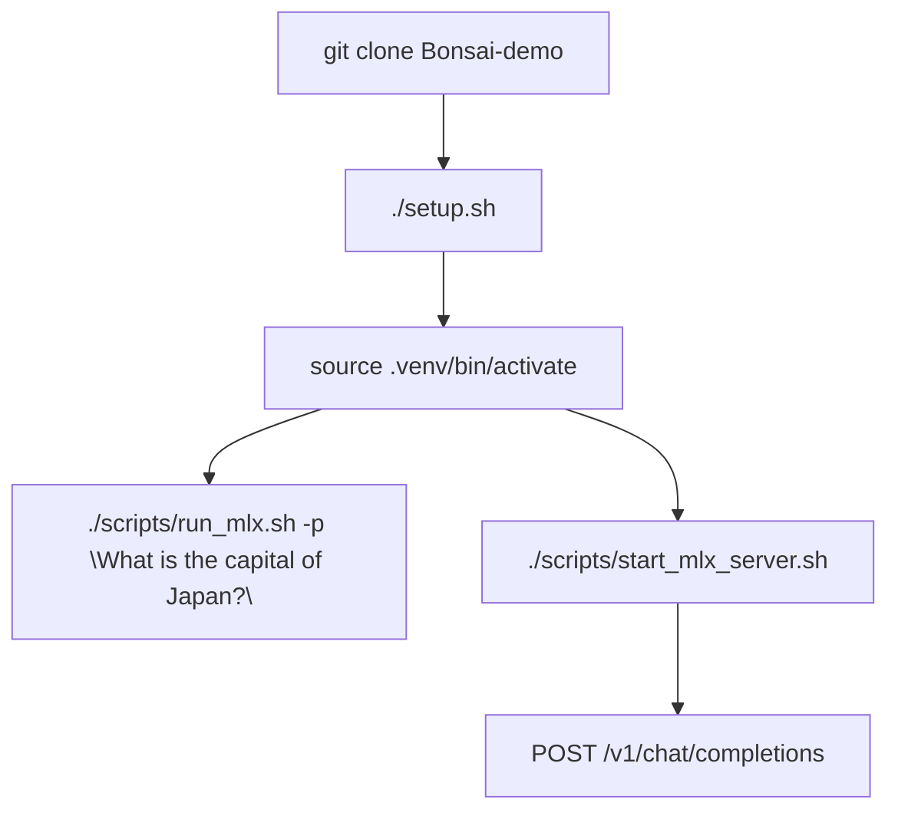

# Bonsai-demo 1-bit量子化モデルをローカルLLMとして試す

## 概要

`Bonsai-demo` は、PrismML の `Bonsai` 系 1-bit モデルをローカルで試すためのデモリポジトリです。
README と model card を読むかぎり、Apple Silicon では MLX 版、他環境では llama.cpp 版を入口にする構成です。

今回残すのは、主に **Apple Silicon + MLX で 8B の 1-bit モデルを動かしたときの観察メモ** です。
細かい性能評価というより、

- どのくらい軽いか
- 日本語でどのくらい自然か
- ローカル API としてどこまで扱いやすいか

を把握するための seed です。

## 先に結論

- 8B 級としてはかなり軽い。公式 model card では **deployed size 1.28 GB**、コンテキスト長は **65,536 tokens** とされている
- 手元ログでも `run_mlx.sh` 実行時の peak memory は **1.306 GB / 1.286 GB** で、少なくとも短い対話ではかなり扱いやすい
- 英語の短い QA は素直に返る
- 日本語も通るが、文章の自然さはまだ粗さがある
- `start_mlx_server.sh` で **OpenAI 互換っぽい `/v1/chat/completions`** をすぐ生やせるのは便利
- ただしログにあるとおり、`mlx_lm.server` は **basic security checks** しか持たず、production 向けとは言いにくい

## Bonsai-demo は何を用意してくれるか

公式 README では、Bonsai の 8B / 4B / 1.7B を GGUF と MLX の両方で試せるようにしてあります。

とくに Apple Silicon では次が重要です。

- `./setup.sh` で依存関係、Python venv、モデル、実行バイナリをまとめて用意できる
- MLX 実行用に `./scripts/run_mlx.sh` がある
- ローカルサーバー用に `./scripts/start_mlx_server.sh` がある
- 必要な 1-bit kernel は upstream の MLX / llama.cpp 本体ではなく、PrismML 側 fork を前提としている

README と Hugging Face model card を合わせて読むと、この MLX 版 8B は **Qwen3-8B 系 dense モデルをベースにした 1-bit 量子化モデル** という位置づけです。

## 実行フローの見取り図



## 今回の観察ログ

### 1. 英語の単純質問

```bash
./scripts/run_mlx.sh -p "What is the capital of Japan?"
```

```text
==================== MLX ====================
> What is the capital of Japan?

The capital of Japan is **Tokyo**.

| Metric       |   Tokens |  Speed (t/s) |
|--------------|----------|--------------|
| Prompt       |       19 |        44.71 |
| Generation   |       11 |        22.21 |

Peak memory: 1.306 GB
```

この種の短い factoid QA は素直です。
少なくとも「軽い 8B をすぐ置いて確認する」用途には十分見えます。

### 2. 日本語の自由入力

```bash
./scripts/run_mlx.sh -p "日本の良さ"
```

```text
==================== MLX ====================
> 日本の良さ

「日本の良さ」について、いくつかの意味で解釈できます：

1. **文化や伝統** - 日本の芸術、哲学、神道、伝統的なValues（誠実さ、礼儀、優雅さなど）が「良さ」として評価されます。

2. **技術** - 日本は世界的に有名な技術産物（自動車、電子機器、製造業など）を生み出しています。

3. **自然** - 日本の自然景観（山脈、海、森林）は多くの人々にとって「良さ」を象徴しています。

4. **社会的** - 日本では多くの社会的制度や取り組みが整っています（大学制度、保険制度、年齢配礼制度など）。

5. **人** - 日本の人々は多くの場合、敬意と柔軟性、そして社会的ポジティブな行動を大切にしています。

ご希望の意味について詳しく説明できますか？

| Metric       |   Tokens |  Speed (t/s) |
|--------------|----------|--------------|
| Prompt       |       15 |        26.86 |
| Generation   |      219 |        20.68 |

Peak memory: 1.286 GB
```

意味は通っていますが、日本語としては少しぎこちないです。
`Values` が混ざる、`年齢配礼制度` のような不自然な語が出る、という点を見ると、**日本語で長めに書かせると品質の揺れはある** と読んだほうが安全です。

## ローカルAPIとしての使い勝手

`start_mlx_server.sh` で MLX サーバーを起動すると、ログ上は `127.0.0.1:8081` で待ち受けました。

```text
=== MLX server ===
  Model: Bonsai-8B-mlx
  Port:  8081

Calling `python -m mlx_lm.server...` directly is deprecated. Use `mlx_lm.server...` or `python -m mlx_lm server ...` instead.
/Users/masumi/tmp/Bonsai-demo/.venv/lib/python3.11/site-packages/mlx_lm/server.py:1695: UserWarning: mlx_lm.server is not recommended for production as it only implements basic security checks.
  warnings.warn(
2026-04-06 17:18:34,890 - INFO - Starting httpd at 127.0.0.1 on port 8081...
127.0.0.1 - - [06/Apr/2026 17:21:21] "POST /v1/chat/completions HTTP/1.1" 200 -
```

`GET /` が 404 なのは、ブラウザ向けトップページではなく API サーバーだからだと思われます。
少なくともログ上では、OpenAI 互換風の `POST /v1/chat/completions` には正常応答しています。

```bash
curl http://127.0.0.1:8081/v1/chat/completions \
  -H "Content-Type: application/json" \
  -d '{
    "messages": [
      {"role": "user", "content": "Hello"}
    ],
    "temperature": 0.7
  }'
```

```json
{
  "choices": [
    {
      "message": {
        "role": "assistant",
        "content": "Hello! I'm Bonsai, an AI assistant developed by PrismML. How can I help you today?"
      }
    }
  ],
  "usage": {
    "prompt_tokens": 13,
    "completion_tokens": 24,
    "total_tokens": 37
  }
}
```

つまり、**手元のアプリや簡単な UI を OpenAI 互換 endpoint にぶら下げる実験台としてはかなり扱いやすい** です。
一方で、ログに明示されているように production 用の security は弱いので、LAN 公開やインターネット公開の前提では見ないほうがいいです。

## どう読むとよさそうか

### 良い点

- 8B 級としてサイズ感がかなり小さい
- Apple Silicon で MLX 導線がある
- スクリプトが整理されていて、試行までの距離が短い
- ローカル API 化までが速い

### 気になる点

- 日本語の自然さは最上位クラスではない
- ここで見えている速度は、短い prompt での局所観測に過ぎない
- 公式 model card の M4 Pro ベンチと、今回ログの 20 t/s 前後は条件が違う可能性が高い
- サーバーはあくまでローカル実験用と見たほうがよい

## まだ確信がない点

- この観察は短い prompt だけなので、コード生成、長文要約、tool calling の安定性は未確認
- 実測マシンの詳細がここでは固定できていないため、速度比較は **参考値** 止まり
- README にはセットアップや取得導線の説明があるが、モデル配布まわりは更新される可能性があるので最新 README を見たほうが安全

## 関連ページ

- [ローカルLLMの選定方法](/experimental-commons/ai/tools/local-llm-selection/)

## 一次情報源

- [PrismML-Eng/Bonsai-demo](https://github.com/PrismML-Eng/Bonsai-demo)
- [prism-ml/Bonsai-8B-mlx-1bit model card](https://huggingface.co/prism-ml/Bonsai-8B-mlx-1bit)
- [1-bit Bonsai 8B whitepaper PDF](https://github.com/PrismML-Eng/Bonsai-demo/blob/main/1-bit-bonsai-8b-whitepaper.pdf)
