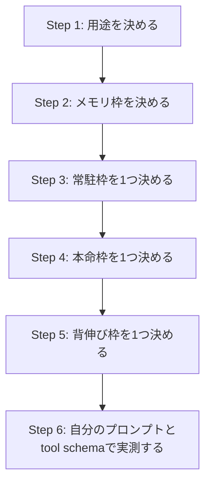

# ローカルLLMの選定方法

## 概要

ローカルLLMの選定は、モデル名を眺めるより先に **何を常用したいか** を決めたほうが整理しやすい。

特に Apple Silicon では、体感を決めるのは「理論上の賢さ」だけではなく、次の3点です。

1. **メモリに無理なく載るか**
2. **待ち時間に耐えられるか**
3. **自分の用途で破綻しにくいか**

このページでは、M4 Max 36GB を主な想定環境にしつつ、候補の役割を次の3つに分けて考えます。

| 役割 | 意味 |
|---|---|
| 常駐枠 | 軽くて、日常的に立ち上げっぱなしにしやすい |
| 本命枠 | いちばんよく使う。品質と速度のバランスを取る |
| 背伸び枠 | 品質は欲しいが、速度や安定性に妥協がいる |

---

## 1. まず「何をしたいか」で分ける

同じローカルLLMでも、用途によって向いているモデルはかなり違います。

| 用途 | 重視点 |
|---|---|
| コード生成・コード読解 | 指示追従、整形の安定、補完の気持ちよさ |
| 日本語の会話・要約・執筆支援 | 日本語品質、文体の自然さ、長文の破綻しにくさ |
| Agent / tool calling | schema の安定性、複数ステップ処理、長めの指示耐性 |
| RAG 併用 | 長文文脈の扱いやすさ、事実抽出の安定 |
| 画像込みのマルチモーダル | 画像理解の有無、UI系タスクとの相性 |

ここを曖昧にしたまま「一番強そうなモデル」を探すと、だいたい迷子になります。

---

## 2. Apple Silicon では「メモリ枠」が最初の現実

M4 Max 36GB クラスでは、ローカルLLM選定の中心は **36GBをどう配分するか** です。

### 実務上の見方

* 物理メモリ全部をモデルに使えるわけではない
* ブラウザ、エディタ、Slack などの常駐分を引く必要がある
* コンテキスト長を増やすほど追加メモリが必要になる
* そのため、**ギリギリ載る** と **日常運用できる** は別問題

### 36GB でのざっくりしたサイズ感

| サイズ帯 | 評価 |
|---|---|
| 7B〜14B級 | かなり快適 |
| 20B前後 | 常駐候補として扱いやすい |
| 24B〜32B級の4-bit | 実用本命帯 |
| 30B前後の8-bit | 条件付き |
| 70B級 dense | 基本きつい |

ローカルLLMでは、**最大サイズ** より **毎日気持ちよく回るサイズ** のほうが価値が高い。

---

## 3. 選定手順は「用途 → 枠 → 候補3つ」で十分

細かい比較を始める前に、まずこの順で絞ると混乱しにくいです。



### Step 1. 用途を決める

* コード中心か
* 会話中心か
* Agent 中心か
* 画像も扱うか

### Step 2. メモリ枠を決める

* 軽量帯
* 中量帯
* 少し重い検証帯

### Step 3-5. 候補を3つに絞る

* **常駐枠**: 軽くて速い
* **本命枠**: 品質と速度のバランスが最良
* **背伸び枠**: 品質重視だが日常運用には注意

これだけで、比較対象が増えすぎる問題をかなり防げます。

---

## 4. M4 Max 36GB での候補整理

### 先に結論

現時点では、M4 Max 36GB なら次の理解がいちばん実務的です。

| モデル | 位置づけ | 一言 |
|---|---|---|
| **gpt-oss 20b** | 常駐枠の有力候補 | 軽さと扱いやすさは魅力。ただし本命にするには賢さ不足を感じる場面がある |
| **Gemma 4 26B-A4B** | 新しい本命候補 | 36GB で現実的。コーディング性能の伸びが魅力 |
| **Qwen3.5-35B-A3B** | 本番寄りの比較対象 | tool calling と日本語の安心感が強い |
| GLM-4.7-Flash | サブ候補 | 試す価値はあるが最優先ではない |
| Moonlight 16B / Kimi-VL A3B 系 | 用途限定候補 | 軽量マルチモーダル寄り |

### gpt-oss 20b の扱い

以前は「本命候補」として置きやすいモデルでしたが、現時点では少し整理し直したほうがよさそうです。

#### 良い点

* 20B級で、36GB Mac との相性は悪くない
* 常駐しやすい
* レイテンシや運用の軽さで気持ちよく使いやすい

#### 気になる点

* 複雑な推論や長めの整理では、**もう少し賢さが欲しい** と感じやすい
* 「常用できる」ことと「最終品質に満足する」ことは別

#### 今の位置づけ

**gpt-oss 20b は本命枠というより、常駐枠の最有力候補** と考えるほうが自然です。

つまり、

* まず軽く立ち上げておくモデル
* 下書き、補助、軽い会話、軽量なローカル処理の受け皿
* 本番の思考や難しい生成は、より賢い別モデルに寄せる

という分担がしっくりきます。

### Qwen3.5-35B-A3B の扱い

このモデルは、36GB 環境だと軽くはありません。ただし、**Agent / tool calling と日本語での信頼感** が高いのが強みです。

* 複雑な schema で比較的安定しやすい
* 日本語タスクで期待値を置きやすい
* ただし本体は重めで、快適さは環境依存

そのため、**常駐枠ではなく、本命枠または比較基準枠** として扱うのがよいです。

### Gemma 4 26B-A4B の扱い

Gemma 4 は、今回の整理で追加したい一番重要な候補です。

* 36GB 環境で現実的なサイズ帯
* コーディング性能の伸びが気になる
* MoE ベースでレイテンシ面にも期待が持てる
* まだリリース直後なので、**実運用での安定性は要検証**

現時点では、**Qwen3.5 と並走テストする本命候補** と見るのが妥当です。

---

## 5. Gemma 4 追加メモ

> 対象環境: Apple M4 Max 36GB  
> 一部の細かな数値やベンチマーク解釈は、公式発表と実測を再確認したいので **要検証** を含みます。

### Gemma 4 概要

Gemma 4 は、Google DeepMind の open model ファミリーとして登場した新しい選択肢です。

* マルチモーダル対応
* 140以上の言語対応
* Tool use / Thinking mode 搭載
* Apache 2.0 ライセンス

### モデルラインナップ

| モデル | アーキテクチャ | 用途 | コンテキスト |
|---|---|---|---|
| E2B | Dense (PLE) | スマホ・エッジ | 128K |
| E4B | Dense (PLE) | ラップトップ | 128K |
| **26B-A4B** | **MoE** | **メインストリーム** | **256K** |
| 31B | Dense | 最高品質 | 256K |

### Mac 別のざっくりした推奨

| Mac | ユニファイドメモリ | 推奨モデル |
|---|---|---|
| MacBook Air M1 | 8 GB | E4B |
| MacBook Air M2 | 16 GB | E4B |
| MacBook Pro M3 Pro | 18 GB | 26B-A4B（かなり際どい） |
| MacBook Pro M3 Max / M4 Max | 36 GB | **26B-A4B が現実的、31B も短文寄りなら候補** |
| Mac Studio M2 Ultra | 64 GB | 全モデル |

### 量子化とメモリ感

| モデル | 4-bit | 8-bit |
|---|---|---|
| E2B / E4B | 5 GB | 15 GB |
| 26B-A4B | **18 GB** | 28 GB |
| 31B | 20 GB | 34 GB |

> 31B を 256K コンテキストでフル活用するなら、36GB では余裕が薄い。長文運用は注意。

### 16GB Mac について

26B-A4B の 4-bit 量子化は **16GB 環境には基本載らない** と考えたほうが安全です。  
そのため、16GB 級では E4B が現実的な上限寄りになります。

### M4 Max 36GB での推奨構成

| 用途 | 推奨モデル | 量子化 |
|---|---|---|
| バランス重視 | 26B-A4B | Q4 |
| 品質重視 | 26B-A4B | Q8 |
| 最高品質を短文で試す | 31B | Q4 |

---

## 6. Gemma 4 26B-A4B vs Qwen3.5-35B-A3B

### 比較の見取り図

| 軸 | Gemma 4 26B-A4B | Qwen3.5-35B-A3B |
|---|---|---|
| 総パラメータ | 26B | 35B |
| 推論時アクティブ | 約 3.8B 相当 | 約 3B 相当 |
| コンテキスト | 256K | 262K |
| マルチモーダル | 画像・動画 | 画像・動画 |
| 音声 | 一部軽量系のみ | 対応系あり |
| ライセンス | Apache 2.0 | Apache 2.0 |
| 立ち位置 | 新しい本命候補 | 実績ある比較基準 |

### 現時点の実務的な読み

* **Qwen3.5 優位**: tool calling の安定感、日本語での安心感
* **Gemma 4 優位**: コーディングの期待値、レイテンシ面の魅力
* 複雑な schema やネストしたパラメータでは、Qwen のほうが安定しそうという観測はある
* Gemma 4 はリリース直後なので、実際のプロンプト資産での再現確認が必要

### 使い分けの仮説

| ユースケース | まず試す候補 | 理由 |
|---|---|---|
| Agent daemon / tool calling | Qwen3.5-35B-A3B | schema 安定性を優先 |
| 日本語タスク | Qwen3.5-35B-A3B | アジア言語の実績を重視 |
| コーディング重視 | Gemma 4 26B-A4B | 新世代で伸びが気になる |
| レイテンシ重視 | Gemma 4 26B-A4B | MoE の恩恵を期待 |
| 軽量ラップトップ運用 | Gemma 4 E4B | サイズ感がよい |

ここはベンチマークの勝敗だけでは決めにくいです。**自前のプロンプト、ツール schema、長文入力で比べる** のが本筋です。

---

## 7. 今のおすすめ構成

### M4 Max 36GB

現時点では、こう分けておくのがわかりやすいです。

| 役割 | モデル |
|---|---|
| 常駐枠 | **gpt-oss 20b** |
| 本命枠 | **Qwen3.5-35B-A3B** または **Gemma 4 26B-A4B** |
| 背伸び枠 | Gemma 4 31B、重めの 30B 級 |

### 判断のしかた

* **安定運用を優先** するなら Qwen3.5 寄り
* **コーディング品質と新規性** を取りに行くなら Gemma 4 寄り
* **軽さと常駐性** を取るなら gpt-oss 20b

重要なのは、`gpt-oss 20b = 本命` と固定しないことです。  
今の整理では、**gpt-oss 20b は軽快な実務補助枠、本命は Qwen3.5 と Gemma 4 の比較で決める** くらいが自然です。

---

## 8. M1 MacBook 16GB ならどう考えるか

16GB 環境では、話がかなり変わります。

| サイズ帯 | 16GB での評価 |
|---|---|
| 1B〜4B | 快適 |
| 7B〜8B の 4-bit | 実用本命 |
| 13B〜14B の 4-bit | 条件付き |
| 20B 以上 | 非推奨 |

### 現実的な候補

* `qwen2.5:7b`
* `qwen2.5-coder:7b`
* `gemma4:e4b`
* `phi` 系の軽量モデル

16GB では、**Gemma 4 26B-A4B は外す** のが安全です。  
このクラスでは「背伸びして重いモデルを回す」より、**7B〜8B 級を快適に使う** ほうが満足度が高いです。

---

## 9. クイックスタート

```bash
# Gemma 4 26B-A4B
ollama pull gemma4
ollama run gemma4

# Gemma 4 E4B
ollama pull gemma4:e4b
ollama run gemma4:e4b
```

---

## 10. 結論

ローカルLLM選定を整理し直すなら、次の理解で十分です。

1. **軽さが欲しいなら gpt-oss 20b**
2. **本命品質は Qwen3.5 と Gemma 4 26B-A4B で比較する**
3. **36GB 環境では 24B〜32B 級 4-bit が主戦場**

そして一番大事なのは、**モデルを1つに決め打ちしないこと** です。

* 常駐枠
* 本命枠
* 背伸び枠

の3つに分けると、選定がかなりスッキリします。

今の感触では、

* **gpt-oss 20b**: 軽快で便利だが、少し賢さ不足を感じる場面がある
* **Qwen3.5-35B-A3B**: 実務の安心感が高い
* **Gemma 4 26B-A4B**: 新しい本命候補。特にコーディング用途は注目

という並びで見るのが、いちばん自然です。

---

## 参考リンク

* Google AI for Developers: [Gemma](https://ai.google.dev/gemma)
* Google DeepMind: [Gemma model family](https://deepmind.google/models/gemma/)
* Qwen: [Official documentation](https://qwenlm.github.io/)
* Ollama: [Library / Docs](https://ollama.com/)

> この記事内の詳細な比較表、メモリ量、実運用コメントの一部は、手元メモと実測前提の整理を含みます。導入前には公式配布ページと自分の環境で再確認したい。
