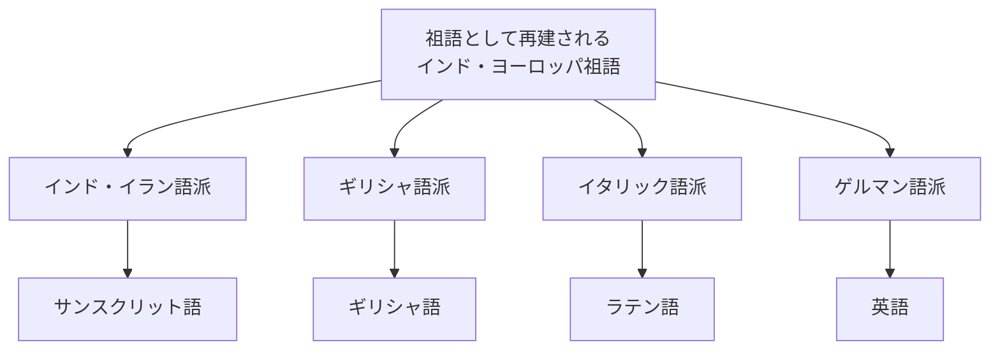

# サンスクリット語入門

このページは、サンスクリット語をこれから学ぶ人向けの地図です。
文字を全部覚える前に、「何を学ぶ言語なのか」「どこでつまずきやすいのか」
「中国語や英語との関係をどう考えればよいのか」を先に整理します。

最初に大事なのは、サンスクリット語を「古いインドの言葉」とだけ見ないことです。
サンスクリット語は、宗教、詩、哲学、文法学、仏典翻訳、比較言語学の交差点にあります。

## 一言でいうと

- サンスクリット語は、インド・アーリア語派に属する古典語です
- ヴェーダ語と古典サンスクリット語は連続していますが、同じものとして雑に扱わないほうがよいです
- デーヴァナーガリーは現代の学習・出版で重要ですが、サンスクリット語の唯一の文字ではありません
- 文法は、語順よりも語形変化を見る感覚が重要です
- 中国語への影響は、主に仏典翻訳を通じた語彙・文体・宗教概念の流入として見るのが自然です
- 英語、ギリシャ語、ラテン語との関係は「サンスクリット語が直接の祖先」ではなく、印欧語族の比較対象としての関係です

## まず覚えたいキーワード

| 用語 | ざっくりした意味 |
| --- | --- |
| `saṃskṛta` / `संस्कृत` | 「整えられた」「洗練された」という意味を持つ語。サンスクリット語の自称として扱われる |
| ヴェーダ語 | ヴェーダ文献に見られる古い段階の言語。古典サンスクリット語より古層を含む |
| 古典サンスクリット語 | パーニニの文法伝統によって規範化された、文学・学術・宗教で広く使われた言語 |
| パーニニ | 文法書『アシュターディヤーイー』で知られる古代インドの文法家 |
| `Aṣṭādhyāyī` | パーニニの文法書。「八章」の意味 |
| IAST | `ā`, `ṛ`, `ṣ`, `ṃ` などの記号でサンスクリット語をローマ字転写する方式 |
| デーヴァナーガリー | `देवनागरी`。現代のサンスクリット語学習でよく使われるインド系文字 |
| サンディ | 音が隣り合うときに変化する規則。語と語の境界が見えにくくなる原因 |
| 格 | 名詞が文中でどんな役割を持つかを表す語形変化 |
| 語根 | 動詞や派生語の核になる要素。辞書・文法で重要 |
| 複合語 | 複数の語が長く結びついた語。サンスクリット語読解の大きな山です |

## デーヴァナーガリーの位置づけ

デーヴァナーガリーは、サンスクリット語を学ぶときに非常によく出会う文字です。
たとえば `dharma` はデーヴァナーガリーで `धर्म` と書きます。

ただし、デーヴァナーガリーはサンスクリット語の唯一の文字ではありません。
Britannica の概説でも、サンスクリット語は歴史上、デーヴァナーガリーだけでなく、
シャーラダー、ベンガル系、グジャラート系、グランタ系など複数の地域文字で書かれてきたと説明されています。

デーヴァナーガリーを学ぶときの最小ポイントは次の3つです。

1. 子音字には、何も付けなければ短い `a` が含まれる
2. 母音記号を付けると、その子音に続く母音が変わる
3. `्` というヴィラーマを使うと、内在する `a` を消せる

たとえば `क` は `ka`、`कि` は `ki`、`क्` は母音なしの `k` に近い扱いです。
Library of Congress のローマ字転写表も、子音には暗黙の `a` が付くが、別の母音記号やヴィラーマがある場合は例外になると説明しています。

## 発音とローマ字転写

最初から発音を完全に再現しようとすると重くなります。
まずは IAST の記号が何を区別しているかを見ます。

| IAST | 例 | 見るポイント |
| --- | --- | --- |
| `ā` | `rāma` | 長い `a` |
| `ṛ` | `kṛṣṇa` | 音節を作る `r` 系の母音 |
| `ṭ`, `ḍ`, `ṇ` | `paṭha`, `daṇḍa` | そり舌音。歯音の `t`, `d`, `n` と区別する |
| `ś`, `ṣ`, `s` | `śiva`, `kṛṣṇa`, `satya` | 3種類の s 系音 |
| `ṃ`, `ḥ` | `saṃskṛta`, `namaḥ` | 鼻音化や気息音的な記号 |

日本語カナだけで覚えると、長短母音、そり舌音、歯音、帯気音の区別が消えやすいです。
初心者は、音声を聞きながら IAST とデーヴァナーガリーを対応させるのがよさそうです。

## 文法の最小モデル

サンスクリット語文法は広大ですが、最初の地図としては次の5点を押さえると混線しにくいです。

### 1. 語順より語形変化を見る

英語では語順が大きな役割を持ちます。
一方、サンスクリット語では名詞や動詞の語尾が多くの情報を持ちます。
そのため、読むときは「どの語が先に出たか」だけでなく、「どんな語尾か」を見ます。

### 2. 名詞には性・数・格がある

名詞には、性、数、格があります。

- 性: 男性、女性、中性
- 数: 単数、双数、複数
- 格: 主格、対格、具格、与格、奪格、属格、処格、呼格など

双数がある点は、現代英語話者にも日本語話者にも少し新鮮です。
「1つ」「2つ」「3つ以上」が文法上区別されます。

### 3. 動詞は語根から見る

動詞は、語根を中心に、人称、数、時制、法、態などが絡みます。
たとえば `gam` は「行く」に関わる語根として学ばれます。
辞書を引くときも、表面の形から語根に戻す力が必要になります。

### 4. サンディで語の境界が変わる

サンディは、音が隣り合ったときの変化です。
これがあるため、書かれている形と辞書見出しがそのまま一致しないことがあります。
読解では「ここで音が変わっているかもしれない」と疑う姿勢が必要です。

### 5. 複合語が長くなる

サンスクリット語では複合語が長くなりやすいです。
慣れないうちは、長い語を見たら「これは単語1個」ではなく
「複数の要素が束になっているかもしれない」と考えるとよいです。

## 中国語への影響

サンスクリット語が中国語に与えた影響は、日常語の全体を変えたというより、
仏教の伝来と仏典翻訳を通じて、宗教語彙、概念、翻訳文体に強く現れたと見るのがよさそうです。

例としては、次のような語がよく挙げられます。

| サンスクリット語 | 中国語・漢訳語 | 日本語で見慣れた形 |
| --- | --- | --- |
| `buddha` | 佛陀 | 仏陀 |
| `bodhisattva` | 菩薩 | 菩薩 |
| `nirvāṇa` | 涅槃 | 涅槃 |
| `prajñā` | 般若 | 般若 |
| `kṣaṇa` | 刹那 | 刹那 |
| `saṃgha` | 僧伽 | 僧伽、僧 |

ここでは、音を写した語、意味を訳した語、音写と意味訳が混ざった語が並びます。
仏教語の漢訳は、日本語・朝鮮語・ベトナム語の宗教語彙にも波及したため、
サンスクリット語の影響は東アジアの漢字文化圏にも間接的に残っています。

ただし、すべての仏教語が古典サンスクリット語から直接来たとは限りません。
パーリ語、プラークリット、ガンダーラ語、仏教混淆サンスクリット、中央アジア経由の伝播などが絡むため、
個別語源は要検証です。

## 英語・ギリシャ語・ラテン語との関係

ここは誤解が起きやすいところです。

サンスクリット語は、英語の直接の祖先ではありません。
ギリシャ語やラテン語の祖先でもありません。
しかし、サンスクリット語、ギリシャ語、ラテン語、英語を含む多くの言語は、
印欧語族という大きな言語家族の中で比較されます。

関係を図にすると、直線ではなく枝分かれです。

つまり、「サンスクリット語が英語を生んだ」のではありません。
むしろ、サンスクリット語の語彙や文法がギリシャ語・ラテン語などと体系的に似ていたため、
近代ヨーロッパの学者が印欧語族という比較の枠組みを作るうえで大きな刺激になった、
と考えるほうが正確です。

たとえば、数詞や親族語、動詞語尾には比較しやすい対応が見られます。
ただし、入門段階では個別の音韻対応を暗記するより、
「似ている語がある」だけでなく「規則的に対応しているか」を見るのが比較言語学の基本だと押さえれば十分です。

## 学び始める順番

完全初心者なら、次の順番が扱いやすいと思われます。

1. IAST で発音記号に慣れる
2. デーヴァナーガリーの母音・子音・ヴィラーマを覚える
3. 名詞の性・数・格をざっくり見る
4. `-a` 語幹の名詞変化から始める
5. 動詞の現在形と語根の見方を学ぶ
6. サンディを少しずつ読む
7. 短い詩句や仏教語・哲学語を例に読む
8. 必要に応じてヴェーダ語、パーニニ文法、比較言語学に進む

## 最初の到達目標

最初から長い原典を読む必要はありません。
まずは、次の状態を目標にするとよさそうです。

- `धर्म`, `कर्म`, `योग`, `बुद्ध`, `निर्वाण` のような語を見て、おおよその読みがわかる
- IAST の `dharma`, `karma`, `yoga`, `buddha`, `nirvāṇa` を見て、長母音や特殊記号を無視しない
- 名詞の語尾を見て、主語っぽいか、目的語っぽいか、所有関係っぽいかを疑える
- 長い語を見たときに、複合語やサンディの可能性を考えられる
- 「サンスクリット語が英語の祖先」という説明を鵜呑みにしない

## まだ曖昧な点

- 仏教語の中国語への伝播は、語ごとに経路が違うため、個別語源の確認が必要です
- デーヴァナーガリー以前・以外の文字史は、このページでは概略に留めています
- パーニニ文法は、現代の初心者向け文法とは見取り図がかなり違うため、別ページで扱うほうがよさそうです
- ヴェーダ語と古典サンスクリット語の違いは、入門ページでは簡略化しています

## 入口として使いやすい情報源

- [Britannica: Sanskrit language](https://www.britannica.com/topic/Sanskrit-language)
- [Britannica: Indo-European languages](https://www.britannica.com/topic/Indo-European-languages)
- [Britannica: Ashtadhyayi](https://www.britannica.com/topic/Ashtadhyayi)
- [Unicode: Devanagari code chart](https://www.unicode.org/charts/PDF/U0900.pdf)
- [Library of Congress: Sanskrit and Prakrit Romanization Table](https://www.loc.gov/catdir/cpso/romanization/sanskrit.pdf)
- [The Sanskrit Library](https://sanskritlibrary.org/)

このページの `status` を `seed` にしているのは、
初心者向けの地図としては使える一方で、個別語源、仏典翻訳史、文字史、比較言語学の細部は
まだ専門的な確認を要するためです。
