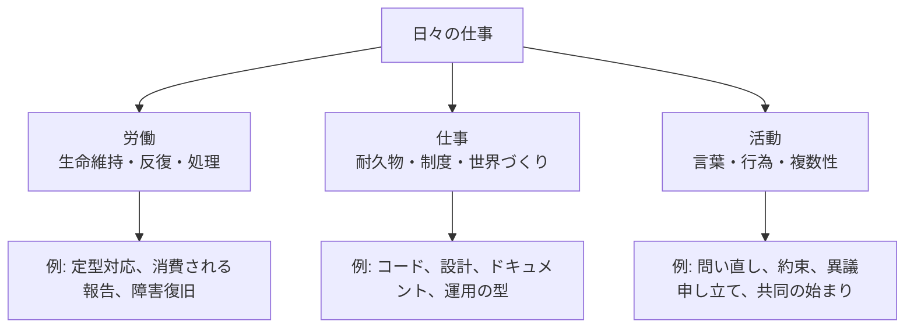

# アーレントの労働・仕事・活動を仕事で考える

## 先に結論

「ハンナ・アーレントは『人間の条件』で、人間の活動を3つに分けた」という記憶は、かなり正しい。

ただし、用語は少し補正したほうがよい。英語版では `labor` / `work` / `action`。日本語の既存邦訳・出版社紹介では、勤労よりも「労働」・「仕事」・「活動」とされることが多い。

この区分は、そのまま現代日本語の「仕事」とは対応しない。私たちが日常で言う「仕事」は、アーレントの意味では、労働的な部分、仕事的な部分、活動的な部分が混ざった複合体です。

だから実践上の問いは、こう置くとよい。

> 自分の「仕事」のなかで、生命維持のための反復である労働、耐久的な世界を作る仕事、他者とともに新しい始まりを作る活動は、どの比率で混ざっているのか。

とくに人間性の復活を考えるなら、単に「労働を減らす」だけでは足りない。
仕事における活動とは何か、つまり、他者の前で言葉と行為を通じて自分を現し、共同の世界に新しい始まりを差し込むことは何かを考える必要がある。

## エビデンス: 記憶はどこまで正しいか

一次情報に近い確認から見る。

University of Chicago Press の 2018 年版ページでは、『The Human Condition』の目次が公開されている。構成上、第 III 部が `Labor`、第 IV 部が `Work`、第 V 部が `Action` になっている。これは、この三分法が本書の中核構造であることを示している。

筑摩書房の『人間の条件』ページも、日本語で「《労働》《仕事》《活動》の三側面から考察」と説明し、目次でも第3章「労働」、第4章「仕事」、第5章「活動」としている。

研究用の確認として、Stanford Encyclopedia of Philosophy は、アーレントが `vita activa` を `labor, work, and action` の三カテゴリーで分析すると整理している。Internet Encyclopedia of Philosophy も、『The Human Condition』における人間活動の三分法として同じ区分を説明している。

したがって、検証結果は次の通り。

| 記憶 | 判定 | 補足 |
| --- | --- | --- |
| アーレントは『人間の条件』で人間の活動を三つに分けた | ほぼ正しい | 対象は `vita activa`、つまり活動的生活の基本活動 |
| 三つは仕事・勤労・活動である | 一部修正 | 標準的には `labor` = 労働、`work` = 仕事、`action` = 活動 |
| 仕事のなかに三つが混ざる | 応用として妥当 | ただしアーレント本人の分類そのものではなく、現代の仕事への読解 |
| 人間性の復活には活動が重要 | アーレント的に強い読み筋 | 活動は複数性、言葉、行為、公共性、自由に深く関わる |

## 三つの活動を分ける

アーレントの区分は、職種分類ではない。
「工場労働者は労働」「職人は仕事」「政治家は活動」というような単純なラベルではない。
むしろ、人間の営みを支える条件の違いを見るための概念です。

| 区分 | 英語 | 対応する条件 | 何をしているか | 産物の性格 |
| --- | --- | --- | --- | --- |
| 労働 | labor | 生命 | 食べ、消費し、生命過程を維持する | 消費され、反復が必要 |
| 仕事 | work | 世界性 | 道具、制度、作品、建物など人工の世界を作る | ある程度持続する |
| 活動 | action | 複数性 | 他者と語り、行為し、関係を始める | 物ではなく出来事・関係・歴史を生む |

### 労働: 生きるための反復

労働は、生命を維持するための反復です。
食べる、片づける、補充する、処理する、また明日も同じことをする。

この領域は軽視してよいものではない。生命を維持しなければ、人は何もできない。
ただし、労働は終わらない。成果は消費され、また必要になる。

現代の仕事で言えば、次のようなものは労働的です。

- 毎日発生する定型処理
- 何度も消費される報告作成
- ひたすら未処理キューを空にする作業
- 壊れた状態を元に戻すだけの緊急対応
- 生活費や組織存続のために避けられない反復業務

これらは必要だが、ここだけに閉じ込められると、人は「生き延びるために処理し続ける存在」になりやすい。

### 仕事: 持続する世界を作る

仕事は、人工的で比較的持続する世界を作る活動です。
道具、建物、制度、文章、ソフトウェア、設計図、チームの運用ルールなどは、自然にそのまま存在するものではない。
人が素材を加工し、形を与え、他の人も使えるものとして残す。

現代の仕事で言えば、次のようなものは仕事的です。

- 長く使われる設計やコードを書く
- 読み返されるドキュメントを作る
- チームの運用手順を整える
- プロダクトやサービスの構造を作る
- 将来の人が住める「作業環境」や「知識の地形」を残す

仕事の良さは、努力がすぐ消費されず、世界の一部として残ることです。
人間は、ただ生命を回すだけではなく、そこに住める世界を作る。

ただし、仕事にも危うさがある。
作ることは目的と手段の論理に入りやすい。
「何を作るか」「どう作るか」「どれだけ効率よく作るか」に集中するあまり、誰とどんな世界を共有するのかが消えることがある。

### 活動: 他者とともに始める

活動は、物を作ることではなく、人と人とのあいだで起こる。
アーレントにとって、活動は言葉と切り離せない。
Stanford Encyclopedia of Philosophy も、『人間の条件』では行為と言葉の結びつきが重視されると整理している。

活動では、人は単に「何をする人か」ではなく、「誰であるか」を現す。
命令を処理するだけでも、成果物を製造するだけでもなく、他者の前に立ち、語り、約束し、異議を唱え、始まりを作る。

現代の仕事で言えば、次のようなものは活動的です。

- 会議で、誰も言っていないが必要な問いを出す
- 顧客や同僚と、目的そのものを問い直す
- 失敗を隠さず共有し、次の共同作業の条件を作る
- 仕様では拾えない現場の現実を言葉にする
- 自分の責任で提案し、他者と約束を結ぶ
- チームがまだ持っていない新しい始まりを作る

活動は、成果物として測りにくい。
しかし、仕事の場から活動が消えると、人は交換可能な処理装置に近づく。
人間性の復活という言葉を使うなら、その中心にはこの活動の回復があると思われる。

## 日々の仕事では混ざっている

ここが重要です。
現実の「仕事」は、三つのどれか一つではない。
一つのタスクの中にも、労働・仕事・活動が混ざる。

たとえば、バグ修正を考える。

| 同じバグ修正の中身 | アーレント的に見ると |
| --- | --- |
| アラートを止め、サービスを戻す | 労働的。生命維持に近い反復的な保守 |
| 再発しにくい設計に直し、テストとドキュメントを残す | 仕事的。持続する人工物を作る |
| なぜこの優先順位になったのかをチームで問い直し、責任と約束を更新する | 活動的。他者との間に新しい関係と始まりを作る |

つまり、同じ「仕事」でも、ただ処理して終わると労働に近い。
残るものを作れば仕事になる。
他者とのあいだで意味、責任、約束、始まりを作れば活動になる。

## 仕事における活動とは何か

仕事における活動とは、単に「会議に出ること」ではない。
会議も、ただ報告を消費するだけなら労働的になりうる。
議事録を残し、意思決定の構造を作るなら仕事的です。
しかし、誰かが問いを発し、他者が応答し、まだなかった共同の方向が生まれるなら、そこには活動がある。

活動には、少なくとも次の要素がある。

| 要素 | 仕事での現れ方 |
| --- | --- |
| 複数性 | 自分と違う人がいることを前提にする |
| 言葉 | 沈黙した処理ではなく、意味を共有する |
| 行為 | 発言だけでなく、実際の責任ある動きが伴う |
| 始まり | 既存プロセスの反復ではなく、新しい方向を開く |
| 公共性 | 自分の内面だけで完結せず、他者の前に現れる |
| 記憶 | その行為が物語として残り、次の人の条件になる |

この意味では、仕事における活動は「偉い人の意思決定」だけではない。
むしろ、日々の小さな場面に現れる。

- 「この仕様は本当に利用者のためになっているのか」と聞く
- 「この手順は新人にだけ負担を押しつけていないか」と言う
- 「私はこの方針に責任を持つ」と引き受ける
- 「今までの暗黙知を、みんなが扱える形にしよう」と始める
- 「この仕事の意味を、もう一度言葉にしよう」と場を作る

これらは、単なる感情表明ではない。
他者の前で世界に関わる行為です。

## 人間性の復活を「活動」から考える

アーレントを現代の仕事に接続するとき、注意したいことがある。
彼女の議論をそのまま「会社で自己実現しよう」という話に縮めると、かなり薄くなる。
アーレントの活動は、消費社会や管理された社会の中で失われがちな公共性・自由・複数性に関わる重い概念です。

それでも、仕事の現場に引き寄せる価値はある。
現代の仕事は、労働化しやすい。
チケットを消し、通知を処理し、数字を追い、次のスプリントに入る。
生成AIや自動化が入ると、処理量はさらに増えるかもしれない。
そのとき、人間がただ「より速い処理者」になるなら、人間性は回復しない。

人間性の復活は、少なくとも次の方向にあると思われる。

1. 労働を見える化する  
   反復処理、消費されるだけの作業、生活維持のための負荷を見えるようにする。

2. 仕事を残る形にする  
   一回限りの処理で終わらせず、次の人が住める世界として、コード、文書、制度、運用を残す。

3. 活動の場を守る  
   問い、異議、約束、共同の始まりが起こる余白を守る。

4. 活動を成果物だけで測らない  
   活動は物ではなく関係と出来事を生む。短期の生産性指標だけでは見落としやすい。

5. 「誰が現れたか」を見る  
   何が作られたかだけでなく、その過程で誰がどう語り、どう責任を引き受け、どんな関係が生まれたかを見る。

## ふりかえりの問い

自分の仕事を、次の問いで棚卸しするとよい。

| 問い | 見たいもの |
| --- | --- |
| 今日やったことのうち、明日また同じように必要になるものは何か | 労働 |
| 今日やったことのうち、来月の誰かを助ける形で残るものは何か | 仕事 |
| 今日やったことのうち、他者との関係や約束を変えたものは何か | 活動 |
| 自分はどこで交換可能な処理者になっていたか | 労働への閉じ込め |
| 自分はどこで住める世界を作っていたか | 仕事の回復 |
| 自分はどこで他者の前に現れ、始まりを作っていたか | 活動の回復 |

この区分は、仕事の価値に序列をつけるためではない。
労働は必要で、仕事は必要で、活動も必要です。
問題は、どれか一つに人間を閉じ込めることです。

日々の仕事が苦しくなるとき、そこではしばしば労働だけが増え、仕事として残るものが減り、活動として他者と始める場が消えている。
アーレントの三分法は、その苦しさを「気合い」や「やりがい」の問題にせず、活動の構造として見るための道具になる。

## まだ確信がない点

このページは、アーレント研究としては入口です。
とくに「人間性の復活」という言い方は、この記事側の応用です。
アーレント本人の語彙としてそのまま置くより、彼女の複数性・公共性・活動の議論から現代の仕事を読むための仮説として扱うのが誠実だと思われます。

また、企業や組織の仕事は、アーレントが重視した政治的公共性とは同じではない。
会社の会議をそのままポリスに見立てるのは危うい。
それでも、他者の前で言葉と行為を通じて新しい関係を始める、という活動の核は、仕事の現場にも部分的に現れると考えられる。

## 一次情報源・参考資料

- [University of Chicago Press / The Human Condition](https://press.uchicago.edu/ucp/books/book/chicago/H/bo29137972.html)
- [筑摩書房 / 『人間の条件』ハンナ・アーレント](https://www.chikumashobo.co.jp/product/9784480081568)
- [Stanford Encyclopedia of Philosophy / Hannah Arendt](https://plato.stanford.edu/entries/arendt/index.html)
- [Internet Encyclopedia of Philosophy / Hannah Arendt](https://iep.utm.edu/hannah-arendt/)
