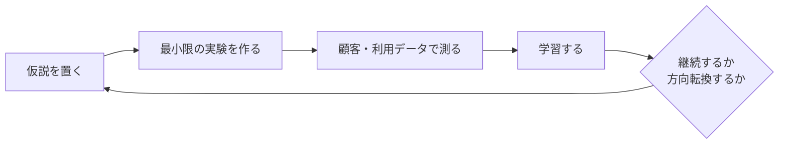

# fail-fast と加速度主義はどちらが先か

## 先に結論

「fail-fast というソフトウェア上の概念」と「accelerationism という名前のついた思想」を比べるなら、**fail-fast の方が先**です。

少なくとも 1981 年には、Jim Gray がトランザクション処理と高可用性システムの文脈で `fail-fast` なモジュールを論じています。一方、`accelerationism` という用語が政治思想・哲学の領域で明確に整理されるのは、主に 2010 年代の議論として扱うのが妥当です。

ただし、比較対象を「加速度主義という名前」ではなく「加速度主義的な思想の源流」に広げると、話は少し変わります。Marx、Deleuze and Guattari、Lyotard、Nick Land / CCRU などへ遡る整理があり、1970 年代以前の思想まで視野に入ります。

したがって、答えは次のように分けるのが正確です。

| 比較するもの | どちらが先か | 理由 |
| --- | --- | --- |
| ソフトウェア概念としての `fail-fast` vs 用語としての `accelerationism` | `fail-fast` が先 | Jim Gray の 1981 年論文に `fail-fast` modules が出てくる |
| アジャイル開発文化で語られる「fail fast」 vs 加速度主義の思想的源流 | 加速度主義の源流の方が先とも言える | 源流を Marx や 1970 年代フランス思想まで含める整理がある |
| Agile Manifesto そのもの vs accelerationism という用語の現代的整理 | Agile Manifesto が先 | Agile Manifesto は 2001 年、Noys や #ACCELERATE 周辺の整理は 2010 年代 |
| 両者に直接の系譜関係があるか | 強い証拠は見当たらない | fail-fast は信頼性設計・デバッグ・仮説検証、加速度主義は資本主義・技術・社会変容の思想 |

このページの立場は、**似て見えるが、直接つながった概念として扱うのは危うい** です。

## 年表で見る

| 時期 | 概念・文献 | 位置づけ |
| --- | --- | --- |
| 1848 年 | Marx and Engels, *The Communist Manifesto* | Britannica は、資本主義の強化がその終焉につながるという Marx の議論を、加速度主義的思想の源流の一つとして整理している |
| 1972-1980 年 | Deleuze and Guattari, *Capitalism and Schizophrenia* | Urbanomic / Britannica の整理では、加速度主義の思想的系譜に含まれる |
| 1981 年 | Jim Gray, [The Transaction Concept: Virtues and Limitations](https://jimgray.azurewebsites.net/papers/thetransactionconcept.pdf) | `fail-fast` computer modules が論じられる。信頼性設計の文脈 |
| 2001 年 | [Agile Manifesto](https://agilemanifesto.org/iso/ja/manifesto.html) | 「fail fast」とは直接言っていないが、動くソフトウェア、変化への対応、短いリリース間隔を重視する |
| 2004 年 | Jim Shore, [Fail Fast](https://martinfowler.com/ieeeSoftware/failFast.pdf) | ソフトウェアを「即座に、見える形で失敗させる」デバッグ・設計原則として説明 |
| 2008-2011 年頃 | [Lean Startup](https://theleanstartup.com/principles) | MVP、validated learning、Build-Measure-Learn の文脈で「早く学習する」実務思想が普及 |
| 2010 年 | Benjamin Noys, [The Persistence of the Negative](https://edinburghuniversitypress.com/book-the-persistence-of-the-negative.html) | `accelerationism` が現代思想の用語として整理される重要な地点 |
| 2013 年 | Williams and Srnicek, [#ACCELERATE MANIFESTO](https://criticallegalthinking.com/2013/05/14/accelerate-manifesto-for-an-accelerationist-politics/) | 左派加速度主義のマニフェストとして広く参照される |
| 2014 年 | Mackay and Avanessian eds., [#Accelerate: The Accelerationist Reader](https://www.urbanomic.com/book/accelerate/) | 加速度主義の系譜を読本として編む |

## fail-fast はどこから来たのか

Jim Gray の 1981 年論文は、トランザクション、障害、可用性の文脈で `fail-fast` を扱っています。そこでの要点は、モジュールが中途半端に壊れたまま動き続けるのではなく、正しく動くか、失敗を検出して何もしないかのどちらかであるべきだ、という信頼性設計の発想です。

この時点の `fail-fast` は、現在のスタートアップ文脈で言う「市場で早く失敗する」とは少し違います。主語は事業仮説ではなく、コンピュータシステムのモジュールです。目的も「大胆に失敗する」ことではなく、障害を局所化し、冗長化や復旧の仕組みを効かせやすくすることです。

2004 年の Jim Shore の記事では、より開発者の日常に近い意味になります。設定ミスや不正な状態を黙って握りつぶすのではなく、問題が起きた瞬間に見える形で止める。これにより、バグの発見と修正が早くなる、という考えです。

つまり、ソフトウェアにおける fail-fast の核は次のように整理できます。

- 誤った状態を長く隠さない
- 問題をできるだけ発生源の近くで検出する
- 失敗を観測可能にする
- 障害の影響範囲を小さくする
- 修正と学習を早める

これは「壊してよい」という原則ではありません。むしろ逆で、**壊れ方を制御することで、システム全体の信頼性を上げる** ための考え方です。

## アジャイルは fail-fast を直接掲げているのか

Agile Manifesto は 2001 年に公開されています。ただし、本文に「fail fast」という言葉が中心原理として出てくるわけではありません。

アジャイル宣言が明示しているのは、プロセスやツールより個人と対話、包括的なドキュメントより動くソフトウェア、契約交渉より顧客との協調、計画に従うことより変化への対応を重視する、という価値判断です。

また、アジャイル宣言の背後にある原則では、価値あるソフトウェアを早く継続的に提供すること、2-3 週間から 2-3 か月の短い間隔で動くソフトウェアをリリースすること、定期的に振り返ってやり方を調整することが示されています。

ここから、アジャイルと fail-fast は相性がよいと言えます。短いサイクルで動くものを出し、フィードバックを得て、変更を受け入れるからです。

しかし、アジャイルそのものを「早く失敗する思想」とだけ要約すると雑になります。アジャイルの中心は、失敗それ自体ではなく、**動くソフトウェア、顧客との協調、変化への適応、持続可能な改善** です。

## Lean Startup は「早く失敗せよ」なのか

Lean Startup になると、fail fast に近い言い回しがより事業仮説の検証に近づきます。MVP を作り、測定し、学び、方向転換するか継続するかを判断する。この文脈では「失敗」は、仮説が市場や顧客に合わないことを早く知る、という意味になります。

ただし Lean Startup の公式説明は、Lean は単に「早く安く失敗すること」ではない、と明記しています。中心にあるのは、プロダクト開発に方法論とプロセスを持ち込み、継続的にビジョンを検証することです。

ここでも、実務上のポイントは「失敗を増やす」ではありません。

fail fast は、制御された学習サイクルの一部です。

## 加速度主義は何を加速するのか

加速度主義は一枚岩ではありません。左派加速度主義、右派加速度主義、Nick Land 周辺の思想、最近の技術楽観的な用法など、かなり異なるものが同じ語で語られます。

ここでは最小限に、現代思想としての加速度主義を次のように押さえます。

> 資本主義、技術、抽象化、社会変容の力を単に拒否・減速するのではなく、それらを押し進めることによって、既存秩序とは別の未来や変容を開こうとする思想群。

Urbanomic の `#Accelerate: The Accelerationist Reader` は、加速度主義を 1990 年代の UK サイバーカルチャーや Nick Land / CCRU から、さらに Marx やポスト 68 年の思想へ遡る系譜として提示しています。Britannica も、Marx、Deleuze and Guattari、1990 年代の CCRU、2010 年代の Noys や Williams / Srnicek へつながる流れとして整理しています。

重要なのは、加速度主義における「加速」は、ソフトウェア開発のフィードバックサイクルを速くする、という意味に限られないことです。対象は、資本主義の抽象化、技術インフラ、社会制度、政治的可能性、あるいは崩壊の力学です。

このため、fail-fast と加速度主義は同じ「速さ」の語彙を共有しているように見えても、扱っている問題のスケールがかなり違います。

## 直接の関係はあるのか

現時点で確認できる資料からは、**アジャイル開発の fail-fast が加速度主義から来た**、または **加速度主義がソフトウェアの fail-fast から来た** と言える証拠は見当たりません。

両者の出自は別です。

| 項目 | fail-fast | 加速度主義 |
| --- | --- | --- |
| 主な領域 | ソフトウェア工学、信頼性設計、開発プロセス、事業仮説検証 | 哲学、政治思想、批判理論、技術社会論 |
| 失敗・加速の対象 | バグ、障害、不正状態、事業仮説 | 資本主義、技術、抽象化、社会変容 |
| 目的 | 早期検知、影響範囲の縮小、学習、修正 | 既存秩序の変容、脱出、または崩壊をめぐる理論 |
| 制御の前提 | 小さく試し、観測し、戻れるようにする | 制御可能性そのものが争点になりやすい |
| 実務上の態度 | リスクを小さくして学ぶ | 大きな構造変化をどう扱うかを問う |

似て見える理由はあります。

どちらも「遅い安定」への不信を含みます。問題を長く隠すより、早く露出させる。変化を避けるより、変化の中で学ぶ。既存の均衡に安住するより、動きを強める。

ここに、Lean Startup やシリコンバレーのスタートアップ文化が重なると、さらに似て見えます。Lean Startup は、MVP、validated learning、Build-Measure-Learn によって、事業仮説を早く市場にさらし、学習を次の判断に戻す方法論です。Paul Graham も 2012 年の `Startup = Growth` で、スタートアップを「速く成長するよう設計された会社」と説明しています。この文脈では、速さは思想上の加速というより、学習速度と成長率を上げるための経営上の圧力です。

Facebook の 2012 年 S-1 にある Zuckerberg のレターは、この文化をより強い標語で表しています。そこでは `Move Fast` が中核価値の一つとされ、「速く動くことで、より多く作り、より速く学ぶ」と説明されています。さらに `Move fast and break things` という社内の言い回しも示されています。これは Silicon Valley 的な速度文化を象徴する表現ですが、ここでも主眼は、プロダクト開発・組織運営・市場機会への対応です。

したがって、Lean Startup や Silicon Valley culture は、fail-fast と加速度主義の中間に見える層です。どちらにも「速度」「実験」「既存の遅さへの不信」があります。しかし、Lean Startup の fail fast は、基本的には **仮説検証を速くして損失を限定する** ための実務です。Facebook 的な `move fast` も、**市場機会を逃さず、プロダクト学習を速める** ための企業文化です。資本主義や技術社会そのものを加速させることで別の秩序や崩壊を問う加速度主義とは、対象も射程も違います。

つまり、ここで止めると危険です。fail-fast は、観測可能で可逆的な実験を増やすための工学的・実務的な原則です。Lean Startup / Silicon Valley の速度文化は、それを市場学習や成長へ拡張した事業文化です。加速度主義は、社会全体の技術的・経済的・政治的な力をどう捉えるかという思想です。

## なぜ危険に見えるのか

「ソフトウェア概念としての fail-fast は安全に見えるが、シリコンバレー文化や加速度主義は危険に見える」という感覚は自然です。

違いは、失敗のスケール、戻しやすさ、そして失敗コストを誰が負担するかにあります。

ソフトウェア工学の fail-fast は、本来は安全装置に近い考えです。壊れることを推奨しているのではなく、壊れた状態を長く隠さず、異常を早く検知し、影響範囲を小さくし、復旧できるようにする。つまり、加速というより **異常検知と非常停止の設計** に近い。

Lean Startup も、厳密には「失敗を増やす」思想ではありません。MVP や validated learning は、仮説を小さく検証し、間違っていた場合の損失を限定するための方法です。ただし、ここで対象はコードから市場やユーザーへ広がります。実験に巻き込まれるのは、開発者の手元のモジュールだけではなく、顧客、ユーザー体験、チーム、資金、ブランドです。

シリコンバレー的な `move fast` 文化が危険に見えるのは、この境界がさらに広がるからです。速度と成長が強い価値になると、壊れるものはテスト環境だけではなく、プライバシー、労働環境、公共圏、規制、地域社会、民主的なプロセスになりえます。しかも、速度の利益を得る人と、壊れた結果を負担する人がずれることがあります。

加速度主義は、さらに大きなスケールを扱います。資本主義、技術、社会制度、欲望、インフラのようなものを加速させる話になるため、そもそも誰が制御できるのか、戻れるのか、失敗の代償を誰が払うのかが問題になります。ここでは、制御可能性そのものが争点です。

この違いは、次のように整理できます。

| 概念 | 安全に見える度合い | 理由 |
| --- | --- | --- |
| fail-fast software | 比較的安全に見える | 小さく、観測可能で、復旧可能な失敗を目指す |
| Lean Startup | 中間 | 仮説検証としては健全だが、市場やユーザーを巻き込む |
| Silicon Valley speed culture | 危うく見える | 速度と成長が倫理・安全・公共性を押しのけやすい |
| 加速度主義 | かなり危うく見える | 社会全体の加速を扱い、制御不能性を含む |

したがって、直感としてはこう言えます。fail-fast は「失敗を早く閉じ込める」考えです。シリコンバレーの速度文化は「失敗を市場に出して学ぶ」考えに近づきます。加速度主義は「失敗や矛盾を含む大きな構造をさらに進める」思想です。後ろに行くほど、失敗の半径が大きくなり、誰が止められるのかが不明瞭になります。

## 実務での分け方

アジャイル開発で fail fast と言うときは、加速度主義と結びつけるより、次のように理解する方が実務的です。

- 失敗を小さくする
- 失敗を早く見つける
- 失敗から学ぶ
- 失敗を隠さない
- 失敗した実験を、次の判断に戻す

一方で、加速度主義を読むときは、単なる「スピード礼賛」として読まない方がよいです。加速度主義は、技術と資本主義の速度をめぐる思想であり、そこには解放、支配、崩壊、制御不能性が入り混じっています。

この二つを混ぜると、たとえば「速くやればよい」「失敗が多いほどよい」「ブレーキは悪い」という粗い議論になりやすい。これは、fail-fast の実務にも、加速度主義の理解にもよくありません。

むしろ、次の対比で覚えるとよさそうです。

| 観点 | fail-fast | 加速度主義 |
| --- | --- | --- |
| 一言で言うと | 制御された早期失敗 | 構造的な加速の思想 |
| よい使い方 | 小さな実験と早い検知 | 技術・資本・社会変容の読解 |
| 悪い使い方 | 雑に壊して学習と言う | 速さそのものを善とみなす |
| 実務上の警句 | 早く失敗するほど、戻れる設計が必要 | 加速するほど、誰が代償を払うのかを問う必要がある |

## まとめ

エビデンスベースで言うと、**ソフトウェア概念としての fail-fast は、加速度主義という名前のついた現代思想より先に確認できます**。1981 年の Jim Gray 論文が強い根拠です。

ただし、加速度主義の思想的源流まで含めるなら、Marx や 1970 年代フランス思想に遡る整理があり、単純に「fail-fast が思想としても先」とは言い切れません。

両者の直接の系譜関係は薄いと見た方がよいです。fail-fast は、信頼性設計、デバッグ、仮説検証のための実務原則です。加速度主義は、資本主義と技術の進行をどう捉えるかという哲学・政治思想です。

似ているのは、どちらも「遅く隠す」より「早く露出させる」方向を持つからです。さらに Lean Startup やシリコンバレー文化を経由すると、その類似は強く見えます。MVP、A/B テスト、growth、`move fast` は、どれも速度と学習を重視するからです。

しかし、fail-fast は **制御された実験**、Lean Startup / Silicon Valley の速度文化は **市場学習と成長のための高速化**、加速度主義は **制御可能性も含めて問う加速の思想** と分けて理解するのが、いちばん誠実だと思われます。危険に見えるかどうかは、速度そのものよりも、失敗の半径、戻しやすさ、失敗コストの負担者が見えているかで変わります。

## 参照資料

- Jim Gray, [The Transaction Concept: Virtues and Limitations](https://jimgray.azurewebsites.net/papers/thetransactionconcept.pdf), 1981.
- Agile Manifesto, [アジャイルソフトウェア開発宣言](https://agilemanifesto.org/iso/ja/manifesto.html), 2001.
- Agile Manifesto, [アジャイル宣言の背後にある原則](https://agilemanifesto.org/iso/ja/principles.html), 2001.
- Jim Shore, [Fail Fast](https://martinfowler.com/ieeeSoftware/failFast.pdf), *IEEE Software*, 2004.
- The Lean Startup, [Methodology](https://theleanstartup.com/principles).
- Paul Graham, [Startup = Growth](https://www.paulgraham.com/growth.html), 2012.
- Facebook, Inc., [Form S-1 Registration Statement](https://www.sec.gov/Archives/edgar/data/1326801/000119312512034517/d287954ds1.htm), 2012.
- Benjamin Noys, [The Persistence of the Negative](https://edinburghuniversitypress.com/book-the-persistence-of-the-negative.html), Edinburgh University Press, 2010.
- Alex Williams and Nick Srnicek, [#ACCELERATE MANIFESTO for an Accelerationist Politics](https://criticallegalthinking.com/2013/05/14/accelerate-manifesto-for-an-accelerationist-politics/), 2013.
- Robin Mackay and Armen Avanessian eds., [#Accelerate: The Accelerationist Reader](https://www.urbanomic.com/book/accelerate/), Urbanomic, 2014.
- Encyclopaedia Britannica, [Accelerationism](https://www.britannica.com/topic/accelerationism).
