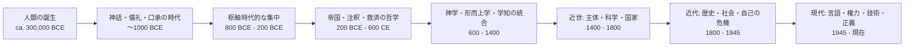

# 哲学史の見取り図

このページは、**人類の誕生から現代まで**をひと続きで見たいときのための、かなり粗い地図です。
ただし厳密に言えば、哲学そのものはホモ・サピエンスの誕生と同時に始まったわけではありません。
人類の長い前史では、神話、儀礼、埋葬、法、口承叙事詩のなかに「世界は何か」「どう生きるべきか」「秩序はどこから来るか」という問いが蓄積され、**文字化された論争的思考としての哲学**はかなり後になって現れます。

また、`西洋` と `東洋` という分け方もかなり雑です。
このページでは便宜上、

- `西洋`: ギリシア・ローマ、キリスト教圏、近代ヨーロッパ、英米圏を中心とする流れ
- `東洋`: インド、中国、仏教圏、日本を中心とする流れ

として扱います。実際には、イスラーム哲学、ユダヤ哲学、中央アジア、植民地経験を経た近現代思想など、境界をまたぐ流れがとても重要です。
そのため、ここでの区分は整理のための仮置きであり、最終的な正解だとは思わないほうがよいです。

人類の長い前史そのものについては、既存ページの [Dawn of Everything（万物の黎明）](/experimental-commons/books/dawn-of-everything/) も補助線になります。

## 長い時間軸

## 時代ごとのざっくり整理

| 時代 | 西洋哲学の軸 | 東洋哲学の軸 | 主要な問い |
| --- | --- | --- | --- |
| 人類前史 - 紀元前1千年紀以前 | 神話、祭儀、法、自然秩序の語り | ヴェーダ、古代中国の礼秩序、神話的宇宙論 | 世界秩序、死、共同体、聖と俗 |
| 紀元前8世紀 - 紀元前2世紀 | ソクラテス以前、ソクラテス、プラトン、アリストテレス | ウパニシャッド、ブッダ、孔子、老子、墨子、孟子、荀子、荘子 | 宇宙の原理、徳、政治、自己修養 |
| 紀元前2世紀 - 6世紀 | ストア派、エピクロス派、懐疑派、新プラトン主義、アウグスティヌス | 龍樹、世親、漢代儒学、玄学、中国仏教の形成 | 苦しみ、救済、理性、内面 |
| 7世紀 - 14世紀 | イスラーム哲学、ユダヤ哲学、スコラ学 | シャンカラ、ラーマーヌジャ、禅、華厳、道元、朱子学 | 信仰と理性、存在、普遍、修行 |
| 15世紀 - 18世紀 | マキャヴェッリ、デカルト、ホッブズ、スピノザ、ロック、ヒューム、ルソー、カント | 陽明学、戴震、伊藤仁斎、荻生徂徠、本居宣長 | 国家、認識、自然科学、道徳法則 |
| 19世紀 - 1945年 | ヘーゲル、マルクス、キルケゴール、ニーチェ、フッサール、ハイデガー、分析哲学 | 西田幾多郎、タゴール、ガンディー、近代新儒家の萌芽 | 歴史、主体、社会、近代批判 |
| 1945年以後 | アーレント、ウィトゲンシュタイン後期、フーコー、デリダ、ロールズ、クワイン、クーン、バトラー | 西谷啓治、牟宗三、杜維明、アンベードカル受容、現代仏教思想 | 権力、言語、正義、技術、脱植民地化 |

## テーマ1: 世界は何からできているか

### 西洋

- **タレス / アナクシマンドロス / ヘラクレイトス / パルメニデス**  
  哲学の出発点としてよく置かれる人々。世界の根源は水か、無限定者か、火か、あるいは変化ではなく不変の有であるか、という形で、神話的説明から一歩ずらした自然探究を始めます。
- **プラトン『国家』『ティマイオス』**  
  感覚世界の背後にイデアを置き、秩序ある宇宙と知の条件を結びつけます。形而上学、政治、教育が分離していません。
- **アリストテレス『形而上学』**  
  存在を「あるものとしてあるもの」として問う方向を明確化し、形相因・質料因・目的因などで世界説明の枠組みを整えます。
- **プロティノス『エネアデス』**  
  万物が「一者」から流出するという新プラトン主義的宇宙論で、後のキリスト教・イスラーム・中世哲学に長く効きます。
- **スピノザ『エチカ』**  
  神と自然を切り離さず、唯一の実体として把握しようとしました。近代合理主義の極点のひとつです。

### 東洋

- **ウパニシャッド**  
  ブラフマンとアートマンの関係を問うことで、宇宙原理と自己の根拠を同時に考えます。世界論と解脱論が分かれていません。
- **老子『道徳経』 / 荘子『荘子』**  
  世界を強制的な概念秩序で固定せず、`道` と生成変化のほうへ重心を置きます。存在論はそのまま政治批判・生の技法にもつながります。
- **ブッダ / 初期仏教経典**  
  固定的実体よりも縁起と無我を重視します。世界を「何でできているか」より、「苦がどう成立するか」という相関的な見方で捉え直します。
- **龍樹『中論』**  
  ものごとが自性をもって自立的に存在するという見方を崩し、空の立場を徹底します。東アジア仏教への影響が非常に大きいです。
- **朱熹『四書章句集注』**  
  `理` と `気` の枠組みで世界と人間秩序を統合し、宋明理学の標準形を作りました。

## テーマ2: どう生きるべきか

### 西洋

- **ソクラテス**  
  「善く生きる」とは何かを対話によって問い続けた人物として記憶されます。著作は残しておらず、主にプラトンやクセノポン経由で知られます。
- **アリストテレス『ニコマコス倫理学』**  
  幸福を一時的快楽ではなく、徳に基づく活動として捉えます。習慣、性格、共同体が倫理の中核にあります。
- **エピクロス派**  
  快楽を粗野な享楽ではなく、苦痛の不在と平静として理解しました。
- **ストア派（エピクテトス、セネカ、マルクス・アウレリウス）**  
  自分に統御できるものとできないものを峻別し、宇宙秩序への同意と内的自由を強調します。
- **カント『道徳形而上学原論』**  
  行為の価値を結果よりも動機と普遍化可能性に求め、近代義務論の基礎を作ります。
- **ニーチェ『道徳の系譜』**  
  倫理を普遍的真理としてではなく、力関係と価値創造の歴史として読み替えます。

### 東洋

- **孔子『論語』**  
  倫理を抽象法則ではなく、`仁` `礼` `孝` `学` を通じた関係的実践として考えます。
- **孟子『孟子』**  
  人間には善の芽があると考え、倫理を人間本性の育成として捉えます。
- **荀子『荀子』**  
  逆に人間の自然状態に厳しい見方を取り、礼と教育の人工性を強調します。
- **ブッダ / 『法句経』など**  
  倫理は命令というより、執着と苦の連鎖を断つための修行の一部です。
- **王陽明『伝習録』**  
  知と行を分けず、良知の自覚を通じて倫理を実践に引き戻します。
- **道元『正法眼蔵』**  
  生き方を教義理解より坐禅実践に結びつけ、修行と悟りの分離を疑います。
- **ガンディー『ヒンド・スワラージ』**  
  近代文明批判、自己統治、非暴力をひとつの倫理政治思想として結びます。

## テーマ3: 国家と秩序は何によって正当化されるか

### 西洋

- **プラトン『国家』**  
  魂の秩序と国家の秩序を相同に捉え、哲人王を中心とする統治像を描きます。
- **アリストテレス『政治学』**  
  人間をポリス的動物として捉え、政治共同体を善く生きるための場と考えます。
- **アウグスティヌス『神の国』**  
  地上国家と神の国を区別しつつ、政治を救済史の視野に置きます。
- **マキャヴェッリ『君主論』**  
  政治を徳目の延長ではなく、権力維持と国家形成の技法として扱います。
- **ホッブズ『リヴァイアサン』**  
  自然状態の不安から主権国家を導き、近代国家論の強い基礎を作ります。
- **ロック『統治二論』 / ルソー『社会契約論』**  
  同意、権利、主権、一般意志という近代政治の語彙を整えます。
- **マルクス『資本論』『ドイツ・イデオロギー』**  
  国家や法を経済的・階級的編成の上部構造として読み替えます。
- **ロールズ『正義論』**  
  現代では、自由と平等を両立させる制度設計の思考実験として大きな影響を持ちます。

### 東洋

- **孔子 / 孟子**  
  政治の正当性を徳と民心に結びます。支配者の徳が秩序の条件だと考えます。
- **墨子『墨子』**  
  兼愛・非攻を掲げ、戦争や奢侈を批判します。かなり早い時期の普遍主義的政治思想とも読めます。
- **韓非子『韓非子』**  
  徳ではなく、法・術・勢によって秩序を維持しようとする法家思想の代表です。
- **『アルタ・シャーストラ』に代表されるインド政治思想**  
  国家運営、外交、統治技術をかなり現実主義的に扱います。
- **朱子学**  
  政治秩序を宇宙秩序と連続的に捉え、東アジアの官僚制や教育制度に強い影響を与えました。
- **荻生徂徠**  
  道徳の内面化より、制度・礼楽・政治技術の再構成を重視します。
- **アンベードカル『カーストの殲滅』**  
  近代インドにおいて、宗教・社会階層・政治的平等を根本から問い直しました。

## テーマ4: 何を知れるのか、どう知るのか

### 西洋

- **アリストテレス『分析論後書』**  
  論証、定義、学知の条件を整理し、長いあいだ知の標準を与えました。
- **フランシス・ベーコン『新機関』**  
  学知を演繹だけでなく観察・実験へつなぐ近代的方法論を提唱します。
- **デカルト『省察』**  
  方法的懐疑から出発して、確実性の基礎を主体の思考に置きます。
- **ロック / ヒューム**  
  観念の起源を経験に求め、因果や自己同一性の確実性を厳しく問い直します。
- **カント『純粋理性批判』**  
  認識は世界をそのまま写すのではなく、人間の認識形式によって条件づけられると論じます。
- **パース / ウィリアム・ジェイムズ**  
  真理を固定的対応ではなく、探究実践や帰結との関係で捉えます。
- **フッサール / ウィトゲンシュタイン / クワイン / クーン**  
  意識の現れ方、言語ゲーム、理論全体の見直し、科学革命などを通じて、20世紀の認識論を大きく組み替えました。

### 東洋

- **ニヤーヤ学派**  
  知識成立の手段を知覚・推理・類比・証言などとして厳密に分析しました。
- **陳那（ディグナーガ） / 法称（ダルマキールティ）**  
  仏教側から知覚と推理の理論を精緻化し、インド認識論の高度な論争を作ります。
- **朱熹**  
  `格物致知` を通じて、道徳修養と認識実践を一体化しました。
- **王陽明**  
  朱子学的な外在的探究を批判し、知を良知の覚醒へ引き戻します。
- **西田幾多郎『善の研究』**  
  近代日本で、主客分離以前の「純粋経験」を知の基底として捉え直しました。

## テーマ5: 自己・心・解放

### 西洋

- **アウグスティヌス『告白』**  
  内面の記憶、時間、意志を徹底して掘り下げ、自己の哲学を強めました。
- **デカルト**  
  `我思う、ゆえに我あり` によって、自己を確実性の拠点として置きます。
- **ヒューム**  
  固定的自我を見出せず、自己を知覚の束として捉えます。
- **キルケゴール**  
  実存、不安、跳躍を通じて、主体の生きた選択を前景化します。
- **フロイト以後の思想や実存主義**  
  主体は透明でも統一的でもない、という見方が広がります。
- **ハイデガー / サルトル / ボーヴォワール**  
  自己を本質ではなく、世界内存在、投企、他者関係のなかで捉え直します。

### 東洋

- **ウパニシャッド**  
  真の自己をアートマンとして探り、それを宇宙原理ブラフマンと接続します。
- **ブッダ**  
  逆に、永続する実体的自己を認めず、五蘊・縁起・無我から解放を考えます。
- **世親 / 唯識思想**  
  心のはたらきと表象の構造を精密に論じ、認識と解脱をつなぎます。
- **シャンカラ**  
  現象世界の多様性を究極的には非二元のブラフマンへ収斂させます。
- **禅と道元**  
  自己理解を概念的自己観察より実践へ移し、「身心脱落」のような仕方で語ります。
- **西谷啓治**  
  ニヒリズムのただなかで空と自己を再考し、近代の主体概念を仏教思想と交差させます。

## テーマ6: 歴史・言語・権力をどう考えるか

### 西洋

- **ヘーゲル『精神現象学』**  
  真理を固定命題ではなく、意識と歴史の運動として捉えます。
- **マルクス**  
  歴史を生産関係と階級闘争の運動として読み替え、哲学を実践へ向け直します。
- **ニーチェ**  
  真理や道徳を、その成立史と力学から解体します。
- **ウィトゲンシュタイン後期『哲学探究』**  
  意味を頭の中ではなく、言語使用と生活形式のなかに置きます。
- **フーコー**  
  知と権力の絡み合いから、主体形成と制度の歴史を分析します。
- **デリダ / バトラー**  
  テクスト、差延、遂行性を通じて、固定的主体や安定した意味を問い直します。

### 東洋

- **近代日本思想（西田、和辻、京都学派）**  
  西洋近代哲学を受容しつつ、場所、間柄、無、歴史世界を再構成しようとします。
- **ガンディー**  
  近代文明批判を、国家独立だけでなく生の形式そのものの問いへ広げました。
- **アンベードカル**  
  伝統の内部批判と近代的権利思想を接続し、カースト秩序と言語化された差別を政治哲学の中心へ押し上げました。
- **現代新儒家（牟宗三、杜維明など）**  
  儒教を近代民主主義や人権とどう接続できるかを再考します。

## ここまでを一言でまとめると

- 古代では、西洋も東洋も「宇宙秩序」と「生の秩序」を切り離していないことが多い
- 中世では、注釈と学派形成を通じて巨大な体系ができる
- 近世では、主体、国家、科学的方法が前面に出る
- 近代以後は、歴史、権力、言語、資本、植民地性が哲学の中心論点になる
- 現代では、「西洋 / 東洋」という二分法自体が要検証になっている

つまり哲学史は、単に「誰が正しかったか」の列伝ではなく、
**世界像、自己像、秩序像がどう入れ替わってきたか**の履歴として読むほうが見通しがよいと思われます。

## 最初に読むならこのあたり

### 西洋哲学の入口

- **プラトン『国家』**: 正義、教育、政治、形而上学が一度に見える
- **アリストテレス『ニコマコス倫理学』**: 倫理と共同体の古典
- **デカルト『省察』**: 近代主体の起点
- **ヒューム『人間知性研究』**: 近代経験論の鋭さ
- **カント『純粋理性批判』**: 近代認識論の分水嶺
- **ニーチェ『道徳の系譜』**: 近代以後の価値批判の入口

### 東洋哲学の入口

- **『論語』**: 倫理と政治がどう連続しているかが見える
- **『道徳経』**: 反制度的・反固定的な世界観の入口
- **『孟子』**: 人間本性と政治の接続
- **ウパニシャッド / 『バガヴァッド・ギーター』**: インド思想の主要な軸
- **初期仏教経典 / 『中論』**: 無我と空の系譜
- **道元『正法眼蔵』**: 日本仏教思想の密度の高い入口

## 一次情報への入口

以下は、代表的テキストへ入るための公開リンクです。多くは翻訳版や公開アーカイブであり、厳密な校訂版が常にこれで足りるわけではありません。

### 西洋

- [Plato, *The Republic*](https://classics.mit.edu/Plato/republic.html)
- [Aristotle, *Nicomachean Ethics*](https://classics.mit.edu/Aristotle/nicomachaen.html)
- [Augustine, *Confessions*](https://www.ccel.org/a/augustine/confessions/confessions.html)
- [René Descartes, *Six Metaphysical Meditations*](https://www.gutenberg.org/ebooks/70091)
- [Thomas Hobbes, *Leviathan*](https://www.gutenberg.org/ebooks/3207)
- [John Locke, *Second Treatise of Government*](https://www.gutenberg.org/ebooks/7370)
- [David Hume, *An Enquiry Concerning Human Understanding*](https://www.gutenberg.org/ebooks/9662)
- [Immanuel Kant, *The Critique of Pure Reason*](https://www.gutenberg.org/ebooks/4280)
- [Immanuel Kant, *Fundamental Principles of the Metaphysic of Morals*](https://www.gutenberg.org/ebooks/5682)
- [G. W. F. Hegel, *Phenomenology of Mind*](https://www.marxists.org/reference/archive/hegel/works/ph/phconten.htm)

### 東洋

- [『論語』 Chinese Text Project](https://ctext.org/analects)
- [『孟子』 Chinese Text Project](https://ctext.org/mengzi)
- [『道徳経』 Chinese Text Project](https://ctext.org/dao-de-jing)
- [『荘子』 Chinese Text Project](https://ctext.org/zhuangzi)
- [*The Upanishads* (Sacred Texts Archive)](https://sacred-texts.com/hin/sbe01/index.htm)
- [*Bhagavad Gita*](https://www.holy-bhagavad-gita.org/)
- [*Anattalakkhaṇa Sutta* (SN 22.59)](https://suttacentral.net/sn22.59/en/sujato)
- [道元「現成公案」関連資料](https://www.sotozen.com/eng/library/key_terms/pdf/key_terms06.pdf)
- [M. K. Gandhi, *Hind Swaraj*](https://www.mkgandhi.org/hindswaraj/hindswaraj.php)
- [B. R. Ambedkar, *Annihilation of Caste* 関連テキスト](https://ccnmtl.columbia.edu/projects/mmt/ambedkar/web/texts.html)

## まだ粗い点

- 「西洋」と「東洋」の区分は教育上の便法で、実際の思想史はもっと混ざっています
- イスラーム哲学、ユダヤ哲学、アフリカ哲学、ラテンアメリカ哲学、フェミニズム思想、分析哲学の詳細はかなり圧縮しています
- インド哲学の内部区分、仏教思想の学派差、中国思想の王朝ごとの差異も、このページだけでは全く足りません

なので、このページは**全体像を見失わないための入口**として使うのがよく、ここから先は各流派ごとに別ページ化したほうが誠実だと思います。
