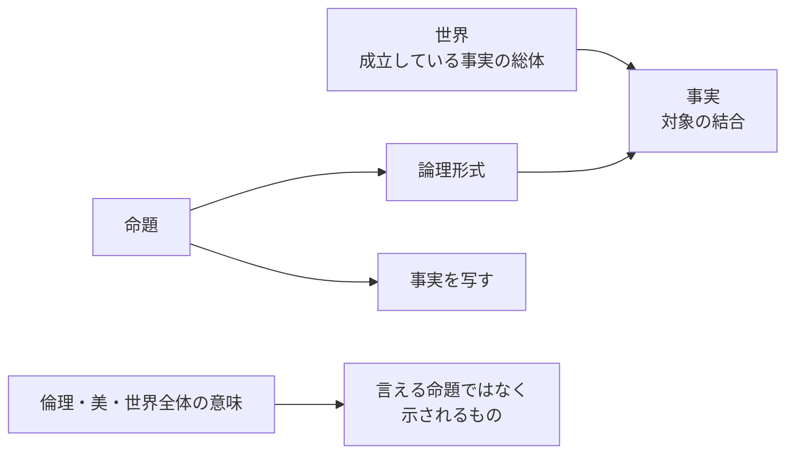

# ウィトゲンシュタイン、言語の限界、LLMの限界

## 先に結論

「ウィトゲンシュタインの哲学は、言語の限界を規定したものだ」という理解は、**半分正しい**。

ただし、その正しさは主に前期ウィトゲンシュタイン、つまり『論理哲学論考』に強く当てはまる。
後期ウィトゲンシュタインまで含めるなら、少し言い換えたほうがよい。

> 前期: 言語が世界を有意味に写す条件と、その外側を示す  
> 後期: 言語の意味は使用のなかで成立し、限界は生活形式・実践・規則のなかに現れる

つまりウィトゲンシュタインは、「言語にはここまでしか到達できない」という単純な境界線を引いたというより、**哲学的混乱がどのような言語観から生まれるか**を繰り返し検査した人だと見るほうがよい。

この視点は、LLM の限界を考えるときにもかなり使える。
LLM は驚くほど流暢に言語形式を扱えるが、そこから直ちに「世界を理解している」「規則を人間と同じ仕方で使っている」「社会的実践のなかで意味を担っている」とは言えない。

LLM の限界は、単に「知識量が足りない」ではない。
むしろ次の4層に分けると見通しがよい。

| 層 | 問い | LLMで問題になること |
| --- | --- | --- |
| 形式 | 文法・構文・統計的パターンを扱えるか | かなり強い |
| 意味 | 記号が世界・行為・目的に接続しているか | 訓練データだけでは弱い |
| 規則 | 規則を新しい場面で正しく適用できるか | 脆さが残る |
| 生活形式 | 言語使用が責任・身体・制度・共同体に埋め込まれているか | LLM単体では持ちにくい |

ウィトゲンシュタイン風に言えば、LLM は「言語ゲームの発話」を非常にうまく模倣できる。
しかし、それがそのまま「言語ゲームに参加している」ことを意味するかは別問題です。

## 検証: 「言語の限界を規定した」はどこまで正しいか

### 正しい点

『論理哲学論考』では、ウィトゲンシュタインは明らかに、言語・思考・世界の関係を論理的に整理しようとしている。

中心にあるのは、命題が世界の事実を「写像」するという考えです。
世界は事物の単なる集まりではなく、成立している事実の総体として捉えられる。
命題は、その事実の可能的配置を論理形式によって写す。

この枠組みでは、有意味に言えることは、事実として成立しうることに限られる。
論理、倫理、美、宗教、世界全体の意味のようなものは、命題として事実を記述するかたちでは言えない。

その意味では、前期ウィトゲンシュタインは、たしかに**有意味な命題の限界**を引こうとした。

### 誤解しやすい点

ただし、「言語の限界を規定した」という言い方には危険もある。

第一に、前期ウィトゲンシュタインは「言葉にできないものは存在しない」と言ったわけではない。
むしろ、言えないが示されるもの、あるいは語りえないものの重要性が最後に残る。

第二に、後期ウィトゲンシュタインは、前期のように言語の本質を単一の論理形式から説明するやり方を強く疑う。
後期では、意味は対象との対応だけで決まるのではなく、使われ方、状況、実践、規則、生活形式のなかで成立する。

第三に、ウィトゲンシュタインは「言語の限界」を固定的な壁として定義したというより、**ある言語の使い方がどこで空回りしているか**を見せようとした。
この点では、哲学は新しい理論を作ることではなく、混乱をほどく作業に近い。

## 前期ウィトゲンシュタイン

前期の代表作は『論理哲学論考』です。
ここでの問いは、おおまかに言えば次のように整理できる。

- 世界とは何か
- 命題が世界を表すとはどういうことか
- 有意味に言えることと、言えないことの境界はどこか
- 哲学は何をすべきか

『論理哲学論考』の基本線は、かなり硬い。

この見方では、命題は世界の可能的状態を表す。
命題が真か偽かは、世界と照合して決まる。
だから、命題がそもそも有意味であるには、世界の事実を写しうる論理形式を持っていなければならない。

前期の限界論は、ここから出てくる。

| 領域 | 前期の扱い |
| --- | --- |
| 自然科学的命題 | 有意味に言える |
| 論理 | 世界を描写しないが、命題の形式を示す |
| 倫理・美・宗教 | 事実命題としては言えない |
| 形而上学 | 多くは言語の論理を誤解したナンセンス |

この意味で、前期ウィトゲンシュタインは「言語の限界」をかなり鋭く引く。
ただし、その目的は「言語を貶める」ことではない。
むしろ、語れることを明晰に語り、語れないものを語れるもののふりで扱わないことにある。

## 後期ウィトゲンシュタイン

後期の代表作は『哲学探究』です。
ここでは、前期の「命題が世界を写す」という図式そのものが疑われる。

後期の中心にあるのは、次のような見方です。

- 意味は、語の対象対応だけでは決まらない
- 意味は、その語が実際にどう使われるかに現れる
- 言語は単一の本質を持つものではなく、多様な言語ゲームの集まりである
- 言語ゲームは生活形式と切り離せない
- 規則に従うとは、頭のなかの私的イメージを参照することではなく、公共的実践のなかで判断されることでもある

前期が「命題と世界の論理形式」を重視したのに対し、後期は「使用」「規則」「実践」を見る。

| 観点 | 前期 | 後期 |
| --- | --- | --- |
| 意味の中心 | 写像・論理形式 | 使用・言語ゲーム |
| 言語のモデル | 命題が世界を表す | 言語は多様な活動の一部 |
| 哲学の仕事 | 言えることの限界を明確にする | 言語の誤用から生じる混乱をほどく |
| 限界のあり方 | 論理的境界 | 実践的・公共的・生活形式的境界 |

ここで重要なのは、後期が「何でもあり」の相対主義ではないことです。
言語ゲームには規則がある。
ただし、その規則は、抽象的な定義だけで完結するものではなく、使い方の訓練、訂正、合意、生活の型のなかで維持される。

LLM に接続すると、この点が重要になる。
LLM は言語ゲームの表面を非常によく生成できる。
しかし、後期ウィトゲンシュタイン的に問うなら、問題は「それっぽい文を出せるか」ではなく、**その使用がどの実践のなかで、どの基準によって正しいとされるのか**です。

## 言語観の大きな2系譜: チョムスキーとサピア=ウォーフ

ウィトゲンシュタインと LLM をつなぐ前に、20世紀以後の言語観をかなり粗く2つに分けておくと便利です。

もちろん、この2つだけで言語哲学・言語学を尽くせるわけではない。
しかし、「言語とは人間の内部構造なのか、それとも文化・世界認識を形づくる実践なのか」という対比を作るには役に立つ。

### 1. チョムスキー系譜: 言語能力は内的・形式的な構造である

チョムスキー系譜では、言語の核心は、個々の発話の背後にある内的な文法能力として考えられる。

重要なのは、`competence` と `performance` の区別です。
`competence` は話者が暗黙に持つ文法能力、`performance` は実際の発話や理解の遂行です。
実際の発話は疲労、注意、記憶容量、言い間違いなどに影響される。
だから、言語学がまず扱うべきなのは、表面の発話の揺れではなく、その背後にある構造的能力だ、という方向へ向かう。

さらに、言語獲得については、子どもが受け取る入力だけでは文法を学ぶには不十分ではないか、という「刺激の貧困」論がある。
この議論は、普遍文法や生得的制約の仮説につながる。

チョムスキー系譜の強みは、言語の形式的・生成的・階層的構造を非常に精密に扱えることです。
LLM との関係で言えば、現代のモデルがどの程度まで階層構造や文法的一般化を獲得しているのか、という問いはこの系譜と接続しやすい。

ただし、チョムスキー的な見方は、意味、使用、社会的文脈、身体性を相対的に周辺化しやすい。
そこがウィトゲンシュタイン後期やサピア=ウォーフ系譜との緊張点になる。

### 2. サピア=ウォーフ系譜: 言語は世界の切り分け方に影響する

サピア=ウォーフ系譜は、言語が単なる伝達手段ではなく、経験や世界理解の枠組みに影響するという方向の議論です。

ただし、ここでも強い言い方と弱い言い方を分ける必要がある。

| 立場 | 内容 | 現在の見方 |
| --- | --- | --- |
| 強い言語決定論 | 言語が思考を決定し、ある言語では考えられない思想がある | かなり疑わしい |
| 弱い言語相対論 | 言語のカテゴリーや文法が注意・記憶・分類に影響する | 領域限定なら検討可能 |

強いバージョンは、「言葉がなければその概念は考えられない」という形になりやすい。
これはかなり過剰です。
人間は新しい語を作るし、翻訳も工夫できるし、既存の語彙にない区別を学ぶこともできる。

一方、弱いバージョンは残る。
たとえば、ある言語で必ず区別しなければならない文法カテゴリーや語彙カテゴリーが、注意の向け方や記憶のしやすさに影響する可能性はある。
ただし、それを検証するには、言語側の特徴と心理側の効果を分け、文化差などの競合要因も慎重に扱う必要がある。

LLM との接続で面白いのはここです。
LLM は訓練コーパスの言語分布から世界を学ぶ。
だとすると、LLM の「世界理解」は、かなり強くテキスト文化のカテゴリーに依存する。
これは一種の機械版サピア=ウォーフ問題です。
ただし人間の場合と違い、LLM は身体や共同生活から直接世界を学ぶわけではないため、相対性はさらにデータ分布・評価指標・プロンプト形式に依存する。

## 3つの言語観を並べる

ウィトゲンシュタイン、チョムスキー、サピア=ウォーフを乱暴に並べると、次のようになる。

| 系譜 | 言語の中心 | 限界の見え方 | LLMへの問い |
| --- | --- | --- | --- |
| 前期ウィトゲンシュタイン | 命題・論理形式・写像 | 有意味に言える命題の境界 | LLMの文は世界とどう照合されるか |
| 後期ウィトゲンシュタイン | 使用・言語ゲーム・生活形式 | 実践のなかで成立する正しさの境界 | LLMは言語ゲームに参加しているのか |
| チョムスキー | 内的文法能力・生成規則 | 形式的能力と遂行の区別 | LLMは文法能力を持つのか、模倣なのか |
| サピア=ウォーフ | 言語カテゴリーと世界認識 | 言語が注意・分類・認識に与える影響 | コーパスと言語分布がモデルの世界像をどう歪めるか |

この表で見ると、LLM の限界は1つではないことがわかる。

- チョムスキー的には、LLM は形式的能力をどこまで持つのかが問われる
- サピア=ウォーフ的には、訓練言語とデータ分布がモデルの世界認識をどう偏らせるかが問われる
- 前期ウィトゲンシュタイン的には、生成文が事実とどう接続し、どこからナンセンスになるかが問われる
- 後期ウィトゲンシュタイン的には、LLM の発話がどの生活形式・規則・責任に属するのかが問われる

## LLMの限界をどう接続するか

### 1. 形式の強さと意味の弱さ

Bender and Koller は、言語モデルの成功が「理解」や「意味」を獲得したこととして語られがちな点に注意を促した。
彼らの主張は強い。
形式だけで訓練されたシステムには、意味を学ぶための道が原理的に欠けている、というものです。

これは前期ウィトゲンシュタインにも後期ウィトゲンシュタインにも接続できる。

前期的には、命題の意味は世界との写像可能性にかかる。
テキストだけを予測するモデルは、世界との照合を自前では保証しない。

後期的には、意味は使用にある。
しかし LLM は、使用の痕跡を大量に学習しているだけで、その使用が成立していた生活形式そのものを持っているわけではない。

このため、LLM は「意味のある発話の形」を作れるが、「意味の成立条件」を常に満たしているとは限らない。

### 2. 形式的言語能力と機能的言語能力の分離

Mahowald らは、LLM の評価において、`formal linguistic competence` と `functional linguistic competence` を分ける必要があると論じている。

前者は、文法・語順・構文・言語パターンを扱う能力。
後者は、言語を使って世界のなかで目的を達成し、推論し、社会的にふるまう能力です。

この区別は、チョムスキー系譜とウィトゲンシュタイン後期を橋渡しする。

- 形式的能力: チョムスキー的な文法能力に近い
- 機能的能力: 後期ウィトゲンシュタインの言語ゲーム・生活形式に近い

LLM は形式的能力では驚くほど強い。
しかし機能的能力では、外部ツール、検索、実行環境、人間の監督、評価設計に支えられることが多い。

この意味で、LLM の限界は「言語ができない」ではなく、**言語形式の能力と、世界内で言語を使う能力が分離している**ところにある。

### 3. 幻覚は「言語の限界」ではなく、評価と世界接続の限界でもある

OpenAI の 2025 年の研究は、幻覚を単なる謎のバグとしてではなく、訓練・評価のインセンティブから説明している。
多くの評価では、わからないと答えるより、推測して当たる可能性に賭けるほうがスコア上有利になる。
その結果、モデルは不確実性を表明するより、もっともらしい答えを出しやすくなる。

これは前期ウィトゲンシュタイン的に読むと、命題が世界と照合されないまま有意味そうに流通する問題です。
後期的に読むと、言語ゲームのルールが悪い。
つまり、「正確さ」ではなく「当てに行くこと」を報酬化するゲームにモデルを参加させている。

したがって、幻覚はモデル内部の問題だけではない。
評価指標、プロダクト設計、ユーザーの期待、責任の配置まで含む社会技術的な問題です。

### 4. 推論の脆さは、規則に従うことの問題として読める

GSM-Symbolic や Apple の reasoning model 研究は、LLM / LRM の推論がまだ脆いことを示している。
数値だけを変えたり、不要な節を1つ足したり、問題の複雑性を上げたりすると、性能が大きく崩れることがある。

これは、後期ウィトゲンシュタインの「規則に従う」問題と響き合う。

人間にとっても、規則は頭の中の抽象物だけではない。
どの場面で同じように続けるのか、どの適用が正しいのかは、訓練、訂正、実践、共同体の基準に支えられている。

LLM は規則適用のテキストパターンを学ぶ。
しかし、新しい場面で「同じように続ける」ことが何を意味するかを、安定して保持できるとは限らない。
ここに、単なる計算力不足とは違う限界がある。

## LLMをめぐる「言語の限界」の整理

LLM の限界をウィトゲンシュタイン的に整理すると、次のようになる。

| 限界 | 内容 | 関連する思想 |
| --- | --- | --- |
| 表象の限界 | 文が世界と照合されなければ、もっともらしいだけの命題になる | 前期ウィトゲンシュタイン |
| 使用の限界 | 発話の意味は実践のなかで成立するが、LLM単体は生活形式を持たない | 後期ウィトゲンシュタイン |
| 形式能力の限界 | 文法的・統計的に強くても、機能的理解とは別 | チョムスキー、Mahowaldら |
| 分布の限界 | 訓練コーパスの言語・文化・制度的偏りがモデルの世界像を制約する | サピア=ウォーフ |
| 評価の限界 | 何を正解とし、何を報酬化するかが発話の性格を作る | 後期ウィトゲンシュタイン、AI評価研究 |
| 責任の限界 | モデルの発話は誰の行為なのか、どの制度が訂正するのか | 言語ゲーム、社会制度論 |

ここから見ると、LLM の問題は「言語を使っているかどうか」では足りない。
問題は、**どの意味で言語を使っているのか**です。

LLM は、少なくとも次の意味では言語を使っている。

- 文法的に自然な文を作る
- 文脈に応じて語彙を選ぶ
- ジャンルや文体を変える
- 既存の言語ゲームの形式を模倣する
- ツールや検索と組み合わせて、一定の目的達成に参加する

しかし、次の意味では、人間の言語使用とは違う。

- 身体を通じて世界に直接関与していない
- 発話の責任を自分で負わない
- 共同体のなかで訓練され、叱責され、生活を変える存在ではない
- 言語ゲームの制度的・倫理的帰結を自分のものとして引き受けない
- 世界との照合は外部ツールや人間の検証に依存する

だから、「LLM は言語を理解しているか」という問いは雑すぎる。
よりよい問いは、次のようなものになる。

- どの言語ゲームでは、LLM の出力を有効な手として扱ってよいか
- どの場面では、LLM の発話を世界と照合する仕組みが必要か
- どの評価指標が、幻覚や過剰な断言を誘発しているか
- どのタスクでは、形式的言語能力だけで十分か
- どのタスクでは、身体性、制度、責任、専門的実践が不可欠か

## いったんのまとめ

あなたの見立ては、前期ウィトゲンシュタインについてはかなり正しい。
『論理哲学論考』は、有意味に語れることの条件と限界を引こうとした本として読める。

ただし、ウィトゲンシュタイン全体をそう要約すると、後期の重要性を落としてしまう。
後期では、言語の限界は論理形式の外枠というより、生活形式、規則、使用、公共的訂正のなかに現れる。

LLM についても同じです。
LLM の限界は「語彙が足りない」「推論が足りない」だけではない。
それは、言語形式、意味、世界、規則、責任、評価制度がどこで接続し、どこで切れているかの問題です。

前期ウィトゲンシュタインは、LLM の発話が世界とどう照合されるのかを問わせる。
後期ウィトゲンシュタインは、LLM がどの言語ゲームにどの資格で参加しているのかを問わせる。
チョムスキーは、LLM の形式的言語能力を問わせる。
サピア=ウォーフは、LLM の訓練言語とコーパスが世界像をどう形づくるかを問わせる。

この4つを重ねると、LLM の限界はかなりはっきり見える。

LLM は「言語の限界を超えた知性」ではない。
むしろ、言語形式を極限まで増幅したことで、**言語だけでは足りないもの**を非常に見えやすくした技術だと思われる。

## まだ確信がない点

- ウィトゲンシュタイン解釈には、前期と後期を強く断絶させる読みと、治療的姿勢の連続性を重視する読みがある。このページでは便宜上、前期/後期の差を強めに置いている。
- サピア=ウォーフ系譜は、現在では単一の仮説というより、個別の言語特徴と認知効果を検証する研究群として扱うほうが正確です。
- LLM の限界については、2026年4月時点でも研究が速く動いている。特に reasoning model、agent、tool use、世界モデルの研究が進むと、ここでの整理は更新が必要になる。
- 「LLM は生活形式を持たない」という言い方は、LLM 単体についての記述です。人間、ツール、制度に組み込まれた AI システム全体については、別に検討する必要がある。

## 関連ページ

- [哲学史の見取り図](/experimental-commons/philosophy/philosophy-history-overview/)
- [ローカルLLMの選定方法](/experimental-commons/ai/tools/local-llm-selection/)

## 一次情報源・参照入口

### ウィトゲンシュタイン

- [Stanford Encyclopedia of Philosophy: Ludwig Wittgenstein](https://plato.stanford.edu/entries/wittgenstein/)
- [The Ludwig Wittgenstein Project: Tractatus Logico-Philosophicus](https://www.wittgensteinproject.org/w/index.php/Tractatus_Logico-Philosophicus_%28English%29)

### チョムスキー・言語学

- [Stanford Encyclopedia of Philosophy: Philosophy of Linguistics](https://plato.stanford.edu/entries/linguistics/)
- [Stanford Encyclopedia of Philosophy: Innateness and Language](https://plato.stanford.edu/entries/innateness-language/)

### サピア=ウォーフ・言語相対論

- [Stanford Encyclopedia of Philosophy: Whorfianism](https://plato.stanford.edu/entries/linguistics/whorfianism.html)
- [Stanford Encyclopedia of Philosophy archive: The Linguistic Relativity Hypothesis](https://plato.stanford.edu/archives/win2003/entries/relativism/supplement2.html)

### LLMの限界

- [Bender and Koller, 2020: Climbing towards NLU: On Meaning, Form, and Understanding in the Age of Data](https://aclanthology.org/2020.acl-main.463/)
- [Bender et al., 2021: On the Dangers of Stochastic Parrots: Can Language Models Be Too Big?](https://doi.org/10.1145/3442188.3445922)
- [Mahowald et al., 2024: Dissociating language and thought in large language models](https://doi.org/10.1016/j.tics.2024.01.011)
- [Apple Machine Learning Research, 2024: GSM-Symbolic](https://machinelearning.apple.com/research/gsm-symbolic)
- [Apple Machine Learning Research, 2025: The Illusion of Thinking](https://machinelearning.apple.com/research/illusion-of-thinking)
- [OpenAI, 2025: Why Language Models Hallucinate](https://openai.com/index/why-language-models-hallucinate/)
