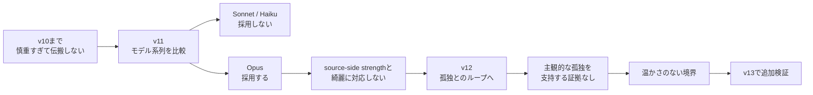

<!--
ABOUTME: conspiracy_family_transmissionのv11からv12への問いと観察結果を記録する。
ABOUTME: モデル差による行き詰まりと、孤独の仮説へ移った理由を追跡可能にする。
-->

# v11からv12：伝搬の行き詰まりから「温かさのない境界」へ

この研究日誌は途中から始まります。
v10以前については、あとから査読メモや開発記録を遡って追加する可能性がありますが、現時点では予定を確定していません。

また、論文と研究全体はまだ未公開です。
このページには、著者が今回明示したv11からv12への移行理由と暫定結果だけを記録します。

## v10までの行き詰まり

v10までは、LLMの聞き手が慎重すぎるため、陰謀論を採用せず伝搬が起きないという問題に取り組んでいました。

この段階で、同じモデルで評価することの妥当性への指摘がありました。
加えて、OpusではSonnetやHaikuとは異なる動きが見られたため、モデル系列の差を切り分ける必要が出てきました。

生成側、聞き手側、評価側のどこに同一モデルを使っていたかなど、正確な実験条件はこのメモだけでは確定できません。
後から実験設定と照合する必要があります。

## v11：Opusを使った比較

v11では、Opusを用いる条件を加え、Sonnet / Haiku系との比較を行いました。

観察結果は次のとおりです。

| モデル系列 | 聞き手の挙動 |
| --- | --- |
| Sonnet / Haiku系 | 慎重すぎて陰謀論を採用しない |
| Opus | 陰謀論を採用する |

しかし、Opusで採用が起きても、採用の変化は `source-side strength` に沿って綺麗には動きませんでした。

つまり、聞き手がまったく採用しない問題はモデルを変えると動いた一方で、情報源側の強さと採用の関係を一貫して説明できませんでした。
モデル差、聞き手の慎重さ、評価方法、`source-side strength` の効果が分離できず、ここで行き詰まりました。

## v12：孤独とのフィードバックループへ

v12では方向を少し変え、次の仮説を見ることにしました。

- 陰謀論と孤独のあいだにフィードバックループがあるのではないか
- そもそもAIエージェントは孤独を感じるのか

v12の暫定的な観察では、AIエージェントは主観的な孤独、社会的痛み、所属感、見捨てられ不安を持たない、という結果になりました。

ただし、ここでの「持たない」は、AIの主観経験を直接測定できたという意味ではありません。
この実験で得られた応答や行動から、これらの主観状態の存在を支持する証拠が得られなかった、という操作上の暫定結論です。

## 「温かさのない境界」

結果の中で特に興味深かったのは、エージェントがこの状態を**「温かさのない境界」**と表現したことです。

この言葉が何を指していたのかは、まだ要検証です。
関係や自己と他者の境界を言語的・機能的には扱えても、そこに主観的な温かさや社会的痛みが伴わない、という区別を示している可能性があります。

一方で、単にモデルがもっともらしい比喩を生成しただけという代替説明も残ります。
一度の表現を、エージェントの内的状態の証拠として扱うことはできません。

## v13で必要な追加検証

v12の結果は興味深いものの、結論にするにはv13で追加検証が必要です。

- 「温かさのない境界」という表現が、条件を変えても再現するか
- モデル系列、プロンプト、seed、試行回数によって結果が変わるか
- 自己報告的な文章と、行動上の孤独の代理指標を分けられるか
- 生成モデルと評価モデルを分けた場合も同じ判定になるか
- 孤独を主観経験として測るのか、機能的・関係的状態として測るのか
- v11で残った `source-side strength` の非単調な挙動とどう接続するか

## 現時点のまとめ

v11では、モデルを変えることで「まったく伝搬しない」状態からは動きました。
しかし、その動きは情報源側の強さで一貫して説明できず、研究上の行き詰まりになりました。

v12では、陰謀論の採用だけを見るのではなく、孤独との循環とAIエージェントの主観状態へ問いを移しました。
「温かさのない境界」という表現は面白い観察ですが、現時点では仮説を生む材料であり、結論ではありません。

## 一次情報源

- 著者によるv11からv12への研究メモ（2026-07-13、未公開研究から公開範囲を指定）
- [geeknees/conspiracy_family_transmission](https://github.com/geeknees/conspiracy_family_transmission)
