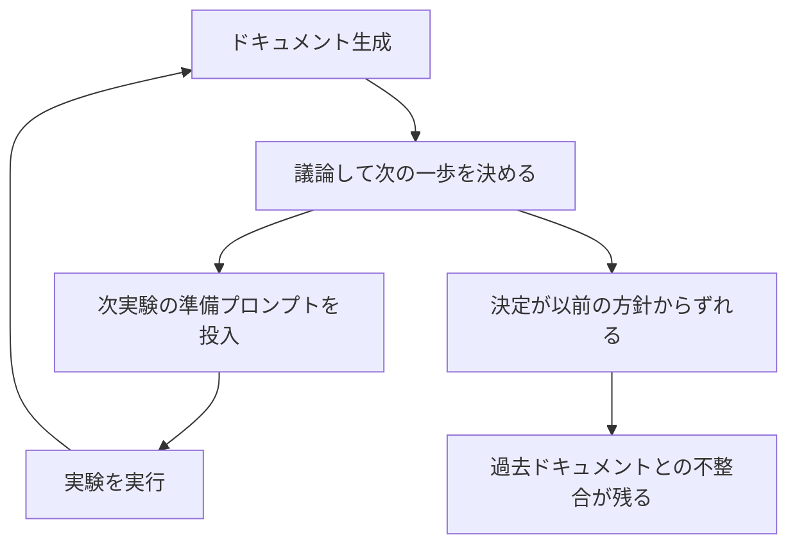

<!--
ABOUTME: v1からv11までのドキュメントを遡って整合性監査する判断と、見つかった不整合を記録する。
ABOUTME: 監査の動機、発見した不整合5件、生成物を元から作り直す修正方針を追跡可能にする。
-->

# v1–v11をバックデートで不整合監査する

この研究日誌は途中から始まり、論文と研究全体はまだ未公開です。
この日誌は、v1からv11までを遡って整合性監査することにした判断と、その理由、そして実際に見つかった不整合を記録します。
記録するのは、著者が今回公開範囲として明示した内容だけです。

## 実験の進め方

この研究の実験は、ステップバイステップで進めています。おおまかには次の繰り返しです。

1. その段階のドキュメントを生成する
2. 生成したドキュメントについて議論し、次の一歩を決める
3. 実行が決まったら、次の実験の準備プロンプトを投入する
4. 実験を実行し、また次のドキュメントを生成する

各ステップで方針を固めきってから進むのではなく、議論しながら次を決めていく進め方です。

## なぜドキュメントがずれるのか

この進め方では、議論の結果として、直前のドキュメントに書いた方針とは違う方向に進むことがままあります。

ずれ方は大きく二つあります。ひとつは**方針転換**で、より良い切り口が見つかって別の条件へ切り替える場合です。もうひとつは**途中放棄**で、いったん採る予定だった指標や採点方式を、途中でやめる場合です。実験そのものは前へ進みますが、以前に書いたドキュメントには、実際には採らなかった方針や、やめたはずの前提が残ります。

こうしたずれが積み重なると、過去のドキュメントに書かれた方針や前提と、実際に進んだ内容とのあいだに不整合が生じます。v11まで来た時点で、この不整合が各バージョンにまたがって残っていました。

## バックデートで整合性監査をする

そこで、v1からv11までを遡り、各バージョンのドキュメントと実際の進行のあいだに不整合がないかを点検することに価値があると考えました。

「バックデート」と呼んでいるのは、後から過去のバージョンへ立ち返って点検するという意味です。前へ進む作業とは別に、これまでの記録全体を一度見直す作業になります。今回の監査では、方針転換・途中放棄に由来する不整合を洗い出しました。

## 見つかった不整合

主に `report.md`（実験結果のレポート）で、次の5件が見つかりました。

| # | 箇所 | 不整合 | 由来 |
| --- | --- | --- | --- |
| A | §13 | `loop_strength` が全条件で0.000に並ぶのに、「`direct_correction` を最低＝断ち手候補」と順位付けしている。一方 §14 は「順位付けするな」と明言 → 矛盾 | 複合指標が床に張り付いた（途中で主指標が実質失敗） |
| B | §15 | §13を指して「後日フォロー（＝`check_in`）」を推奨しているが、対応する仮説 H8 は inconclusive（未測定） | 同上 |
| C | §12 | 「`family_avoidance_intent` は §8 の表にある」と書くが、その表に列が無い | 設計時の想定と実際の表の乖離 |
| D | §17 | 「`loop_strength` の MDE を n で縮める」とあるが、MDE は0（床）でありノイズではない。また「rubric-scored dimension の multi-judge」とあるが、v12 に rubric 採点は無い（blind judge を途中放棄） | 方針転換の残骸 |
| E | §6 | `Loop Strength` を主指標として提示するが、over-repair で床に落ちうるという注記が無い | 主指標が事実上、別の集計次元へ移行 |

いくつか用語を補足します。

- **`loop_strength`（複合指標）**: 今回の主指標。全条件で0.000＝下限に張り付き（床効果）、指標として差を検出できませんでした。主指標が実質的に機能しなかったのに、それを前提にした順位付けや推奨が別の節に残っていた、というのがA・B・Eの共通構造です。
- **床（floor）**: 値が下限に張り付いて条件間の差が出ない状態。差が小さいのではなく、そもそも検出対象が下限に達しています。
- **MDE（最小検出可能効果）**: 本来はサンプル数 n を増やせば縮められます。しかし `loop_strength` は床に達していてノイズが問題なのではないため、n で縮めるという説明（§17）が状況に合っていませんでした。
- **rubric 採点 / blind judge**: 採点方式の一つ。v12 では rubric 採点を使っておらず、blind judge も途中で放棄しています。§17 の記述はその名残でした。

C は設計時に想定した表の構成と、実際に出力された表がずれていた例で、方針転換や放棄とは別種の不整合です。

## 生成物は元を直して作り直す

`report.md` は手書きではなく生成物です。そのため、レポート本文を直接いじるのではなく、テンプレートである `lib/report.rb` を修正します。全24家族分がチェックポイント済みなので、実験を再実行する必要はなく、キャッシュから `report.md` を再生成できます。

この区別は大切だと考えています。生成物であるレポートを、元のテンプレートを直して作り直すことは、判断の経緯を消す「履歴の書き換え」とは別のものです。研究の経緯そのものは、この開発日誌の側にappend-onlyで残します。

## 決めたこと

- v1からv11までを遡って整合性監査を実施する。
- 不整合は、軽く確認しながら順に修正していく。一件ずつ厳密な検証で止めるのではなく、まず通しで整える。
- ただし、この監査で整えた内容は確定ではなく、あとで改めてセルフ査読を行う前提にする。
- 不整合の調整は、必要なら別のタイミングでも進められる。ここにこだわりすぎない。

## 次のステップ

- もう少し不整合を確認する。
- そのうえで v13 へ進む（不整合調整は別途でも進められるため、完全に片付くまで待たない）。
- 後日、整えた `report.md` とテンプレートに対してセルフ査読を行い、修正が妥当だったかを確認する。

## 関連する開発日誌

- [v11からv12：伝搬の行き詰まりから「温かさのない境界」へ](/experimental-commons/research/conspiracy-family-transmission/journal/2026-07-13-v11-to-v12/)
- [第3弾に陰謀論を選んだ理由](/experimental-commons/research/conspiracy-family-transmission/journal/2026-07-13-why-conspiracy-theory/)

## 一次情報源

- 著者による整合性監査の研究メモ（2026-07-14、未公開研究から公開範囲を指定）
- [geeknees/conspiracy_family_transmission](https://github.com/geeknees/conspiracy_family_transmission)
