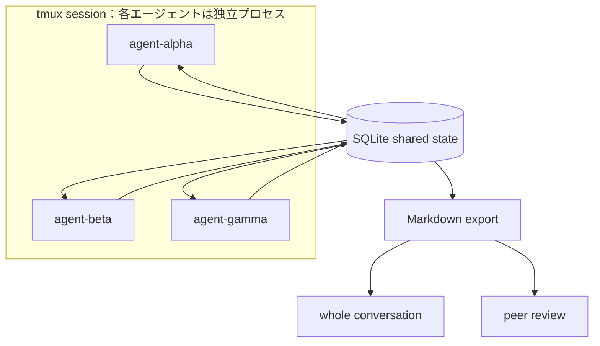

<!--
ABOUTME: 完成したdecentralized-multi-agentの設計、実装、検証結果を要約する。
ABOUTME: Teal型の協調原理とPoCの成果、今後の改善余地を区別して記録する。
-->

# AIエージェントをTeal型組織として動かす

`decentralized-multi-agent` は、AIエージェントを会社、軍隊、官僚組織のような固定的な命令系統ではなく、自己管理するTeal型組織として動かせるかを試したプロジェクトです。

3つのエージェントが共有状態を読み書きし、自分でロールを選び、提案と相互レビューを経て成果物を生成するPoCまで実装しました。
この開発は完了しており、詳細はZenn記事「[AIエージェントをTeal型組織として動かす Decentralized Multi-Agent System](https://zenn.dev/geeknees/articles/dc49480af6b726)」で公開されています。

> **Update:** Zenn記事は初期プロトタイプの実行記録です。その後、成果物レビュー、自己投票・自己レビュー防止、LLMプロバイダ抽象化、DOI付きworking paperまで発展しました。最終リリースまでの経緯は、下の研究日誌に分けて残しています。

## 完了状態

| 項目 | 状態 |
| --- | --- |
| プロジェクト | 完了 |
| 実装 | bash + SQLite + tmux + Claude Code CLIによるPoC |
| 検証 | 記事に記録されたテスト結果は30件成功、0件失敗 |
| 成果物 | エージェント間の議論、提案、投票、Markdown成果物の生成 |
| 公開 | GitHubリポジトリとZenn記事を公開済み |

このページの `evergreen` は、開発記録として内容が安定していることを表します。
プロダクション運用に必要な機能がすべて実装されている、という意味ではありません。

## 開発日誌

- [第一弾のソロ研究を6日間で形にする](/experimental-commons/research/decentralized-multi-agent/journal/2026-05-05-first-solo-research/)

この日誌では、ソロ研究、非階層型エージェント、AI主体の論文執筆を同時に試した動機と、公開までの経緯を振り返ります。

## 出発点となった問い

中心にあったのは、AIエージェントを階層型組織の延長として設計すると、人間の組織が抱えてきた命令系統や権力集中の問題まで再生産するのではないか、という問いです。

そこで、フレデリック・ラルーが『Reinventing Organizations』で整理したTeal型組織の考え方を参照し、「誰が偉いか」ではなく「どう自律し、どう協調し、どう統治するか」を実装対象にしました。

## 5つの設計原理

| 設計原理 | PoCでの実装 |
| --- | --- |
| Constitution / Policy | `agents/CLAUDE.md` にロール選択、アクション形式、レビュー規則を記述 |
| Shared State / Blackboard | SQLiteを全エージェントの共有メモリとして利用 |
| Dynamic Roles | 各エージェントが利用可能なロールから自分で選択 |
| Peer Review | 2件のAPPROVEで提案を `DECIDED` にするSQLiteトリガー |
| Human Escalation | `purpose_doc.md` の編集とミッション切り替えを人間の介入点として設計 |

Human Escalationのうち、金銭、法務、不可逆操作を自動的に人間へ差し戻す仕組みは、このPoCでは未実装です。

## アーキテクチャ

SQLiteには、メッセージ、提案、レビュー、エージェントの状態を保存します。
各エージェントは未読メッセージと未決定の提案を読み、Claude Code CLIから受け取ったJSONアクションをDBへ書き戻します。

## 主な技術判断

### SQLite

共有ファイルではなくSQLiteを選んだ主な理由は、意思決定を原子的に扱えることです。
2票目のAPPROVEが入った瞬間に提案を `DECIDED` に更新する処理をトリガーへ置き、エージェント側から投票集計の責務を外しました。

### tmux

各エージェントを独立したプロセスとして動かし、ログをリアルタイムで観察するためにtmuxを使いました。
この規模のPoCでは、DockerやKubernetesより小さい運用単位で十分でした。

### Claude Code CLI

`claude --print` のバッチモードを使い、プロンプトを標準入力、JSONアクションを標準出力として扱いました。
共通指示を `agents/CLAUDE.md` に置くことで、複数エージェントへ同じ行動規則を渡しています。

### purpose_doc.md

人間はミッション、期待する成果物、完了条件、利用可能なロール、フェーズ条件を定義します。
エージェントの行動を逐一命令するのではなく、自律的に判断するための境界を与える役割です。

## 実行時に観察されたこと

3エージェントへJavaScriptフレームワーク比較を依頼した実験では、次の流れが生じました。

1. 各エージェントが自分のロールと方針を宣言した
2. Criticが調査開始前に、評価軸や対象読者が未定義であることを指摘した
3. Researcherが文書構成を提案した
4. Criticが条件付きでAPPROVEし、評価軸の追加を求めた
5. 2票のAPPROVEが揃い、SQLiteトリガーが提案を `DECIDED` にした
6. 総メッセージ数が50を超えるとWork Phaseへ移り、Implementerが成果物を書き出した

特に、Criticへ「REJECTする場合は代替案を含める」と指示したことで、否定だけで終わらず次の手を提示するレビューが生まれました。

## 分かったこと

- CriticとResearcherの往復は、細かな会話手順を指定しなくても発生した
- 合意形成をSQLiteトリガーへ置くと、「決まった」という状態をエージェントの解釈から分離できた
- 議論と制作のフェーズを分けることで、会話の発散を抑えられた
- ロールを固定配分しなくても、他のエージェントの行動を見て役割を変更する例があった

## 今後の改善候補

PoCは完了していますが、実験から次の改善余地も見つかりました。

- 複数エージェントが同じロールを選ぶため、必要ならロール占有や人数制約を設ける
- 自分の提案へのセルフAPPROVEを防止する
- API呼び出しコストを抑えるバックオフを導入する
- 金銭、法務、不可逆操作を確実に人間へ差し戻すHuman Escalationを実装する
- 固定のメッセージ数以外にも、停滞や合意度からフェーズを判断できるか検証する

これらは完成したPoCを無効にする欠陥ではなく、次の研究またはプロダクション化で扱う論点です。

## 一次情報源

- [AIエージェントをTeal型組織として動かす Decentralized Multi-Agent System](https://zenn.dev/geeknees/articles/dc49480af6b726)
- [geeknees/decentralized-multi-agent](https://github.com/geeknees/decentralized-multi-agent)
- [Zenodo: Decentralized Multi-Agent System v0.1.0](https://doi.org/10.5281/zenodo.20034240)
